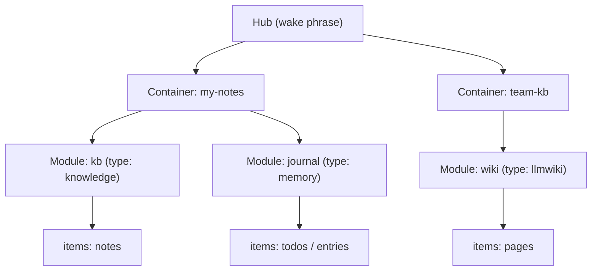
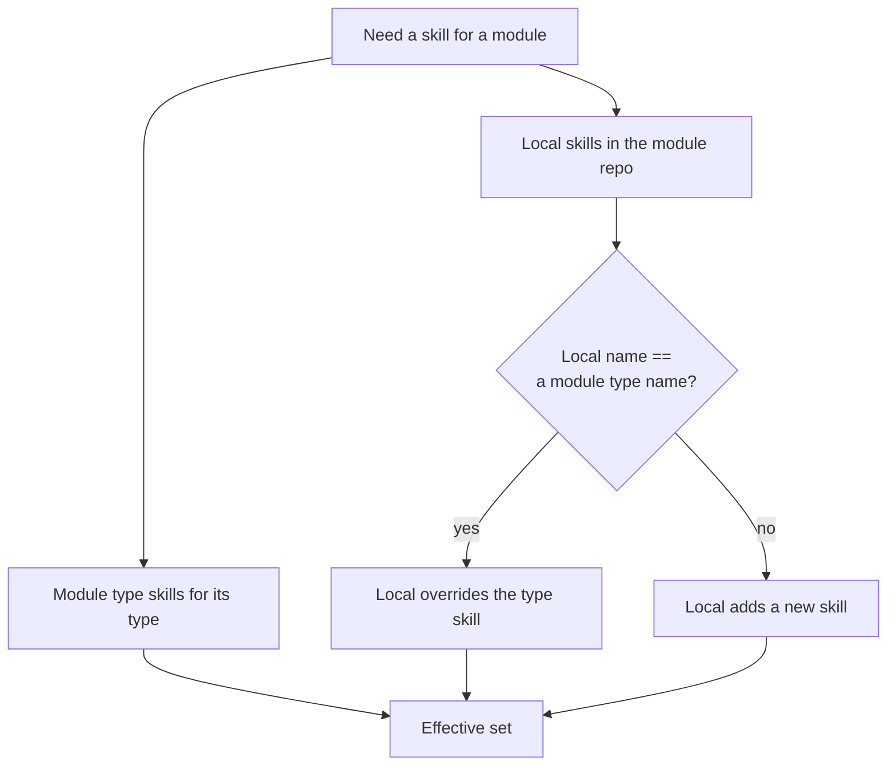
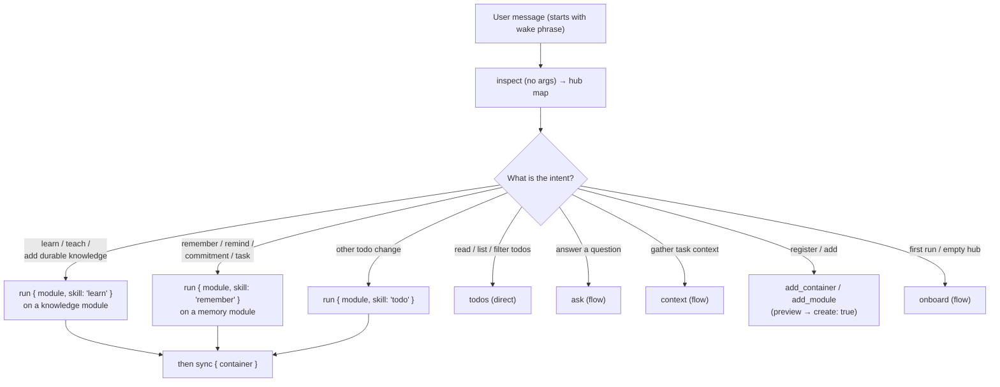

# Concepts & routing

How the Open Knowledge Hub (OKH) MCP server is organized, and how a natural-language
request is routed to the right capability. The no-arg `inspect` tool returns this same
picture as a live **hub map**; this doc explains the model behind it.

## Key concepts

- **Hub** — this MCP server. The user addresses it by a **wake phrase** (default
  `hub`, configurable via `config`). A message that starts with the wake phrase, or
  refers to "the hub" / "knowledge hub", means: consult the hub.
- **Container** — a registered repo / workspace / folder that holds modules. Backed by
  git or a local/OneDrive path, with a **sync** mode (`auto` = push to origin,
  `shared` = personal branch + PR).
- **Module** — a typed unit of content inside a container, at some `path`. Its **type**
  (built-in: `knowledge`, `skills`, `memory`, `llmwiki`; or any custom string)
  determines how its items are enumerated and which skills it ships.
- **Skill** — a named unit of runnable discipline (`SKILL.md`). Skills are *guidance*:
  `run` returns the skill's instructions for the agent to follow; it does not itself
  read or write. Skills have three provenances (below).
- **Item** — an individual piece of content in a module (a note, a todo, a wiki page…),
  counted per module in the hub map.

### Structure

## Skill provenance

Every skill a module can run comes from one of three places. The hub map factors them
so nothing repeats: **global** once, **module type** once per in-use type, **local**
per module.

| Provenance | Where it lives | Scope | Run with |
| --- | --- | --- | --- |
| **Global** | `resources/shared/skills/` (server-bundled) | Module-less | `run { skill }` |
| **Module type** | `resources/module-types/<type>/skills/` | Any module of that type | `run { container, module, skill }` |
| **Local** | in-repo: `.okh/skills/`, `.claude/skills/`, module root (for `skills` type) | That one module | `run { container, module, skill }` |

A module's **effective** skills = its module type skills, minus any local
**overrides**, plus its local skills. A local skill with the same name as a module
type skill shadows it.

## Request routing

The hub map ends with **routing gates**: they map a user intent to the correct skill
so the agent does not skip the discipline by calling a deterministic tool directly.

- **Operational tools** act on their own: `inspect`, `add_container`, `add_module`,
  `sync`, `config`, `todos`. (`add_container` / `add_module` preview until re-called
  with `create: true`.)
- **Flows** return discipline for the agent to follow — they do not read or write:
  `ask`, `context`, `run`, `onboard`.

**Gate rules (never shortcut these):**

- *learn / teach / add durable knowledge* → `run { container, module, skill: "learn" }`
  on a knowledge module. Do not substitute a memory module's `remember`.
- *remember an observation, reminder, commitment, or task* →
  `run { container, module, skill: "remember" }`. Never call `todos` first.
- *any other natural-language todo change* → `run { container, module, skill: "todo" }`.
- Call `todos` directly only to read / list / filter, or after the active memory skill
  directs the deterministic mutation.

After any write, call `sync { container }`. In **shared** sync mode, `sync` pushes the
configured branch; use the `publish-pr` action to open a PR.
