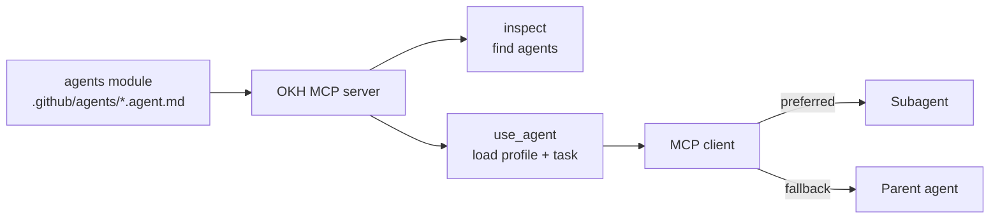
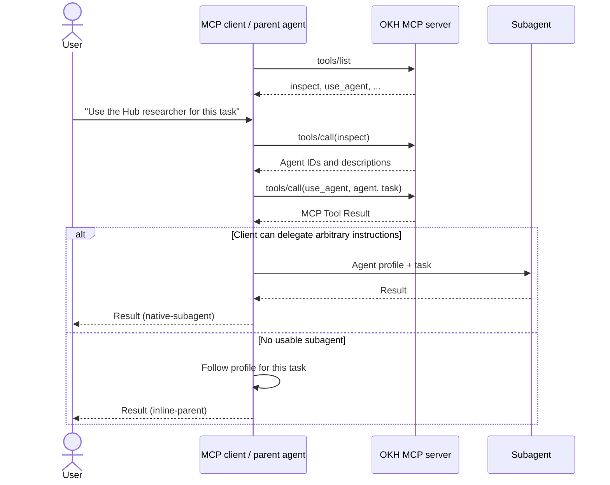

# Agents Module and Client Delegation

**Status:** Approved and implemented
**Date:** 2026-07-17

## 1. Decision

Add a built-in module type named `agents`.

- One module holds many GitHub Copilot agent profiles.
- Profiles keep the normal Copilot format.
- Profiles are stateless files with no memory, logs, or runtime state.
- The Hub returns a standard MCP Tool Result containing the profile and task.
- The MCP client, not the Hub, runs the model.



## 2. Module format

```text
team-agents/
  .okh/
    module.yaml
  .github/
    agents/
      researcher.agent.md
      reviewer.agent.md
```

```yaml
type: agents
description: Research and review agents
```

The only OKH-specific file is `.okh/module.yaml`. Agent files remain ordinary
Copilot YAML frontmatter plus Markdown:

```markdown
---
name: Researcher
description: Finds reliable sources and reports evidence
tools: [read, search, web]
---

Research the assigned question. Cite primary sources.
```

### Loading rules

- Read direct `.agent.md` and `.md` files in `.github/agents`.
- Prefer `.agent.md`; plain `.md` is accepted for VS Code compatibility.
- Derive the agent ID by removing `.agent.md` first, otherwise `.md`.
- Reject duplicate IDs, including case-only and cross-extension duplicates.
- Require a non-empty `description`.
- Preserve all frontmatter and profile text without rewriting the file.
- Enforce Copilot's 30,000-character prompt limit and a 256 KiB file limit.
- Reject unsafe paths, symlinks, nested profiles, and invalid files.
- Report bad profiles while still listing valid siblings.

`inspect(container, module)` exposes each agent ID as the item title, with its
description and relative file path. The same ID is passed to `use_agent`.

Normal loading is read-only. Scaffolding creates one ordinary
`.github/agents/example.agent.md`.

> A Hub module is usually nested inside a container, so Copilot does not
> discover it as a repository agent automatically. Portable means the same file
> can later be installed or copied without conversion.

## 3. MCP delegation

MCP has no standard request that means "launch this host subagent." The Hub
therefore uses tools to provide the profile and task. The client performs the
actual execution.

The Hub stays tools-only:

| Tool | Purpose |
|---|---|
| Existing `inspect(container, module)` | List agent IDs and descriptions |
| New `use_agent(container, module, agent, task)` | Return the agent profile and task |

At connection time, the client discovers both tools with MCP `tools/list`.
When the user asks for a Hub agent, the client calls them with `tools/call`.

### Hub Tool Result convention

MCP Tool Results always contain `content` and may also contain
`structuredContent`. Hub tools use these rules:

| Tool result | Return format |
|---|---|
| Guidance or prompt payload such as `ask`, `run`, or `use_agent` | Text is the product; no structured output is required |
| Small data or mutation result | Human summary + `structuredContent` + exact JSON text fallback |
| Large data result | Short summary + `resource_link`; only small metadata stays inline |
| Tool or input error | Corrective text with `isError: true` |
| MCP protocol or transport failure | JSON-RPC error |

For a structured success:

1. `structuredContent` is the canonical result.
2. `content[0]` is a concise summary derived from that same result.
3. `content[1]` is `JSON.stringify(structuredContent)` for clients that ignore
   structured output.
4. The structured root is an object, as required by MCP 2025-11-25.
5. `_meta` is reserved for client or UI metadata, not domain data.

This keeps the CLI readable while meeting MCP's compatibility guidance. Text
for a data-bearing result must not disagree with or add facts missing from
`structuredContent`.

Stable data tools should declare `outputSchema`. When they do, every successful
path must return conforming structured content. The pinned MCP SDK requires an
object schema at the root, so multiple shapes use a `kind` field inside one
object or a nested union, never a root-level schema union.

Exact JSON fallback is limited by `maxInlineStructuredBytes` (default 32 KiB).
Larger data moves to an MCP resource instead of being duplicated in text and
structured form.

This limit applies only to duplicated structured fallbacks. Text-first guidance
such as `use_agent` remains governed by its own profile and tool-result limits.

Expected tool and input failures return sanitized `isError: true` results.
Protocol and transport failures use JSON-RPC errors. Unexpected handler errors
are logged server-side and returned as generic `isError: true` text; raw
exception details are not exposed.

`inspect` already returns markdown plus `structuredContent: { result }`; it is
not text-only. A later Hub-wide migration can add its JSON fallback and a nested
object output schema.

Example:

```json
{
  "name": "use_agent",
  "arguments": {
    "container": "main",
    "module": "team-agents",
    "agent": "researcher",
    "task": "Find primary evidence for the proposal."
  }
}
```

### `use_agent` guidance result

`use_agent` validates the reference, reads the exact profile, and returns:

```json
{
  "agent": {
    "container": "main",
    "module": "team-agents",
    "id": "researcher",
    "description": "Finds reliable sources and reports evidence"
  },
  "requestedTools": ["read", "search", "web"],
  "profile": {
    "format": "github-copilot-agent-md",
    "content": "---\nname: Researcher\n..."
  },
  "task": "Find primary evidence for the proposal.",
  "delegation": {
    "preferredMode": "native-subagent",
    "fallbackMode": "inline-parent",
    "instruction": "Prefer a subagent that accepts these instructions. Otherwise follow the profile inline. Return the result and report which mode was used."
  }
}
```

The first `TextContent` block says which agent was prepared. The second contains
the object above as JSON. For this tool, the instructions are the product, so
the MVP does not duplicate the full profile in `structuredContent`. Keeping
`profile` and `task` in separate JSON fields preserves exact content without
unsafe text delimiters.

### Client flow



### Client contract

1. Prefer a subagent when it can receive the profile and task and access the
   tools needed for the task.
2. Otherwise execute in the parent context for this task only.
3. Tell the user whether execution was `native-subagent` or `inline-parent`.
4. Never claim that the Hub enforced model, tool, or process isolation.

Native execution here means a host subagent that accepts arbitrary instructions.
It does not mean the Hub profile was installed as a named Copilot custom agent.

Profile `tools`, `model`, and `mcp-servers` are preserved but advisory. Actual
models, tools, and permissions are controlled by the client. In inline mode the
profile runs with the parent's privileges; profile trust and sandboxing are the
client's responsibility.

The Hub guarantees profile selection, validation, and Tool Result construction
only. It creates no run record, agent memory, model request, or output
validation.

### Delegation capability diagnostic

Standard MCP capability negotiation has no subagent capability, and a
`tools/call` request does not identify whether it came from a parent or child
model context. The Hub cannot independently prove native delegation.

The existing zero-argument `capabilities` tool should therefore add this
diagnostic result:

```text
Subagent delegation: Unknown. Standard MCP does not expose subagent execution.
To check behavior, run use_agent with a harmless task and ask the client to
report native-subagent or inline-parent. Treat the answer as client-reported.
```

This is guidance, not an active protocol probe. It adds no arguments, callback,
nonce, or server state, and it must never report `passed` or `verified`.

A purpose-built Copilot SDK adapter can provide stronger host-observed evidence
from `subagent.started` and `subagent.completed` events. That is a host-specific
integration, not a standard MCP capability.

MCP Sampling and MCP Prompts are not used. Tools match the Hub's current
architecture, work for model-driven clients, and allow an inline fallback when
native delegation is unavailable.

## 4. Implementation

### Agents module

1. Register `agents` as a built-in module type.
2. Add a deterministic loader and shared profile validator.
3. Add an optional loader validation hook to `ContainerService.validate()`.
4. Reuse `inspect` for discovery.
5. Add the read-only `use_agent` tool, schema, and tool metadata.
6. Add one MCP Tool Result renderer and the client contract to server
   instructions.
7. Add the `Subagent delegation: Unknown` diagnostic and manual check guidance
   to `capabilities`; keep the tool zero-argument and stateless.
8. Report incompatible pre-existing `type: agents` layouts through validation;
   never move or delete their files.
9. Update the server's exact tool-list test for `use_agent`.

### Separate Hub-wide migration

The return convention is shared, but migrating existing tools is a separate
change:

1. Add `okText(text)` and `okStructured(summary, data)`.
2. Migrate stable data tools one at a time with exact JSON fallbacks.
3. Add object-root output schemas only after every success shape is covered.
4. Coordinate any `todos` schema change with its MCP App type guards.
5. Keep guidance tools and `use_agent` text-first.
6. Add MCP resources before moving large existing results.
7. Sanitize unexpected handler failures at the shared error boundary.

### Essential tests

- Discover `.agent.md` and compatible `.md` profiles.
- Preserve raw profile content and unknown frontmatter.
- Reject duplicates, invalid metadata, unsafe paths, and size-limit violations.
- Keep valid profiles visible when a sibling is invalid.
- Expose the agent ID from `inspect` and accept it in `use_agent`.
- Return exact profile and task in one JSON TextContent block without duplicate
  structured content.
- Keep guidance tools text-only.
- Verify loading and delegation preparation perform no model call or runtime
  write.
- Verify client guidance covers native delegation and inline fallback.
- Report subagent delegation as unknown and not observable through standard MCP.
- Ensure the manual check is labeled client-reported, never passed or verified.

The separate Hub migration tests each declared output schema against every
success path, preserves MCP App consumers, verifies exact JSON fallbacks under
the size limit, and uses resource links above it.

## 5. Sources

- [MCP Tools](https://modelcontextprotocol.io/specification/2025-11-25/server/tools):
  Tool Results, structured content, output schemas, JSON text fallback, errors,
  and resource links.
- [MCP TypeScript SDK server guide](https://github.com/modelcontextprotocol/typescript-sdk/blob/v1.x/docs/server.md):
  official `outputSchema` and `structuredContent` examples.
- [MCP client best practices](https://modelcontextprotocol.io/docs/develop/clients/client-best-practices):
  recommends output schemas for precise programmatic return types.
- [MCP capability negotiation](https://modelcontextprotocol.io/specification/2025-11-25/basic/lifecycle):
  defines client capabilities and has no standard subagent capability.
- [GitHub custom-agent configuration](https://docs.github.com/en/copilot/reference/custom-agents-configuration):
  Copilot profile format and limits.
- [VS Code custom agents](https://code.visualstudio.com/docs/agent-customization/custom-agents):
  `.agent.md` profiles and direct `.md` compatibility.
- [Copilot CLI custom agents](https://docs.github.com/en/copilot/how-tos/copilot-cli/use-copilot-cli/invoke-custom-agents):
  repository profiles and native subagent behavior.
- [Copilot SDK custom agents](https://docs.github.com/en/copilot/how-tos/copilot-sdk/features/custom-agents):
  host-specific `subagent.started` and `subagent.completed` lifecycle events.
