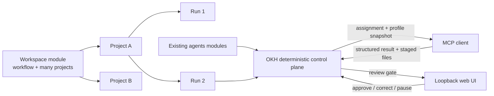
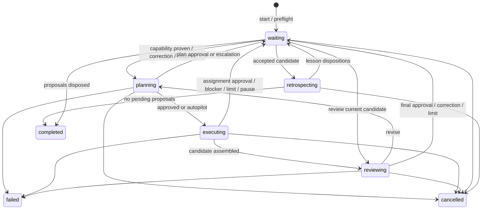

# Lean Workspace Collections and Human-Supervised Runs

**Status:** New proposal replacing the metadata-heavy draft
**Date:** 2026-07-19

## 1. Decision

Add a built-in module type named `workspace`.

- One workspace module defines one reusable workflow and contains any number of
  projects that follow it.
- A project is one investigation, presentation, or other instance of that workflow.
- The durable hierarchy is `Workspace -> Project -> Run -> Assignment`.
- The Hub is the deterministic control plane. Existing stateless profiles from `agents`
  modules execute in the MCP client.
- The loopback web app is the human surface for project management, review, correction,
  acceptance, recovery, and learning.
- Retrospectives may propose improvements, but no proposal edits live guidance, policy,
  skills, knowledge, or agent profiles automatically.

The persistent format has a strict metadata budget:

1. Reuse `.okh/module.yaml` for workspace configuration.
2. Use one ordinary Markdown `README.md` as each project's metadata and brief.
3. Use the standard CloudEvents JSON batch format for project and run activity.
4. Store source snapshots and artifacts as ordinary files, not parallel metadata
   schemas.
5. Do not persist derived indexes, projections, caches, or duplicate state.



This is not a second agent runtime or a general workflow platform. It adds no model
provider, scheduler, queue service, database, BPMN/CWL engine, or graph framework.

## 2. Why the prior format is replaced

The prior draft introduced a separate `workspace.yaml`, `project.yaml`, `state.yaml`,
several event directories, artifact blobs and set manifests, pointer events, assignment
request/result files, retrospective files, and proposal files.

Those pieces were individually defensible but collectively violated OKH's file-first
design. They duplicated state, made a project hard to understand outside the app, and
created more OKH-specific format than the feature needed.

The replacement is:

| Prior draft | New proposal |
|---|---|
| `workspace.yaml` | Existing `.okh/module.yaml` `config` |
| `project.yaml` + `brief.md` + project `guidance.md` | One project `README.md` |
| `state.yaml` | No persisted projection; derive from source records |
| Event-per-file directories | One CloudEvents batch per project and run |
| Plan/assignment/review/retrospective sidecars | CloudEvent `data` |
| Blob store + set manifests | Immutable ordinary candidate directories |
| `current.yaml` pointer | `acceptedCandidate` in project frontmatter |
| Pointer event directory | Project CloudEvents batch |
| Lesson proposal directory | Run proposal event + project disposition event |

The design still keeps two event scopes because they have different lifetimes:

- a **run log** becomes immutable when that run is terminal; and
- a small **project log** remains writable for lifecycle, run start/finish, artifact
  acceptance/undo, and later lesson dispositions.

Combining those would either make a project-wide log grow without a run bound or require
mutating terminal run history.

## 3. Module and project boundaries

The module represents a workflow category, not one outcome:

```text
container/
  investigations/                    # one workspace module
    .okh/module.yaml
    index.md                         # overview + shared guidance
    projects/
      strategic-suppliers/
      battery-market/

  presentations/                     # another workspace module
    .okh/module.yaml
    index.md
    projects/
      2026-q3-strategy/
      2026-board-update/

  team-agents/                       # reusable stateless profiles
    .okh/module.yaml
    .github/agents/*.agent.md
```

Rules:

- Workspace modules remain direct children of a container.
- Project folders are direct children of `projects/`.
- Projects contain no `.okh/module.yaml` and are never discovered as modules.
- The lowercase kebab-case folder name is the project ID; it is not duplicated in
  project frontmatter.
- Project paths cannot escape their project folder or reference another project's
  mutable files.
- Sync remains container-wide. Put a workspace in a separate container when it needs a
  separate repository, access policy, or sync lifecycle.

## 4. Goals and non-goals

### Goals

1. Support an arbitrary number of projects sharing one workflow.
2. Create, find, sort, continue, pause, complete, reopen, archive, and unarchive projects
   without losing their work.
3. Support presentation date sorting and investigation continuation without separate
   built-in types.
4. Compose existing agents as coordinator, planner, executor, reviewer, and
   retrospector.
5. Resume after client or server interruption without chat history.
6. Bound plan -> execute -> review -> correct loops.
7. Keep artifacts, approvals, corrections, and learning auditable.
8. Reuse existing module, manifest, config, agent, skill, web, path-safety, and sync
   capabilities.
9. Keep the source tree understandable in GitHub, an editor, or a Markdown tool without
   the OKH web app.

### Non-goals for v1

- Server-side model execution.
- Parallel assignments within one run.
- More than one active run for one project.
- Distributed multi-host coordination.
- Writable execution on OneDrive or network-shared paths.
- Publishing, deployment, email, deletion, or other external side effects.
- Calendar integration, recurring projects, or portfolio management.
- A persistent search/index database inside the module.
- Large binary artifact management or cross-repository write targets.
- Automatic lesson promotion or free-form agent memory.
- Recording hidden reasoning or chain-of-thought.

## 5. Lean on-disk format

```text
investigations/
  .okh/
    module.yaml                       # existing OKH manifest + workspace config
  index.md                            # ordinary shared overview/guidance
  projects/
    strategic-suppliers/
      README.md                       # project metadata, objective, brief, guidance
      events.json                     # CloudEvents batch: project-scope activity
      runs/
        2026-07-19-001/
          events.json                 # bounded CloudEvents batch: run activity
          sources/                    # immutable ordinary-file snapshots
            module.yaml
            index.md
            README.md
            agents/
              lead.agent.md
              researcher.agent.md
              reviewer.agent.md
          candidates/
            01/
              findings.md
              evidence.md
            02/
              findings.md
              evidence.md
```

There is intentionally no:

- `workspace.yaml`;
- project YAML sidecar;
- derived `state.yaml`;
- assignment, plan, review, retrospective, or proposal sidecar;
- blob store or set manifest;
- accepted-artifact copy or pointer sidecar; or
- client-writable directory inside the container.

`sources/` and `candidates/` are content, not competing state schemas. They are immutable
after the event that references their hashes.

## 6. Workspace contract in the existing manifest

The current manifest already has an arbitrary type-specific `config` map. A workspace
uses it rather than adding another configuration file:

```yaml
type: workspace
description: Evidence-based investigations with human review.
config:
  version: 1

  projectKind:
    singular: investigation
    plural: investigations

  defaultSort:
    field: updatedAt
    direction: desc

  acceptance:
    - id: credible-evidence
      description: Every material claim cites a primary or authoritative source.
      required: true
    - id: alternatives
      description: Viable alternatives are compared consistently.
      required: true
    - id: decision
      description: The conclusion states tradeoffs and unresolved risks.
      required: true

  team:
    members:
      lead:
        container: shared-hub
        module: team-agents
        id: orchestrator
      researcher:
        container: shared-hub
        module: team-agents
        id: research-synthesizer
      reviewer:
        container: shared-hub
        module: team-agents
        id: evidence-reviewer
    roles:
      coordinator: lead
      planner: lead
      executors: [researcher]
      reviewer: reviewer
      retrospector: reviewer

  oversight:
    mode: supervised

  limits:
    maxIterations: 3
    maxExecutionAssignments: 20
    maxAttemptsPerAssignment: 2

  learning:
    enabled: true
    minProjectsForWorkspacePromotion: 2
```

A presentation workspace changes labels and default sorting:

```yaml
config:
  version: 1
  projectKind:
    singular: presentation
    plural: presentations
  defaultSort:
    field: targetDate
    direction: asc
  # team, acceptance, oversight, limits, and learning follow
```

The generic manifest parser continues to accept `config`, but the workspace loader applies
a dedicated Zod schema before listing, starting, or editing a workspace. Invalid team
bindings, criteria, sort fields, modes, or limits fail visibly.

The existing generic `config` tool may replace complete top-level config values. The
workspace initialization skill and typed web Settings form are the preferred editors
because they validate the complete resulting workspace config before atomically saving
the existing manifest.

### `index.md`

`index.md` follows the existing module-overview convention and contains human-readable
shared guidance:

```markdown
# Investigations

Use primary evidence, distinguish facts from assumptions, and preserve unresolved
questions.

## Working guidance

- Start with primary sources.
- Record contrary evidence.
- State uncertainty instead of inventing precision.
```

It is both the module overview and the shared guidance snapshot for future runs. A lesson
proposal targeting one section hashes and patches that section, not unrelated parts of
the file.

## 7. Project record as Markdown

Every project has one `README.md`:

```markdown
---
title: Strategic supplier investigation
description: Compare suppliers for the next sourcing cycle.
status: active
createdAt: 2026-07-19T18:30:00Z
updatedAt: 2026-07-19T18:30:00Z
targetDate: 2026-08-15
tags: [sourcing, strategy]
activeRun: null
acceptedCandidate: null
acceptance:
  - id: geography
    description: Coverage includes North America and Europe.
    required: true
---

## Objective

Recommend two suppliers with evidence, risks, and open questions.

## Brief

Compare the shortlisted suppliers for the next sourcing cycle.

## Project guidance

Prefer filings and direct supplier documentation over market summaries.
```

The format follows the existing OKH use of Markdown plus YAML frontmatter and the common
Jekyll/Hugo content convention. Timestamps are ISO 8601.

Rules:

- `title`, `status`, `createdAt`, `updatedAt`, `activeRun`, `acceptedCandidate`,
  `Objective`, and `Brief` are required.
- `status` is `active`, `completed`, or `archived`.
- `targetDate` is an optional `YYYY-MM-DD` value.
- Tags are normalized lowercase kebab-case.
- Project acceptance criteria are additive; they cannot weaken required workspace
  criteria.
- `activeRun` is either `null` or a run ID under this project.
- `acceptedCandidate` is either `null` or `{ path, treeHash }`, where `path` resolves to
  an immutable candidate under this project's `runs/`.
- Conditional lifecycle fields are `completedAt`, `archivedAt`, and `archivedFrom`.
- Objective, brief, and project-guidance sections are addressed by heading so edits can
  preserve unrelated Markdown.

The service reuses the frontmatter parser and the source-preserving patch approach used
by todos: re-read, verify the expected SHA-256 ETag, patch only known spans, validate the
result, then atomically replace the file. It never regenerates unrelated prose.

### Current-state authority

Project README frontmatter is the canonical current project record. Project events are
the audit, idempotency, and multi-file transaction journal for service-governed fields
(`status`, lifecycle timestamps, `activeRun`, and `acceptedCandidate`); they do not form
a second current-state projection. Run events are the canonical run record.

`updatedAt` is the sole denormalized convenience field. It is the maximum meaningful
project/run activity time, may briefly lag after a crash, and is repaired from committed
events. It is not a governed transaction field.

Recovery precedence is explicit:

1. With no open prepared transaction, README current-state fields are authoritative and
   every committed project event must agree with the governed fields it changed.
2. An open prepared event describes the only permitted in-flight change; recovery
   rolls it forward or appends its explicit abort.
3. Governed README state that disagrees with the last committed event and is not
   explained by an open prepare is corruption and blocks mutation.
4. Derived collection/run views are rebuilt in memory and are never committed.

Direct edits to title, description, tags, acceptance, or Markdown sections are allowed
when the file validates and no service transaction is open. An active run continues to
use its source snapshot; the edit affects future runs. Direct edits to governed fields
are rejected as inconsistent unless performed through the service.

Thus "no persisted projection" means no `state.yaml` or index cache, not the absence of
one canonical current project record.

## 8. Project lifecycle and collection behavior

| Project status | New run | Resume run | Editable | Default list |
|---|---|---|---|---|
| `active` | Yes, when `activeRun` is null | Yes | Yes | Shown |
| `completed` | No; reopen first | No | Metadata only | Shown |
| `archived` | No | No | Read-only except unarchive | Hidden |

Actions:

1. **Create** writes a complete project in a sibling temporary directory, including its
   initial `project.created` CloudEvent, then atomically renames the directory.
2. **Continue** starts a new run for an active project with no active run.
3. **Resume** continues the exact run referenced by `activeRun`.
4. **Complete** changes the project to completed after its run is terminal.
5. **Reopen** changes a completed project to active.
6. **Archive** hides and freezes a project; an active run must first finish or cancel.
7. **Unarchive** restores `archivedFrom`, defaulting to active.

Dates do not change lifecycle automatically. A past presentation remains active until a
user completes or archives it.

Project creation and lifecycle commands use a command ID and expected project ETag.
Repeating the same command and arguments returns the recorded result; changed arguments
conflict. Desired-state repeats such as archiving an already archived project are
successful no-ops when their expected state still matches.

### Listing and scale

The workspace loader reuses the existing finite `Loader.enumerate()` contract. It reads
project README frontmatter into normal `Item` records; the workspace tool enriches those
records and paginates its response.

Supported sort fields are `targetDate`, `createdAt`, `updatedAt`, and `title`. Missing
target dates sort last, then project ID breaks ties.

This deliberately favors consistency and no sidecar index over asymptotically optimal
listing. V1 is intended for hundreds, not millions, of projects per workspace. A
per-machine rebuildable cache may be added later without changing the module format.
No cache or collection projection is committed to the container.

The web app loads run state only for the displayed page. `updatedAt` is advanced on
meaningful run and lifecycle activity. If a crash leaves it behind a committed event,
the next writable service recovery repairs it from that event's time.

## 9. CloudEvents activity records

Both `projects/<id>/events.json` and `runs/<run>/events.json` use the CloudEvents 1.0
JSON batch format, whose media type is `application/cloudevents-batch+json`.

```json
[
  {
    "specversion": "1.0",
    "id": "2b7ce542-b724-43ab-9f18-4ec64337a076",
    "source": "okh://main/investigations/projects/strategic-suppliers",
    "type": "dev.okh.workspace.run-start.prepared",
    "subject": "runs/2026-07-19-001",
    "time": "2026-07-19T18:42:00.000Z",
    "datacontenttype": "application/json",
    "sequence": 4,
    "okhcommandid": "9c7f6765-81db-490d-a4f0-bdf45d2cda57",
    "data": {
      "runId": "2026-07-19-001",
      "expectedProjectEtag": "sha256:..."
    }
  }
]
```

CloudEvents supplies the standard event envelope; it does not supply ordering,
idempotency, locking, or crash recovery. OKH defines only:

- reverse-DNS event types under `dev.okh.workspace.*`;
- a contiguous integer `sequence` extension;
- an `okhcommandid` extension for retry correlation;
- URI-reference `source` and project/run-relative `subject` values; and
- event-specific JSON `data` validated by Zod.

Every event ID is a `crypto.randomUUID()` value unique within its source; `sequence`
provides ordering. Events contain summaries, structured results, hashes, and references,
not hidden reasoning, secrets, or full tool transcripts.

`eventHash` means SHA-256 of the exact canonical UTF-8 bytes of one event object as first
written to the batch. Byte-preserving append keeps that hash stable.

### Project event scope

The low-volume project batch records:

- project creation and lifecycle changes;
- project README edits performed through the service;
- run-start and run-finish prepare/commit transactions;
- accepted-candidate changes and undo;
- project-scoped corrections outside a run; and
- lesson acceptance, rejection, deferral, promotion, and override decisions.

It remains writable for the life of the project.

### Run event scope

The bounded run batch records:

- run start and exact source hashes;
- coordination, planning, execution, review, and retrospective assignments;
- claims, attempts, releases, results, and limits;
- plans, candidates, evidence, corrections, and human decisions;
- run-scoped lesson proposals; and
- the terminal outcome.

The run batch becomes immutable after `completed`, `failed`, or `cancelled`.

### Atomic append without rewriting prior events

Under the shared container writer:

1. Read and validate the current JSON batch and expected ETag.
2. Copy all existing bytes except the closing array delimiter verbatim to a sibling
   temporary file.
3. Append one canonical JSON CloudEvent and the closing delimiter.
4. Flush the file and directory where supported.
5. Atomically rename the temporary file over `events.json`.

Prior event bytes and unknown extension attributes are never parsed and re-emitted.
Readers ignore temporary files. Each run's configured assignment, attempt, and iteration
limits plus a server event-file size cap bound replay and rewrite cost.

## 10. Run start and immutable sources

Starting a run is a recoverable project transaction:

1. Append `run-start.prepared` to the project batch with the generated run ID, command
   ID, project ETag, and accepted-candidate base.
2. Create the run in a sibling temporary directory.
3. Copy exact source files into `sources/`.
4. Write the first run CloudEvent with source hashes and effective criteria.
5. Atomically rename the run directory.
6. Patch project `activeRun` and `updatedAt`.
7. Append `run-start.committed`.

Every valid prepare is resolved explicitly:

- recovery rolls it forward when its recorded preconditions still hold;
- a prepare that cannot begin safely receives a matching `run-start.aborted` event with
  the stable command result; and
- a conflicting partial state stops visibly for human recovery rather than guessing.

No prepared event is silently deleted or treated as never having happened. Retrying the
command returns the original committed or aborted result.

The source snapshot contains:

- the exact workspace `.okh/module.yaml`;
- `index.md` when present;
- the exact project `README.md`;
- every resolved `.agent.md` profile; and
- the accepted-candidate reference and tree hash.

The snapshots remain ordinary, inspectable files. The first run event records their
SHA-256 values; subsequent events refer to those hashes rather than embedding or
duplicating the content.

Workspace, project, guidance, or live profile edits affect only future runs. Because a
project has at most one active run and undo is blocked during it, the accepted candidate
used as the run base remains immutable for the run's lifetime.

## 11. Agent composition and assignments

The workspace references existing agent profiles; a project does not duplicate the
team. At run start the Hub resolves and validates all required profiles through the
current agents loader and snapshots their exact files.

Every client-executed invocation is a durable assignment:

```text
coordination | planning | execution | review | retrospective
```

Each assignment has a stable ID, kind, profile hash, expected result schema, attempt
number, claim generation, and structured request/result in run events.

- If coordinator and planner aliases differ, coordination produces an iteration brief
  before planning.
- If they match, one planning assignment combines both responsibilities.
- An approved plan creates execution assignments.
- Review and retrospective assignments are state-machine generated.
- All non-execution assignments use `analysis`.
- Only execution assignments may use `project-artifact`.

`analysis` returns structured JSON and declares no artifact operation.
`project-artifact` may write only declared files in external claim staging. Neither
class grants direct workspace, project, accepted-candidate, repository, publishing,
deployment, communication, or destructive access.

The first claim creates attempt one. Retryable failure, explicit claim release, or pause
that invalidates a claim consumes the attempt. Process restart alone does not. A
successful result closes the assignment permanently.

`maxExecutionAssignments` counts plan-created execution work. Iteration and attempt
limits bound the remaining kinds; a server maximum bounds total assignments.

### Plan shape

```yaml
version: 1
summary: Research candidates, compare them, and update the recommendation.
humanReviewCriteria: []
assignments:
  - key: gather-evidence
    agent: researcher
    task: Gather primary evidence for candidate suppliers.
    dependsOn: []
    inputs:
      - name: brief
        kind: project-section
        heading: Brief
    coversCriteria: [credible-evidence]
    expectedArtifacts:
      - destination: evidence.md
        operation: upsert
    actionClass: project-artifact
```

The Hub validates unique keys, aliases, finite acyclic dependencies, limits, action
classes, typed inputs, logical artifact paths, destination collisions, unsupported
actions, and coverage of all required effective criteria.

V1 executes approved execution assignments serially even when dependencies could run in
parallel.

## 12. External claim staging

Client-writable data never lives under a registered container.

The Hub creates a private per-machine staging path keyed by container identity, module,
project, run, assignment, attempt, claim generation, and a nonce:

```text
<okh-state>/workspace-staging/<container-hash>/<module>/<project>/<run>/<claim>/
  inputs/                              # Hub-written, client read-only
  output/                              # client-writable
```

Before the first assignment, the client proves access by writing a nonce to the returned
challenge path. Remote clients and inline uploads are deferred.

The claim event stores the relative staging key, generation, server-instance ID, and
bearer-token hash, never the token. On submit the Hub:

1. validates the claim;
2. opens declared output with no-follow semantics where available;
3. revalidates each opened handle as a contained regular file;
4. copies and hashes exact bytes into a Hub-owned temporary candidate tree;
5. commits the result event, which closes the claim; and
6. removes staging.

Cleanup failure is visible but grants no authority. A later claim uses a new generation
and nonce. Container-wide Git staging, checkout, rebase, and sync cannot capture or
alter live client output.

### Lost credential recovery

Bearer tokens are transient and excluded from the "same command returns the same result"
guarantee. Losing one does not force loss of the assignment attempt.

1. A server-instance change automatically makes its old active claim recoverable. While
   the same server is alive, the user must authorize **Recover claim** in the web UI so
   one local client cannot silently take work from another.
2. `next` returns `claim-recovery-required` with a fresh external-staging challenge.
3. The client writes the nonce and calls `preflight`.
4. The Hub appends `claim.credential-rotated`, invalidates the old token and staging
   generation, creates fresh staging, and returns a new token for the same assignment
   attempt.

Old partial output is never inherited. Explicit release, retryable failure, and pause
still consume an attempt; credential rotation does not.

## 13. Client-pulled protocol

Add one deterministic tool:

```text
workspace {
  operation:
    list | create | status | start | preflight | next | submit
  container
  module
  project?
  ...
}
```

| Operation | Project | Purpose |
|---|---|---|
| `list` | Omitted | Filter, sort, and page project summaries |
| `create` | New ID | Create one project from explicit fields and Markdown |
| `status` | Required | Return lifecycle, run projection, accepted candidate, and review availability |
| `start` | Required | Create one new run for an active project |
| `preflight` | Required | Prove access to external staging |
| `next` | Required | Claim the next assignment or return a wait/terminal result |
| `submit` | Required | Submit the current assignment's structured result |

`list` supports status, query, tags, target-date range, sort, direction, limit, and
cursor. It returns an opaque project ETag for edits.

Every mutation has a caller-generated command ID:

- project-scoped commands are recorded in project events;
- run-scoped commands are recorded in run events; and
- same ID plus same canonical arguments returns the recorded result, while changed
  arguments conflict.

The MCP tool cannot satisfy a human review or lifecycle gate. Those are same-origin web
actions. Handlers assign `actor: client` or `actor: web:local`; callers cannot choose
the actor. `web:local` is an audit label, not verified identity.

Starting a run requires a live loopback review origin. Review URLs are derived from the
current server handle, not persisted. A restart on another port rebinds the same
decision. If the server becomes unavailable, the run remains safely waiting.

`next` returns one of:

```json
{"kind":"assignment","project":"...","run":"...","assignment":"a003","assignmentKind":"execution","claimToken":"...","profileHash":"sha256:...","requestedTools":["read","search"],"profile":{"format":"github-copilot-agent-md","content":"---\nname: Researcher\n...\n---\nResearch the assigned task."},"task":"...","inputs":[],"expectedResultSchema":{},"delegation":{},"staging":"..."}
{"kind":"preflight-required","project":"...","run":"...","path":"...","nonce":"..."}
{"kind":"claim-recovery-required","project":"...","run":"...","assignment":"a003","path":"...","nonce":"..."}
{"kind":"review-required","project":"...","run":"...","decision":"d004","reviewUrl":"..."}
{"kind":"review-unavailable","project":"...","run":"...","decision":"d004"}
{"kind":"paused","project":"...","run":"...","reviewUrl":"..."}
{"kind":"terminal","project":"...","run":"...","outcome":"completed"}
```

The assignment shape reuses the existing `use_agent` result convention but reads the
snapshotted profile, never the live profile. It includes the exact profile content,
requested tools, bounded task, resolved inputs, profile hash, expected result schema,
and native-subagent/inline-parent delegation instructions. Large payloads use the
existing MCP `resource_link` convention instead of truncation.

## 14. Run state and recovery



Wait reasons are:

```text
client-capability
plan-approval
assignment-approval
final-approval
correction
blocked
budget-exceeded
no-progress
paused
retrospective-review
```

Required recovery behavior:

| Wait | Allowed exits |
|---|---|
| `blocked` | Retry after blocker resolution; structured correction; review current candidate; cancel |
| `budget-exceeded` | Bounded one-run limit override; structured correction; review current candidate; cancel |
| `no-progress` | Structured correction; review current candidate; cancel |
| `paused` | Resume saved phase; cancel |

A current candidate may reach final approval only after a matching reviewer `pass`.
Reviewing a blocked, budget, or no-progress candidate does not bypass that requirement.

Web claim release works in planning, execution, review, and retrospective phases.
Attempts exhausted by release or pause enter `budget-exceeded`.

Stop conditions are successful final acceptance, human judgment, pause/cancel, bounded
limits, repeated candidate hash, unavailable required input/profile, or a non-retryable
deterministic failure.

### Run finalization

Completing, failing, or cancelling a run is a project transaction:

1. Append `run-finish.prepared` to project events with the intended outcome, expected
   run ETag, expected project ETag, and active run ID.
2. Append the terminal event as the final run event.
3. Atomically clear project `activeRun` and advance `updatedAt`.
4. Append `run-finish.committed` to project events.

Before the terminal event, an invalid precondition produces `run-finish.aborted`. After
the terminal event exists, recovery always rolls forward to the matching README and
committed project event. A run batch rejects every append after its terminal event.

## 15. Candidates, acceptance, and undo

Agents never write accepted project artifacts directly.

For each iteration, the Hub builds a complete immutable candidate tree under:

```text
runs/<run>/candidates/<iteration>/
```

The tree starts from the project's currently accepted candidate, or empty for a new
project. Declared upserts replace logical paths and declared deletes remove them.
Duplicate destinations are rejected.

The candidate event embeds a sorted array of `{ path, size, sha256 }` and a tree hash:

```text
sha256(canonical JSON of the sorted file array)
```

There is no separate manifest file.

The review UI compares the candidate tree with the path in project
`acceptedCandidate`. Acceptance is a project transaction:

1. Append `candidate-acceptance.prepared` with command ID, expected project ETag,
   expected current accepted reference/hash, and target candidate reference/hash.
2. Atomically patch `README.md` `acceptedCandidate` and `updatedAt`.
3. Append `candidate-acceptance.committed`.
4. Advance the run to retrospective.

Recovery compares the prepared event, README pointer, and immutable candidate hashes and
then completes the missing step. A third unexpected pointer is a visible conflict.

No file copy or multi-directory swap is required. Context, web, and continuation resolve
accepted artifacts through the frontmatter reference.

Undo is allowed only when:

- the project has no active run;
- `acceptedCandidate` still points at the target run's accepted candidate; and
- the previous candidate still exists and matches its recorded tree hash.

Undo uses the same prepare/patch/commit protocol and repoints to the prior immutable
candidate. Large binaries may duplicate across candidate trees; binary deduplication or
external artifact storage is deferred rather than imposed on the text-first v1 format.

## 16. Review and correction

Reviewer results are structured event data:

```yaml
verdict: revise
summary: Two material claims lack primary evidence.
criteria:
  - id: credible-evidence
    outcome: fail
    evidence:
      - artifact: findings.md
        location: Supplier B / market share
    feedback: Cite a primary filing or mark the value unknown.
  - id: alternatives
    outcome: pass
    evidence:
      - artifact: comparison.md
```

`verdict` is `pass`, `revise`, or `needs-human`. Every required criterion appears with
`pass`, `fail`, or `unclear`. The Hub validates shape, criterion IDs, candidate hash,
and evidence paths; semantic correctness remains the reviewer's and human's judgment.

Final acceptance binds:

- current candidate tree hash;
- current accepted-base reference and hash;
- review event ID and result hash; and
- effective criteria snapshot hash.

Corrections are structured:

```yaml
target:
  criterion: credible-evidence
  artifact: findings.md
issue: The market-share claim relies on an uncited secondary summary.
expectedChange: Cite a primary filing or mark the value unknown.
severity: blocking
```

Before the first candidate a correction revises the plan. After a candidate it starts a
new iteration. Raw chat history is never the correction contract.

Autopilot still requires a reviewer profile hash different from every profile that
coordinated, planned, or produced governed material. Otherwise the run downgrades to
supervised. Final acceptance is always a web decision.

## 17. Continuation and learning

**Resume** continues the exact active run from its event projection. It does not create
new snapshots or rerun completed assignments.

**Continue** creates a new run after the prior run is terminal. The new run receives:

- current workspace/project/guidance/profile snapshots;
- the current accepted-candidate reference and selected files;
- the latest completed retrospective summary;
- unresolved corrections; and
- no raw prior conversation or hidden reasoning.

### Retrospective

The retrospective assignment submits structured event data:

```yaml
outcome: completed
successfulPractices:
  - Used primary filings before comparative analysis.
failures:
  - Initial market-share evidence was secondary.
humanInterventions:
  - decision: d004
    effect: Required a primary source.
evidence:
  - event: 2b7ce542-b724-43ab-9f18-4ec64337a076
  - review: 599a9581-cb24-4210-b89d-dddf1450b913
proposals:
  - id: improve-source-triage
    evidence:
      - project: strategic-suppliers
        run: 2026-07-19-001
        eventId: 2b7ce542-b724-43ab-9f18-4ec64337a076
        eventHash: sha256:...
        reviewId: 599a9581-cb24-4210-b89d-dddf1450b913
        reviewHash: sha256:...
        artifactPath: evidence.md
        artifactHash: sha256:...
    target:
      scope: workspace
      path: index.md
    baseHash: sha256:...
    mediaType: text/plain; charset=utf-8
    format: unified-diff
    change: |
      --- a/index.md
      +++ b/index.md
      @@ -8,3 +8,4 @@
       - Start with primary sources.
       - Record contrary evidence.
       - State uncertainty instead of inventing precision.
      +Prefer primary filings during initial source triage.
    benefit: Improve evidence quality earlier.
    regressionRisk: May omit authoritative non-filing sources.
    validation: Recheck two prior investigations.
```

The proposal lives in the run event. Its later disposition lives in the owning project's
event batch so terminal run history remains immutable.

Promotion rules:

1. Nothing is applied automatically.
2. Every proposal identifies source projects, runs, event/review/artifact hashes, target,
   exact change, expected benefit, regression risk, and validation.
3. Project guidance may use one project's evidence.
4. Workspace guidance or policy normally requires evidence from
   `minProjectsForWorkspacePromotion` distinct projects. A web reviewer may override
   with a recorded justification.
5. Project/workspace changes affect only future runs.
6. Human-edited Markdown, YAML, agent, and skill files use a unified diff over exact
   bytes so comments and formatting survive.
7. RFC 6902 `application/json-patch+json` is used only for machine-owned JSON, with a
   canonical JSON base hash.
8. Stale base hashes require a newly reviewed proposal.
9. Cross-module changes use the target module's existing skill to prepare and validate
   the change; the Hub applies the exact approved diff and then uses normal sync/PR.
10. Rejected and deferred proposals remain discoverable through project events.

The owning project disposition event repeats the governed proposal event ID/hash and its
normalized evidence references. Promotion validates every referenced project, run,
event, review, artifact path, and artifact hash, then counts distinct project IDs before
applying the threshold.

There is no lessons directory or automatically rewritten instruction file.

## 18. Durability, concurrency, and sync

### Shared container writer

Add one `ContainerTransactionCoordinator` keyed by canonical container path and shared
by Hub-managed workspace, todo, module/config, and sync mutation paths.

- It owns one in-process mutex and one OS-backed exclusive writer capability.
- Every Hub-managed container mutation uses the same capability.
- Sync holds it through validation, staging, commit, and push.
- Reads remain available when another process owns the writer.
- The OS releases the capability on process exit.
- Known multi-host storage remains inspect-only because this is not a distributed lease.

The writer is held only for short state commits, not while a client model runs against
external staging. Multiple projects may therefore execute concurrently while each
project retains at most one active run and claim.

OKH cannot claim exclusion over direct filesystem edits made by a client following a
skill. Sync and any later Hub mutation therefore revalidate governed preimage hashes and
surface conflicts. Accepted exact-change proposals that need serialization are applied
through a Hub-managed patch operation rather than an unconstrained skill edit.

Sync also compares the staged tree and governed working-tree hashes immediately before
commit; a concurrent direct edit fails visibly instead of being folded into an
unexpected commit.

### Recovery rules

- All user-visible files use sibling temporary write, flush, and atomic rename.
- Multi-file project transactions use prepared/committed project CloudEvents and exact
  before/after hashes.
- Candidate/source directories are written completely before the event that references
  them.
- Orphan temporary directories have no authority and are removed after recovery.
- Malformed committed CloudEvents, unsafe paths, stale ETags, conflicting command IDs,
  or missing governed hashes fail visibly.
- Run event batches are bounded and immutable after terminal.
- Project event batches are low-volume; rotation is deferred until a demonstrated size
  need.

### Sync

Sync still commits the whole container, not one project or module. Meaningful boundaries
are project creation/lifecycle, approved plan, terminal run, accepted candidate, and
promoted lesson rather than one commit per event.

External claim staging and per-machine caches are never part of sync. Shared-mode
containers retain their personal-branch and PR workflow.

## 19. Web UX

The app gains Workspaces, Agents, and Reviews features.

### Workspace directory

`/workspaces` lists workspace modules with:

- description and project-kind label;
- active/completed/archived project counts;
- active runs and pending reviews;
- nearest target date;
- team/config validity; and
- unsynced-container warning.

### Workspace collection

`/workspaces/:container/:module` provides:

- `New investigation` or `New presentation`;
- status, query, tag, and target-date filters;
- configured sorting with a user override;
- project title, status, target date, updated time, and pending-review indicator; and
- state-aware Open, Continue, Resume, Review, Reopen, or Unarchive actions.

Presentation workspaces sort `targetDate` in the configured direction, place missing
dates last, mark past dates, and never auto-complete a project.

Workspace tabs are Projects, Workflow, Team, Learning, and Settings. Team binds existing
agent profiles to future-run roles through a validated manifest-config update; profile
authoring remains in the agents module workflow.

### Project detail

`/workspaces/:container/:module/projects/:project` provides:

| Tab | Contents |
|---|---|
| Overview | Rendered project README, status, dates, tags, continue/resume/lifecycle controls |
| Run | Plan, assignments, attempts, waits, summaries, and controls projected from events |
| Artifacts | Accepted vs candidate diff resolved from immutable candidate paths |
| Review | Pending and historical decisions with governed hashes |
| Learning | Retrospectives, corrections, proposals, and dispositions |
| Settings | Source-preserving project metadata/body edits |

### Agents and global review

`/agents` browses existing profiles, source, requested tools, validation, and workspace
references. `/reviews` aggregates pending decisions across workspace/project/run events.

Every review shows the project, governed hashes, criteria, evidence, diff, rollback
effect, and equal-weight approve/reject/request-changes controls.

### Routing and availability

The current exact-path frontend registry must gain validated parameterized route
matching. Route segments are decoded once and checked as safe IDs. Invalid routes render
not-found rather than redirecting to Browse.

Review controls display server unavailability without changing the persisted wait.
Restarting the loopback server restores the same decision at its new derived URL.

## 20. Integration with current OKH

### Reused unchanged

- `.okh/module.yaml` identity, description, and `config`.
- Existing module discovery and top-level module boundary.
- Current finite `Loader` contract.
- `index.md` module overview convention.
- Markdown/YAML frontmatter parser and source-preserving edit pattern.
- Existing `agents` loader and standard `.agent.md` profiles.
- Existing `use_agent` client-delegation convention.
- Generic `run` skills and target-module learning flows.
- Loopback host/origin checks, CSP, body limits, sanitized errors, and MCP App patterns.
- Container-wide sync and shared-mode PR workflow.
- Existing `yaml`, Zod, and Node crypto dependencies.

### Added

- `workspace` in `BUILTIN_MODULE_TYPES`.
- A workspace-config Zod schema applied to manifest `config`.
- A workspace loader for direct project README files.
- One `WorkspaceService` for project/run transitions and event projections.
- CloudEvents batch validation and byte-preserving atomic append.
- Shared `ContainerTransactionCoordinator`.
- Workspaces/Agents/Reviews web features and parameterized routing.

### Explicitly not added

- A separate workspace config file.
- A database, durable queue, scheduler, or workflow engine.
- A collection-loader abstraction.
- A committed state/index cache.
- A blob/content-addressed artifact subsystem.
- A new agent profile format.

## 21. Delivery plan

### Phase 1 - Lean workspace collections

- Workspace manifest-config schema and loader.
- Project README parser, source-preserving edits, CRUD, lifecycle, sorting, and listing.
- Project CloudEvents batch and run-start recovery.
- Read-only Workspace, Project, and Agent web views.

### Phase 2 - Supervised runs

- Source snapshots, run CloudEvents, state projection, assignments, claims, attempts,
  limits, external staging, and resume.
- `workspace` tool and coordinate skill.
- Plan/assignment web review.

### Phase 3 - Artifacts and review

- Immutable candidate trees, hashes, acceptedCandidate transaction, diff review, final
  acceptance, undo, and global review queue.

### Phase 4 - Learning

- Retrospective events, exact-change proposals, project dispositions, multi-project
  evidence rules, and target-module promotion.

### Deferred

- Parallel assignments.
- Automatic local/Copilot SDK runner.
- Calendar view/integration and recurring projects.
- Timed claim expiry and notifications.
- Persistent external collection index.
- Large binary deduplication or remote artifact storage.
- Remote/multi-host execution.
- Web-based agent profile authoring.

## 22. Essential tests

### Format and listing

- Valid/invalid workspace manifest config.
- Project README frontmatter and required sections.
- Source-preserving metadata/body edits.
- Safe, case-insensitive direct-child project discovery.
- Status/query/tag/date filters, sorting, null-date ordering, ties, and pagination.
- Archived projects hidden by default and still inspectable.
- Presentation target-date ordering and past-date display.
- No generated state/index file.

### Project lifecycle

- Create uses one atomic directory rename and replays its command ID.
- Continue creates exactly one run after every crash boundary.
- Resume preserves the exact active run.
- Complete/archive reject an active run.
- Reopen/unarchive restore legal state.
- Archive never moves or deletes project history.
- Multiple projects may run concurrently; one project cannot have two active runs.

### CloudEvents and recovery

- Every event conforms to CloudEvents JSON and its event-specific Zod schema.
- Event IDs, sequence, source, subject, time, and command IDs validate.
- Append preserves prior event bytes exactly.
- Stale ETag and changed command arguments conflict.
- Temporary files/directories are ignored and recovered.
- Project and run batches rebuild the same state after restart.
- Terminal run batches reject further writes.
- Project events remain writable for acceptance, undo, and lesson disposition.
- README is authoritative for governed current fields; open prepares are the only valid
  temporary disagreement.
- Run-start and run-finish prepare/commit/abort recover at every crash boundary.

### Planning and execution

- Effective criteria merge workspace plus additive project criteria.
- All five assignment kinds have stable IDs, claims, attempts, requests, and results.
- Plan DAG, aliases, limits, action classes, inputs, and destinations validate.
- Profile/source snapshots remain fixed after live edits.
- `next` returns the frozen profile, tools, task, inputs, result schema, and delegation
  contract rather than reloading a live profile.
- Autopilot downgrades when reviewer and producer hashes match.
- External preflight succeeds before the first assignment.
- Container sync never observes client-writable staging.
- Failed/released/paused claims consume attempts; process restart does not.
- Web-authorized or server-restart credential rotation replaces a lost token without
  consuming an attempt and rejects the old staging generation.

### Artifacts and review

- Candidate assembly produces deterministic sorted file and tree hashes.
- Candidates cannot cross project/run roots and become immutable after commit.
- Approval binds candidate, accepted base, review, and criteria hashes.
- AcceptedCandidate prepare/patch/commit recovers every crash boundary.
- Undo rejects active runs and stale current pointers.
- Review covers every required criterion.
- Blocked/budget/no-progress waits expose only guarded exits.
- Current-candidate review still requires a pass before final approval.

### Learning

- Retrospectives reference existing event/review/artifact hashes.
- Distinct-project evidence validates project, run, event, review, artifact path, and
  artifact hash before promotion.
- Proposal disposition remains possible after terminal run.
- Unified diffs are syntactically valid and preserve human-edited Markdown/YAML
  formatting.
- RFC 6902 is accepted only for machine-owned JSON.
- Workspace promotion requires distinct-project evidence or a recorded override.
- Stale base hashes block promotion.
- Rejected/deferred proposals remain auditable.

### Web and server

- Workspace collection, project detail, agents, and global review routes.
- Parameterized routes validate decoded IDs.
- Same-origin protection on lifecycle and review mutations.
- No review/lifecycle gate is satisfiable through the MCP workspace tool.
- State-aware actions and accessible live status.
- Review-server restart rebinds pending decisions.
- The server makes no model call or background agent execution.

## 23. Standards and research basis

The format uses established conventions where they fit:

| Concern | Convention |
|---|---|
| Module identity/config | Existing OKH `.okh/module.yaml` |
| Human project record | Markdown with YAML frontmatter |
| Agent profiles | GitHub Copilot `.agent.md` |
| Activity envelope | CloudEvents 1.0 JSON batch |
| Human-edited exact changes | Unified diff over exact bytes |
| Machine JSON changes | RFC 6902 JSON Patch |
| Time | ISO 8601 |
| Integrity/concurrency | SHA-256 ETags and atomic replace |

Sources:

- [CloudEvents specification](https://github.com/cloudevents/spec) and
  [JSON event format](https://github.com/cloudevents/spec/blob/v1.0/json-format.md):
  standard event attributes and `application/cloudevents-batch+json`.
- [RFC 6902 JSON Patch](https://www.rfc-editor.org/rfc/rfc6902):
  exact operations for machine-owned JSON.
- [Jekyll front matter](https://jekyllrb.com/docs/front-matter/) and
  [Hugo front matter](https://gohugo.io/content-management/front-matter/):
  established Markdown metadata convention.
- [Anthropic, Building effective agents](https://www.anthropic.com/engineering/building-effective-agents):
  start with simple composable workflows, use evaluator/optimizer loops only when
  useful, and bound autonomy.
- [OpenAI Agents SDK human-in-the-loop](https://openai.github.io/openai-agents-python/human_in_the_loop/)
  and [Microsoft AutoGen human-in-the-loop](https://microsoft.github.io/autogen/stable/user-guide/agentchat-user-guide/tutorial/human-in-the-loop.html):
  serializable interruptions and explicit resume.
- [Microsoft Guidelines for Human-AI Interaction](https://www.microsoft.com/en-us/research/project/guidelines-for-human-ai-interaction/):
  visible capability, correction, undo, and transfer of control.
- [NIST AI RMF Generative AI Profile](https://doi.org/10.6028/NIST.AI.600-1):
  provenance, information integrity, monitoring, and meaningful oversight.
- [Reflexion](https://arxiv.org/abs/2303.11366) and
  [Self-Refine](https://arxiv.org/abs/2303.17651):
  reflection can improve later work when loops and promotion are bounded.

BPMN, CWL, Temporal, LangGraph, hosted tracing, worker fleets, and framework-specific
workflow DSLs are intentionally not adopted. They solve broader execution problems at
the cost of a second runtime and substantially more metadata than OKH needs.
