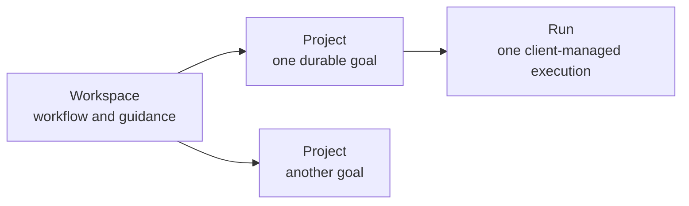
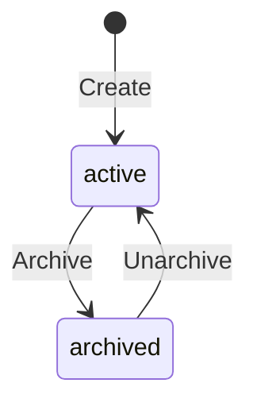
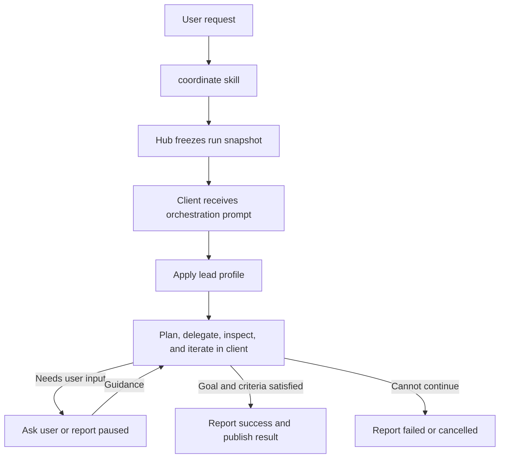
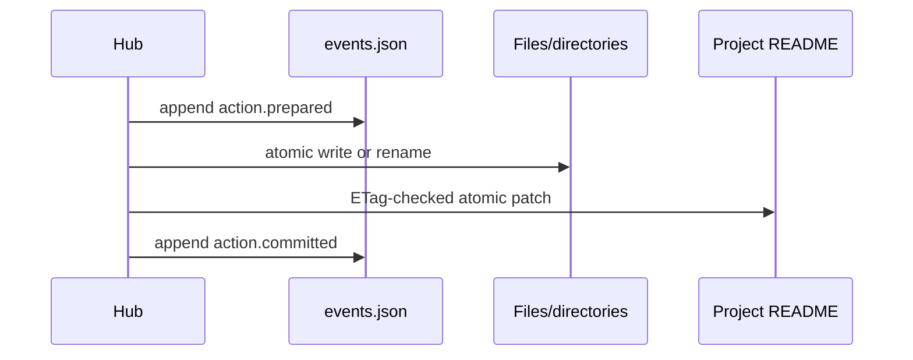
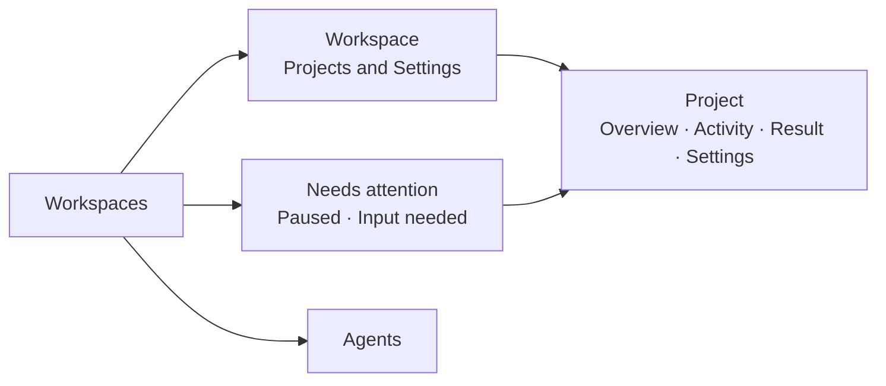
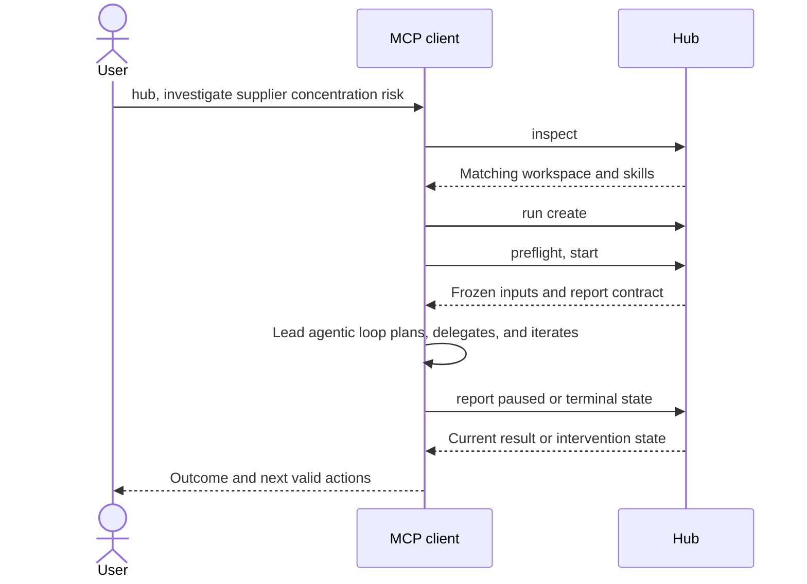

# Workspace Module Design

**Status:** Proposed
**Date:** 2026-07-19

## 1. Proposal

A workspace is one reusable way of doing work. It contains any number of similar
projects:

- **Investigations** is a workspace; each investigation is a project.
- **Presentations** is a workspace; each presentation is a project.



Here, **Run** is the workspace domain noun for one project execution. The existing MCP
`run` tool remains the generic way to invoke a module skill, such as `coordinate`; it is
not another workspace entity.

The Hub is a deterministic record keeper. Existing stateless agents execute in an MCP
client; the Hub freezes run inputs, records run-level checkpoints and outcomes,
publishes results, and exposes human controls in the web app. It does not run models or
a background scheduler.

The minimal v1 decisions are:

| Concern | Decision |
|---|---|
| Workspace configuration | Reuse `.okh/module.yaml` |
| Human-readable guidance | Use `README.md` |
| Project history and run state | One append-only `events.json` per project |
| Reproducible inputs | One immutable snapshot per run |
| Durable output | One immutable result per successful run |
| Agent coordination | Prompt the MCP client's own agentic loop |
| Human involvement | Client conversation or web guidance; restore/archive afterward |

There is no workspace state sidecar, project config sidecar, run journal, artifact
manifest, candidate-version system, approval queue, database, or workflow engine.

## 2. Files and authority

```text
investigations/
  .okh/
    module.yaml
  README.md
  projects/
    strategic-suppliers/
      README.md
      events.json
      runs/
        2026-07-19-001/
          snapshot/
          result/                 # present only after success
```

Client-writable staging lives outside the container:

```text
<okh-state>/workspace-staging/<container>/<module>/<project>/<run>/
```

Each file has one job:

| Path | Authority |
|---|---|
| `.okh/module.yaml` | Lead and agent pool |
| Workspace `README.md` | Shared guidance and acceptance rubric |
| Project `README.md` | Current project state, goal, and optional guidance |
| `events.json` | Project history, run checkpoints/outcomes, idempotency, and recovery |
| `runs/<id>/snapshot/` | Exact inputs frozen when the run starts |
| `runs/<id>/result/` | Complete immutable output of one successful run |

The project README is the canonical current projection. `events.json` explains how that
state was reached and enables safe retry and crash recovery; it is not a second editable
projection.

One project-level journal is enough for v1. Each run event identifies its run in the
CloudEvents `subject`. A terminal run event prohibits later events for that run, while
the project stream remains open for future runs, lifecycle changes, and result
restoration. Journal segmentation can be added later if measured file size requires it.

## 3. Workspace configuration

The existing module manifest already has the required extension point:

```yaml
type: workspace
description: Evidence-based investigations.
config:
  lead: coordinators/orchestrator
  agents:
    - researcher
    - research-agents/source-analyst
    - shared-hub/review-agents/evidence-checker
```

Only `lead` is required. `agents` is optional.

- `lead` supplies the orchestration behavior for the client agentic loop.
- `agents` is the pool of other profiles supplied for optional delegation.

The `agents` key is a workspace-local list of references resolved through existing
agents modules; it does not define another module type or copy agent profiles.

The pool determines which profiles the Hub supplies; it is not a security boundary, and
the Hub cannot prove what an external MCP client executes.

### Agent references

| Form | Resolution |
|---|---|
| `agent` | Unique agent with that ID in the current container |
| `module/agent` | Agent in that module of the current container |
| `container/module/agent` | Fully qualified agent |

The final segment is the filename-derived agent ID used by the existing agents module,
not mutable display `name`. An ambiguous bare reference fails with qualification
suggestions.

At run start, every reference resolves to canonical `{ container, module, id }`
identity. The Hub rejects missing, ambiguous, or duplicate canonical references and
snapshots the exact profile. The lead is always included in the coordination prompt and
need not be repeated in `agents`.

### Customization without more schema

Workspace purpose comes from its module folder, description, README guidance, and agent
selection. Project-specific detail uses ordinary Markdown sections. The UI consistently
calls each item a **Project**.

The manifest `description` is also a routing hint. It should use the nouns and verbs a
person is likely to say, such as "investigate evidence-based questions" or "create and
refine presentations."

V1 deliberately has no configuration for:

- project kind or UI labels;
- sorting;
- acceptance criteria;
- execution mode or oversight;
- task, retry, turn, or cost limits;
- agent roles other than lead; or
- retrospectives and learning.

Sorting is a remembered user preference. The initial sort is `updatedAt` descending;
presentations can use `targetDate` ascending without changing workspace configuration.
Execution budgets use the MCP client's native limits rather than a second Hub policy.

## 4. README contract

### Workspace `README.md`

The root README is both the GitHub-friendly overview and the shared instructions:

```markdown
# Investigations

Use primary evidence, distinguish facts from assumptions, and preserve unresolved
questions.

## Working guidance

- Start with primary sources.
- Record contrary evidence.
- State uncertainty instead of inventing precision.

## Acceptance

- Material claims cite primary or authoritative sources.
- Viable alternatives are compared consistently.
- The conclusion states tradeoffs and unresolved risks.
```

### Project `README.md`

```markdown
---
title: Strategic supplier investigation
status: active
createdAt: 2026-07-19T18:30:00Z
updatedAt: 2026-07-19T18:30:00Z
targetDate: 2026-08-15
tags: [sourcing, strategy]
activeRun: null
result: null
---

## Goal

Recommend two suppliers with evidence, risks, and open questions.

## Guidance

Prefer filings and direct supplier documentation over market summaries.

## Acceptance

- Cover both North America and Europe.
```

Required frontmatter:

- `title`;
- `status`, either `active` or `archived`;
- `createdAt` and `updatedAt`;
- `activeRun`, either `null` or a run ID; and
- `result`, either `null` or a safe relative path such as
  `runs/2026-07-19-001/result`.

Optional frontmatter is limited to:

- `targetDate` as `YYYY-MM-DD`; and
- normalized lowercase kebab-case `tags`.

The project folder name is its immutable lowercase kebab-case ID and is not repeated in
frontmatter. Only `## Goal` is required in the Markdown body. All other headings are
workflow-specific.

### Acceptance rubric

The workspace must contain at least one top-level bullet under `## Acceptance`. A
project may add more. Every listed criterion is required.

At run start, the Hub snapshots the exact criterion text and assigns simple run-local
IDs in source order, such as `workspace-1` and `project-1`. The lead's final integration
reports evidence for every criterion. Unmet criteria keep the client loop working or
cause a pause when it can no longer make credible progress.

Acceptance is therefore a work rubric, not a separate YAML schema or human approval
record. The Hub validates criterion IDs, coverage, evidence references, and result
hashes; it does not claim that an agent's semantic judgment is correct.

### Source-preserving edits

The Hub reuses the current Markdown/frontmatter parser and the source-preserving edit
pattern used by todos:

1. Re-read the file and verify its SHA-256 ETag.
2. Patch only selected frontmatter fields or heading content.
3. Validate the complete result.
4. Atomically replace the file.

The Hub owns `status`, timestamps, `activeRun`, and `result`. A user may edit the title,
target date, tags, goal, guidance, acceptance additions, and arbitrary workflow sections.
Unrelated Markdown is never regenerated.

## 5. Project lifecycle

Projects have one binary lifecycle:



| Action | Rule |
|---|---|
| Create | Creates an active project with no run or result |
| Continue | Starts a new run when the project is active and has no active run |
| Resume | Continues the exact run named by `activeRun` |
| Archive | Changes an active project to archived when no run is active |
| Unarchive | Returns an archived project to active |

Each project has at most one active run. Multiple projects may run independently.
Archived projects are hidden and frozen. There is no completed state; dates and
successful runs never change project status automatically.

Create builds the complete project directory, including README and the initial
`project.created` event, in a sibling temporary directory and atomically renames it.
That first event stores the create command ID and argument hash. If the target already
exists, the same pair returns the existing project; a different command or arguments
conflict.

The finite workspace loader scans README frontmatter, then filters, sorts, and paginates
in memory. Supported sort fields are `targetDate`, `createdAt`, `updatedAt`, and `title`.
Missing target dates sort last and project ID breaks ties. V1 targets hundreds, not
millions, of projects.

## 6. Client-managed coordination

The Hub starts and records a run; the MCP client's own agentic loop manages it:



Before starting or resuming agent execution, the client proves that it can read and
write the external staging area. A failed preflight creates no new run and leaves an
existing run unchanged.

The `coordinate` skill supplies one orchestration prompt containing:

- the frozen workspace and project guidance;
- the goal, acceptance criteria, and current result;
- the lead profile and optional agent-pool profiles;
- the run ID, staging path, and result constraints; and
- the run-level report contract.

That prompt instructs the client LLM to:

1. Apply the lead profile to plan and integrate the work.
2. Delegate to supplied agent profiles when useful, using native subagents when
   available and inline fallback otherwise.
3. Inspect agent outputs and iterate in the client's own context.
4. Ask the user directly when clarification or judgment is needed.
5. Stop when the client's native budget is reached or progress is no longer credible.
6. Write one complete result to staging and report the run state to the Hub.

This reuses the existing
[agents module client contract](2026-07-16-agents-module-design.md): use a native
subagent when the client supports one, or apply the same profile in the parent context
otherwise. Neither mode implies process isolation.

Plans, delegated tasks, retries, model turns, and agent transcripts are client-internal;
they are not Hub entities or events. The Hub therefore does not duplicate the client's
scheduler, retry policy, or token/cost budget and does not claim to audit hidden
reasoning.

The client reports only run-level states:

```text
paused | succeeded | failed | cancelled
```

A paused report includes a concise summary, relevant staged paths, and the question or
blocker for the human; it never contains hidden reasoning. Guidance may come from the
same client conversation or the web app. A successful report includes criterion
evidence and the staged result. The Hub validates structure, paths, hashes, and state
transitions, not semantic quality.

A successful run automatically makes its result current. The project remains active, so
one project may have any number of successful runs before it is archived.

## 7. Events and recovery

`events.json` is a CloudEvents 1.0 JSON batch:

```json
[
  {
    "specversion": "1.0",
    "id": "2b7ce542-b724-43ab-9f18-4ec64337a076",
    "source": "okh://main/investigations/projects/strategic-suppliers",
    "type": "dev.okh.workspace.run.start.prepared",
    "subject": "runs/2026-07-19-001",
    "time": "2026-07-19T18:42:00.000Z",
    "datacontenttype": "application/json",
    "sequence": 4,
    "okhcommandid": "9c7f6765-81db-490d-a4f0-bdf45d2cda57",
    "data": {
      "expectedProjectEtag": "sha256:..."
    }
  }
]
```

The standard envelope supplies identity, source, subject, time, type, content type, and
data. OKH adds only a contiguous `sequence`, `okhcommandid` for retry correlation, and
event-specific data schemas.

Run-scoped events use `runs/<run-id>` as `subject`. The successful terminal event also
records result publication. Later lifecycle and result-restoration events are
project-scoped and mention prior runs only in `data`, so they never append to a terminal
run.

The stream records:

- project creation, edits, archive, and unarchive;
- run start, pause checkpoints, human guidance, and terminal outcome;
- snapshot and result hashes; and
- result publication at successful run completion and later restoration.

Prior event bytes never change. Appending copies them byte-for-byte into a sibling
temporary file, writes the new event and closing array delimiter, flushes, and atomically
renames the file. A server file-size limit prevents unbounded replay.

### One transaction pattern

Every multi-file mutation uses the same protocol:



The prepared event contains the expected preimages and exact target hashes for every
step. Recovery replays an unfinished transaction by checking both states:

- before an authoritative file change, it may append `action.aborted`;
- a target hash means that step already succeeded and is skipped;
- an expected preimage means that step is applied;
- after any authoritative file change, remaining steps always roll forward; and
- a conflicting hash, unsafe path, malformed event, or impossible transition blocks
  mutation visibly.

The same pattern covers run start, successful run finish with result publication, other
run finishes, result restoration, and lifecycle changes. Project creation is simpler
because the whole new directory is assembled and renamed atomically.

Every mutation has a command ID. Repeating the same command and arguments returns its
recorded outcome; reusing the ID with different arguments conflicts.

### Hashes

- File ETags cover exact bytes with SHA-256.
- Result tree hashes cover RFC 8785 canonical JSON of the path-sorted
  `{ path, size, sha256 }` array.
- Snapshot events record the hash of every frozen source file.

## 8. Runs, snapshots, and results

At run start, `snapshot/` receives exact write-once copies of:

- the workspace module manifest;
- the workspace README;
- the project README; and
- every resolved agent profile.

The start transaction creates the complete run directory, sets project `activeRun`, and
commits the snapshot hashes. Live config, guidance, or profile edits affect future runs
only.

The client agentic loop uses external staging as scratch space while the run is active.
Staging survives a server restart on the same machine but is not container content and
never syncs. The Hub records no client-internal work graph or transcript.

When the client reports success, the Hub:

1. Validates the active run, report schema, acceptance evidence, and output limits.
2. Reads files without following links and revalidates opened handles where supported.
3. Copies the complete output into a sibling temporary result directory.
4. Atomically renames it to `runs/<run>/result`.
5. Sets project `result` to that relative path and clears `activeRun`.
6. Commits the result tree hash and terminal run event.

A failed or cancelled run clears `activeRun` without creating a result. The previous
project result remains current.

Each successful run contributes one immutable result. Comparing or restoring a result
uses prior successful run directories; candidate versions and artifact manifests are
unnecessary.

The successful terminal event stores the result's path-sorted file array and tree hash.
Result comparison diffs those recorded arrays and reads selected changed text files only
when a content diff is requested; it creates no separate manifest.

Restore is allowed only when the project is active, no run is active, and the current
result still matches the expected path and tree hash. The user selects a specific prior
successful result, and the normal transaction protocol changes the README pointer to
that path. Result directories are never mutated or deleted by restore.

### Continue versus resume

- **Resume** reconstructs the orchestration prompt from the frozen snapshot, staging,
  latest durable checkpoint, and later guidance for the run in `activeRun`.
- **Continue** starts a new run from current snapshots, the current result, and an
  optional human correction.

Neither operation depends on prior chat history or hidden model reasoning. After an
unexpected client exit, resume may repeat client-internal work; immutable result
publication and command idempotency keep that retry safe.

## 9. Tool and client boundary

One deterministic MCP tool is sufficient:

```text
workspace {
  operation:
    list | create | status | preflight | start | report | update | intervene
  action?
  state?
  filters?
  include?
  container
  module
  project?
  ...
}
```

| Operation | Purpose |
|---|---|
| `list` | Filter, sort, and page projects, including archived or needs-attention views |
| `create` | Create one project |
| `status` | Return current state plus optional resume inputs or result history |
| `preflight` | Prove access to external staging |
| `start` | Start a run and return frozen coordination inputs |
| `report` | Record a paused or terminal state; publish a successful result |
| `update` | Archive, unarchive, or restore a project |
| `intervene` | Add guidance to a paused run or cancel any active run |

`update.action` is `archive | unarchive | restore`.
`intervene.action` is `guide | cancel`.
`report.state` is `paused | succeeded | failed | cancelled`. Each transition accepts
only its relevant fields and validates the current ETag and state.
`start` accepts optional continuation-correction text.

`list` may filter project lifecycle status and `attention: true`; attention means the
latest active-run boundary is a pause with no later guidance. `status` may include:

- `resume`: the run ID, frozen inputs, staging path, latest checkpoint, and later
  guidance for `activeRun`; and
- `results`: prior successful run IDs, timestamps, result paths, and tree hashes.

Result entries use the existing module-file resource template to expose their files; no
separate history or artifact-browsing operation is needed.

`start` returns the run ID, staging path, expected report schema, and frozen inputs as
embedded content or MCP `resource_link` values. The `coordinate` skill combines those
inputs with its orchestration instructions and hands the resulting prompt to the
client's agentic loop.

The server never calls a model. The `coordinate` skill checks `status` with the resume
package and preflights the current client first. If `activeRun` exists, it rebuilds the
prompt from that package; otherwise it calls `start`. Resuming a paused run records the
current user request through `intervene: guide` before execution. After the client loop
yields, `coordinate` calls `report` only for a paused or terminal state.

`update: archive` and `update: unarchive` change project lifecycle status;
`update: restore` changes the current result pointer. They share one operation because
all are project-level mutations that require no active run. `intervene: cancel`
terminalizes the Hub run and rejects late reports, but it cannot stop an MCP client
process that is still executing.

Built-in skills remain small:

- `initialize` creates the manifest and workspace README;
- `configure` updates lead, agents, guidance, or acceptance;
- `create` gathers a goal and creates one project; and
- `coordinate` starts or resumes coordinated work.

Project lifecycle and intervention requests call `update` or `intervene` directly after
the client resolves the workspace and project.

## 10. Human and web experience

There is no formal review entity. Human control is expressed through project actions and
run interventions:



### Workspaces

`/workspaces` shows description, project count, active runs, attention count, nearest
target date, agent-reference validity, and sync state.

### Workspace detail

`/workspaces/:container/:module` provides:

- **New project**;
- status, archive, tag, target-date, and text filters;
- user-remembered sorting;
- Archive and Unarchive actions; and
- settings for lead, agent pool, guidance, and workspace acceptance.

Target-date sorting places missing dates last. Past dates are highlighted but never
change project state.

### Project detail

| Tab | Content |
|---|---|
| Overview | Goal, guidance, lifecycle, and current state |
| Activity | Run checkpoints, human guidance, outcomes, and history |
| Result | Current/prior results, diff, criterion evidence, and Restore |
| Settings | Source-preserving README edits |

Activity offers Cancel for any active run and explains that this closes the Hub record
but cannot terminate an MCP client process.

Inspecting a result creates no durable "reviewed" state. If it needs work, the user edits
project guidance or tells an MCP client to continue with a correction. If it should not
be current, the user restores a specific prior result. Archiving is the only project
lifecycle action for work that should no longer remain active.

### Needs attention and agents

**Needs attention** aggregates only active runs waiting for human action. Its panels show
the recorded checkpoint and offer guidance or cancellation; there is no global
approval/review queue.

`/agents` browses existing profiles, canonical identities, and workspace references.
Workspace settings select one lead and maintain the optional agent pool for future runs;
they never edit profile files or active snapshots.

Runs start and resume only from an MCP client, because that client executes the agents.
The web app has no Start, Continue, or Resume-run button.

The frontend route registry must support validated parameterized routes. Invalid IDs
render not-found. Web mutations are same-origin; equivalent MCP lifecycle or
intervention calls require an explicit user request and use the same service,
preconditions, and command IDs. `web:local` and `mcp:user-request` are audit labels, not
verified identities. Controls expose state and disabled reasons accessibly.

## 11. Usage from an MCP client

The default Hub wake phrase is `hub`; users may configure another. Workspace requests
follow the same routing rule as existing Hub requests: when addressed, the client calls
`inspect` first and routes through the selected module's skills and tools.

### Natural-language routing contract

The client resolves an explicit `container/module/project` reference directly.
Otherwise it:

1. Inspects live containers and modules.
2. Matches a workspace by module name and description.
3. Resolves an existing project by ID or unique title match.
4. Asks one clarification when a workspace or project is ambiguous.
5. Uses the user's verb to distinguish create, resume, continue, and lifecycle changes.

The client never guesses between multiple matching workspaces and never creates a second
project when the request refers to an existing one.

A user may disambiguate directly:

> hub, continue `Work/investigations/supplier-concentration-question` with the latest
> filings.

| User intent | Hub routing |
|---|---|
| "Set up an Investigations workspace" | `add_module` workflow, then workspace `initialize` |
| "Configure Investigations to use..." | Workspace `configure` skill |
| "Create an investigation for later" | Workspace `create` skill only |
| "Investigate..." or "start a new presentation..." | Create a project, then `coordinate` |
| "Resume..." | Continue the existing `activeRun` through `coordinate` |
| "Continue... with..." | Start a new run from the current result plus correction |
| "Archive", "unarchive", "reopen", or "restore" | `workspace` with `operation: update` |
| "Use this guidance" for a paused run, or "cancel" an active run | `workspace` with `operation: intervene` |
| "What needs attention?" | `workspace` with `operation: list`, `attention: true` |
| "Show result history" | `workspace` with `operation: status`, including `results` |
| "List", "find", or "show status" | `workspace` with `operation: list` or `status` |



### Example A: Set up and configure a workspace

> hub, add an Investigations workspace to my Work container. Use the orchestrator as
> lead, include the researcher and evidence-checker in its agent pool, and require
> primary sources, explicit alternatives, and unresolved risks.

The client:

1. Calls `inspect` to resolve the Work container and agent references.
2. Starts the existing `add_module` workflow with `type: workspace` and a proposed
   `investigations` path.
3. Shows the normal add-module plan and waits for confirmation.
4. Creates the module, then runs its `initialize` skill with the requested config,
   guidance, and `## Acceptance` bullets.
5. Validates the new workspace and syncs its container.

The result is still only:

```text
investigations/
  .okh/module.yaml
  README.md
  projects/
```

Later configuration uses the workspace skill rather than another metadata file:

> hub, configure Investigations to add the market-analyst agent and require an explicit
> confidence statement.

The `configure` skill presents the exact manifest/README changes, applies them after any
required confirmation, validates agent resolution, and syncs. The same values remain
editable in the web Settings page.

### Example B: Create a project or start new work

To create a project without starting agents:

> hub, create an investigation for the supplier concentration question so I can work on
> it later. Target August 15, 2026 and tag it sourcing.

The client resolves the Investigations workspace, proposes
`supplier-concentration-question` as the immutable project ID, runs the workspace
`create` skill, and syncs. It asks only if routing or required goal details are unclear.

An imperative workflow request means create **and** start:

> hub, investigate supplier concentration risk in North America and Europe and recommend
> two resilient alternatives.

The client creates a project from that goal, preflights staging, and runs `coordinate`
until success or intervention.

If a likely matching project already exists, it reports that project and asks whether to
resume/continue it or create a distinct project.

The same routing works for another workspace:

> hub, start a new presentation on the Q3 roadmap for the July 30, 2026 leadership
> meeting.

The client resolves the Presentations workspace, creates a project with
`targetDate: 2026-07-30`, then coordinates its first run. If more than one workspace
matches "presentations," it asks which one instead of choosing silently.

### Example C: Resume or continue

Resume means an active run already exists:

> hub, resume the supplier concentration investigation.

The client resolves the project, calls `status` including the resume package, preflights
the current client, records the resume request as guidance when needed, and re-enters
the client agentic loop without calling `start` or creating a new snapshot.

Continue means the prior run is terminal and a new run is wanted:

> hub, continue the supplier concentration investigation. Add direct evidence from the
> latest filings and make the regional tradeoffs explicit.

The client verifies that no run is active, calls `start` with the correction text, and
coordinates a new run from the current result and fresh snapshots.

If the user says "continue" while a run is active, the client reports that state and asks
whether to resume it or cancel it; it never starts a second run.

If the project is archived, the client reports that state and requires unarchive before
starting.

### Example D: Unarchive, iterate, and handle intervention

People commonly say "reopen"; for an archived project, that means unarchive:

> hub, reopen the supplier concentration investigation.

This calls `workspace` with `operation: update` and `action: unarchive`. To unarchive and
immediately do more work, the user can compose both intents:

> hub, reopen the supplier concentration investigation and continue it with the latest
> regulatory changes.

The client unarchives the project, then starts and coordinates a new run. If the project
is already active, it reports that state and treats "reopen" as a request to continue
only after confirming the intent.

An intervention can also be handled entirely from the client:

> hub, what workspace work needs attention?

> hub, retry the supplier investigation with this guidance: treat distributor data as
> provisional and document the uncertainty.

The first request lists waits. The second resolves the waiting run, calls
`workspace` with `operation: intervene` and `action: guide`, and resumes `coordinate`.
Cancel requests use the same project resolution but may target any active run. The web
**Needs attention** view invokes the same deterministic actions.

### Example E: Archive and restore

> hub, archive the supplier concentration investigation.

> hub, unarchive the supplier concentration investigation.

Each prompt resolves the project and calls `workspace` with the matching `update` action.
Archive requires no active run and is the only way to set aside finished or inactive
work. Unarchive always returns the project to active.

To roll back an automatically published result:

> hub, show the result history for the supplier concentration investigation.

> hub, restore the result from run `2026-07-19-001`.

The client lists immutable successful results, resolves the requested run, and calls
`workspace` with `operation: update` and `action: restore`. It changes only the current
result pointer.

For Git containers, client-driven configuration, creation, lifecycle, restore, and
intervention actions sync after the completed user request. `coordinate` syncs at human
waits and terminal outcomes.

## 12. Safety and OKH integration

### Concurrency and recovery

Workspace writes reuse the existing hub-wide container mutation lock rather than adding
a workspace-specific lock. Hub-managed module, workspace, todo, and sync writes
serialize; sync holds the lock through validation, staging, commit, and push.

The lock is not held while an MCP client runs its agentic loop. A later report
revalidates the project ETag, run state, output paths, and hashes. Projects therefore
execute independently, while their short durable writes may queue behind another Hub
mutation. Per-container lock partitioning is deferred unless measured contention
justifies it.

Required invariants:

- user-visible files use sibling temporary write, flush, and atomic rename;
- snapshots and results are complete before an event references them;
- old event bytes and result directories never change;
- a terminal run rejects later run-scoped events;
- archived projects cannot start work;
- one project cannot have two active runs; and
- invalid state stops visibly instead of being repaired heuristically.

### Reuse

- Existing `.okh/module.yaml` and arbitrary `config`.
- Existing module discovery and finite loader.
- Markdown/YAML frontmatter and source-preserving edit patterns.
- Existing agents loader, canonical identity, and `.agent.md` support.
- Existing `use_agent` response and `resource_link` conventions.
- Generic module skills and container sync/PR workflow.
- Loopback web security and MCP App patterns.
- Existing YAML, Zod, and Node crypto dependencies.

### Add

- The `workspace` built-in module type and validators.
- `WorkspaceService`.
- Workspace `initialize`, `configure`, `create`, and `coordinate` skills with
  wake-phrase routing guidance.
- CloudEvents batch validation and byte-preserving atomic append.
- Workspace/project/attention/agent web views.
- Safe parameterized frontend routes.

### Do not add

- Another workspace or project config file.
- Separate project and run journals.
- Database, queue, scheduler, or server-side model runner.
- Persisted plans, tasks, attempts, claims, or client transcripts.
- Persisted collection index.
- Candidate artifact versions or manifests.
- Formal review, approval, or agent-role subsystem.
- Custom agent format.
- Project-type-specific code.

Sync commits the whole container. Useful boundaries are project lifecycle or
intervention changes and run-level pauses or terminal outcomes. External staging and
user UI preferences never sync.

## 13. Delivery and deferred work

1. **Projects:** module config, README parsing/editing, events, lifecycle, listing, and
   MCP routing/skills, and read-only web pages.
2. **Runs:** snapshots, coordination prompts, staging, pause/terminal reports, results,
   recovery, resume, continue, and restore.
3. **Web controls:** workspace settings, project actions, Needs attention, result
   comparison, agents, routing, accessibility, and sync integration.

Deferred until a demonstrated need:

- retrospectives and automated learning;
- automatic local or Copilot SDK runner;
- calendar and recurring projects;
- notifications;
- journal segmentation and persistent external indexing;
- binary deduplication or remote result storage;
- remote multi-host active-run execution; and
- web agent authoring.

## 14. Essential validation

The implementation must prove:

- minimal config, agent-reference, and README validation;
- source-preserving edits and ETag conflicts;
- lifecycle and archive transitions;
- wake-phrase routing for create, start, resume, continue, update, and intervention;
- lifecycle/attention filtering, pagination, and remembered sorting;
- preflight before run creation;
- exact replay after restart;
- transaction recovery at every crash boundary;
- CloudEvents schema, sequence, command replay, and terminal-run enforcement;
- deterministic coordination-prompt composition from frozen inputs;
- pause, guidance, success, failure, and cancellation report transitions;
- client-only run initiation and the status/preflight start-versus-resume branch;
- resume-package and result-history retrieval without a new run;
- cancellation of active runs and rejection of late client reports;
- snapshot stability when source files later change;
- staging isolation and missing-staging failure;
- result path safety, deterministic tree hashes, publication, comparison, and restore;
- acceptance extraction, criterion IDs, and final lead evidence coverage;
- container write/sync serialization;
- safe parameterized routes and accessible state-aware controls; and
- absence of server-side model or background agent execution.

## 15. Standards and references

| Concern | Convention |
|---|---|
| Module identity/config | Existing OKH `.okh/module.yaml` |
| Human-readable content | `README.md` with YAML frontmatter |
| Agent profiles | GitHub Copilot `.agent.md` |
| Operational history | CloudEvents 1.0 JSON batch |
| Canonical structured hashing | RFC 8785 JSON Canonicalization Scheme |
| Time | ISO 8601 |
| Integrity/concurrency | SHA-256 ETags and atomic replace |

References:

- [CloudEvents specification](https://github.com/cloudevents/spec)
- [CloudEvents JSON format](https://github.com/cloudevents/spec/blob/v1.0/json-format.md)
- [RFC 8785 JSON Canonicalization Scheme](https://www.rfc-editor.org/rfc/rfc8785)
- [Jekyll front matter](https://jekyllrb.com/docs/front-matter/)
- [Hugo front matter](https://gohugo.io/content-management/front-matter/)
- [Anthropic, Building effective agents](https://www.anthropic.com/engineering/building-effective-agents)
- [OpenAI Agents SDK human-in-the-loop](https://openai.github.io/openai-agents-python/human_in_the_loop/)
- [Microsoft AutoGen human-in-the-loop](https://microsoft.github.io/autogen/stable/user-guide/agentchat-user-guide/tutorial/human-in-the-loop.html)
- [Agent2Agent Protocol, Life of a Task](https://a2a-protocol.org/latest/topics/life-of-a-task/)
- [Microsoft Guidelines for Human-AI Interaction](https://www.microsoft.com/en-us/research/project/guidelines-for-human-ai-interaction/)
- [NIST AI RMF Generative AI Profile](https://doi.org/10.6028/NIST.AI.600-1)

BPMN, CWL, Temporal, LangGraph, hosted tracing, and worker fleets are intentionally not
adopted. They solve broader execution problems at the cost of another runtime and more
metadata than this module needs.
