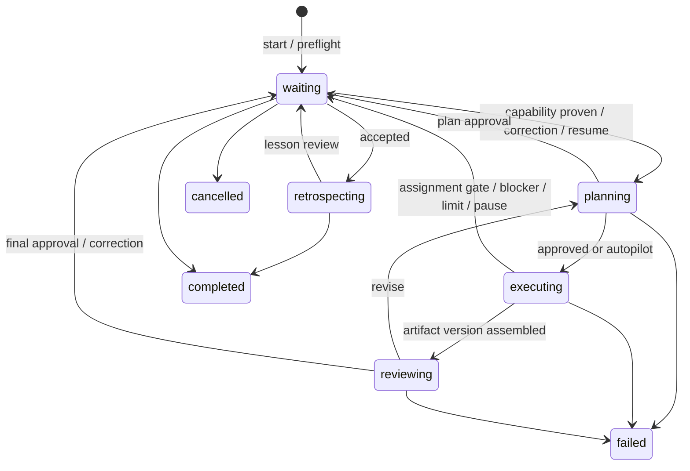

# Minimal Workspace Collections

**Status:** Proposed
**Date:** 2026-07-19

## 1. The proposal in one minute

A workspace is one reusable way of doing work. It contains many projects:

- **Investigations** is a workspace; each investigation is a project.
- **Presentations** is a workspace; each presentation is a project.

The durable hierarchy is:

```text
Workspace -> Project -> Run -> Assignment
```

The Hub coordinates. Existing stateless agents execute in the MCP client. People manage
projects and approve consequential steps in the web app.

The design follows four rules:

1. **Use `README.md` everywhere people read or edit prose.**
2. **Reuse `.okh/module.yaml` for workspace configuration.**
3. **Use CloudEvents JSON for operational history.**
4. **Store snapshots and artifacts as ordinary files.**

There is no workspace sidecar, project YAML sidecar, state cache, assignment sidecar,
artifact database, blob store, or lesson directory.

## 2. The whole file structure

```text
investigations/
  .okh/
    module.yaml
  README.md
  projects/
    strategic-suppliers/
      README.md
      project.json
      runs/
        2026-07-19-001/
          run.json
          snapshot/
          artifacts/
            1/
            2/
```

Client-writable staging lives outside the container and is not shown.

Only four things need explanation:

| Path | Purpose | Who writes it |
|---|---|---|
| `.okh/module.yaml` | Workspace workflow, team, limits, and list behavior | Existing config flow / web settings |
| `README.md` | Human-readable workspace or project content | User/agent for content; Hub for governed state |
| `project.json` | Small project-lifetime event journal | Hub only |
| `run.json` | One bounded run's event journal | Hub only |

`snapshot/` and `artifacts/` are content directories, not metadata systems.

### Why `project.json` remains

A run becomes immutable when it finishes, but some actions happen later:

- accepting or undoing an artifact version;
- completing, reopening, archiving, or unarchiving a project;
- recording run start/finish recovery; and
- accepting, rejecting, or promoting a lesson.

Those events need one project-lifetime journal. Removing it would either mutate terminal
runs or make local, non-Git projects unauditable. It is deliberately low volume.

## 3. Workspace configuration and customization

The existing module manifest already has a type-specific `config` map:

```yaml
type: workspace
description: Evidence-based investigations with human review.
config:
  version: 1

  projectKind:
    singular: investigation
    plural: investigations

  defaultSort:
    field: updatedAt
    direction: desc

  acceptance:
    - id: credible-evidence
      description: Material claims cite primary or authoritative sources.
      required: true
    - id: alternatives
      description: Viable alternatives are compared consistently.
      required: true
    - id: decision
      description: The conclusion states tradeoffs and unresolved risks.
      required: true

  team:
    members:
      lead:
        container: shared-hub
        module: team-agents
        id: orchestrator
      researcher:
        container: shared-hub
        module: team-agents
        id: research-synthesizer
      reviewer:
        container: shared-hub
        module: team-agents
        id: evidence-reviewer
    roles:
      coordinator: lead
      planner: lead
      executors: [researcher]
      reviewer: reviewer
      retrospector: reviewer

  oversight: supervised

  limits:
    maxIterations: 3
    maxExecutionAssignments: 20
    maxAttemptsPerAssignment: 2

  learning:
    enabled: true
    minProjectsForWorkspacePromotion: 2
```

The manifest stays a normal OKH manifest. The workspace loader validates `config` with a
type-specific Zod schema before listing, starting, or editing work.

### Different project types without different code

A presentation workspace changes configuration, not the storage model:

```yaml
config:
  version: 1
  projectKind:
    singular: presentation
    plural: presentations
  defaultSort:
    field: targetDate
    direction: asc
  # presentation team, criteria, oversight, limits, and learning follow
```

Types customize:

- singular/plural labels;
- default sorting;
- agent team and role bindings;
- acceptance criteria;
- oversight and execution limits; and
- human guidance in the workspace README.

Project Markdown may add any headings useful to that workflow. An investigation might
add `Evidence` and `Open questions`; a presentation might add `Audience`, `Narrative`,
and `Delivery notes`. The Hub does not invent a schema for prose.

V1 keeps a small universal metadata set. If a future workflow needs searchable custom
fields, that should be a separate JSON Schema proposal backed by a demonstrated use case.

## 4. One README convention

### Workspace `README.md`

The root README is both the GitHub-friendly overview and shared guidance:

```markdown
# Investigations

Use primary evidence, distinguish facts from assumptions, and preserve unresolved
questions.

## Project conventions

Investigation projects normally include Evidence, Alternatives, and Open questions.

## Working guidance

- Start with primary sources.
- Record contrary evidence.
- State uncertainty instead of inventing precision.
```

### Project `README.md`

Each project has one Markdown record:

```markdown
---
title: Strategic supplier investigation
description: Compare suppliers for the next sourcing cycle.
status: active
createdAt: 2026-07-19T18:30:00Z
updatedAt: 2026-07-19T18:30:00Z
targetDate: 2026-08-15
tags: [sourcing, strategy]
activeRun: null
accepted: null
acceptance:
  - id: geography
    description: Cover North America and Europe.
    required: true
---

## Goal

Recommend two suppliers with evidence, risks, and open questions.

## Brief

Compare the shortlisted suppliers for the next sourcing cycle.

## Guidance

Prefer filings and direct supplier documentation over market summaries.
```

Required frontmatter:

- `title`, `description`, `status`, `createdAt`, and `updatedAt`;
- `activeRun`, either `null` or a run ID; and
- `accepted`, either `null` or `{ run, version, treeHash }`.

Optional frontmatter:

- `targetDate` as `YYYY-MM-DD`;
- normalized lowercase kebab-case `tags`;
- additive project acceptance criteria; and
- lifecycle timestamps `completedAt` and `archivedAt`; and
- `archivedFrom`, whose value is `active` or `completed`.

`Goal` and `Brief` are required headings. Everything else is ordinary customizable
Markdown.

The project folder name is its lowercase kebab-case ID. It is not repeated in
frontmatter.

### Editing

The service reuses the current Markdown/YAML frontmatter parser and the source-preserving
edit pattern used by todos:

1. re-read the file;
2. verify its SHA-256 ETag;
3. patch only known fields or selected heading content;
4. validate the result; and
5. atomically replace the file.

Unrelated Markdown is never regenerated.

README frontmatter is the canonical current project state. `project.json` is its audit,
idempotency, and multi-file transaction journal, not a second state projection.

`updatedAt` is the only denormalized convenience field. If a crash leaves it behind a
committed event, recovery repairs it.

The Hub exclusively writes `status`, `createdAt`, `updatedAt`, `activeRun`, `accepted`,
`completedAt`, `archivedAt`, and `archivedFrom`. Direct edits may change title,
description, target date, tags, acceptance, and Markdown content after ETag validation.
An unexplained disagreement between governed fields and the last committed project event
blocks mutation.

## 5. Projects and runs

### Project lifecycle

| Status | Start run | Resume run | Edit | Default list |
|---|---|---|---|---|
| `active` | When `activeRun` is null | Yes | Yes | Shown |
| `completed` | Reopen first | No | Metadata only | Shown |
| `archived` | No | No | Unarchive only | Hidden |

Actions:

- **Create** creates an active project with no runs.
- **Continue** starts a new run using accepted artifacts and current guidance.
- **Resume** continues the exact run in `activeRun`.
- **Complete** marks a project complete after its run is terminal.
- **Reopen** returns a completed project to active.
- **Archive** hides and freezes a project; no active run is allowed.
- **Unarchive** restores `archivedFrom`, defaulting to active.

Dates never change status automatically.

Create builds the complete project directory, including README and the initial
`project.created` event, in a sibling temporary directory and atomically renames it.
Retry with the same command ID returns the created project; different content conflicts.

### Multiple projects

One workspace may contain any number of projects. Multiple projects may run at the same
time, but each project has at most one active run and one claimed assignment.

The existing finite loader scans project README frontmatter. The workspace tool filters,
sorts, and paginates that result. V1 targets hundreds, not millions, of projects. No
committed index or cache is added.

Supported sort fields are `targetDate`, `createdAt`, `updatedAt`, and `title`. Missing
target dates sort last; project ID breaks ties.

## 6. Standard event records

`project.json` and `run.json` are CloudEvents 1.0 JSON batches:

```json
[
  {
    "specversion": "1.0",
    "id": "2b7ce542-b724-43ab-9f18-4ec64337a076",
    "source": "okh://main/investigations/projects/strategic-suppliers",
    "type": "dev.okh.workspace.run-start.prepared",
    "subject": "runs/2026-07-19-001",
    "time": "2026-07-19T18:42:00.000Z",
    "datacontenttype": "application/json",
    "sequence": 4,
    "okhcommandid": "9c7f6765-81db-490d-a4f0-bdf45d2cda57",
    "data": {
      "runId": "2026-07-19-001",
      "expectedProjectEtag": "sha256:..."
    }
  }
]
```

The standard envelope supplies ID, source, type, subject, time, content type, and data.
OKH adds only:

- contiguous `sequence`;
- `okhcommandid` for retry correlation; and
- event-specific `data` schemas.

Event IDs use `crypto.randomUUID()`. Event and file integrity use SHA-256.

Hash preimages are deterministic:

- a file hash covers its exact bytes;
- `eventHash` covers the RFC 8785 canonical JSON serialization of one CloudEvent;
- a review hash is its review event's `eventHash`; and
- `treeHash` covers RFC 8785 canonical JSON of the path-sorted
  `{ path, size, sha256 }` array.

### Project journal

`project.json` records only project-lifetime events:

- create and lifecycle transitions;
- README transactions;
- run start and finish;
- accepted-version changes and undo; and
- lesson dispositions and promotions.

It remains writable for the life of the project.

### Run journal

`run.json` records one bounded run:

- source snapshot hashes;
- assignments, claims, attempts, and results;
- plans, candidate versions, reviews, and corrections;
- human decisions and limits;
- retrospective and lesson proposals; and
- one terminal outcome.

After its terminal event, the run journal is immutable.

### Atomic append

Under the shared container writer, the Hub validates the current batch and ETag, copies
prior bytes except the closing array delimiter unchanged to a sibling temporary file,
writes a comma when the batch is non-empty, writes the new event and closing delimiter,
flushes, and atomically renames the file.

Prior event bytes are never parsed and re-emitted. Temporary files have no authority.
Run limits and a server file-size limit keep replay bounded.

## 7. Starting and finishing a run

### Start

1. Append `run-start.prepared` to `project.json` with the generated run ID, command ID,
   expected project ETag, and accepted base.
2. Create the complete run in a sibling temporary directory.
3. Write the snapshot and first `run.json` event.
4. Atomically rename the run directory.
5. Patch project `activeRun` and `updatedAt`.
6. Append `run-start.committed`.

A valid prepare rolls forward during recovery. A prepare that cannot safely begin gets
an explicit `run-start.aborted` event. Retrying returns the same committed or aborted
result.

### Finish

1. Append `run-finish.prepared` to `project.json`.
2. Append the terminal event to `run.json`.
3. Clear project `activeRun` and update `updatedAt`.
4. Append `run-finish.committed`.

Before the terminal event, an invalid precondition may abort. After the terminal event,
recovery always rolls forward.

### Snapshot

`snapshot/` stores exact, write-once copies of:

- the workspace module manifest;
- the workspace README;
- the project README; and
- each resolved `.agent.md` profile.

The first run event records all snapshot hashes and the accepted base. Later events refer
to hashes rather than duplicating source content.

Live workspace, project, guidance, or agent edits affect future runs only.

## 8. Agents and assignments

The workspace binds existing profiles to these roles:

| Role | Responsibility |
|---|---|
| Coordinator | Frames iterations and incorporates corrections |
| Planner | Produces a bounded structured plan |
| Executor | Produces declared artifact changes |
| Reviewer | Evaluates the current artifact version against criteria |
| Retrospector | Produces evidence-linked lessons |

Every client execution is an assignment:

```text
coordination | planning | execution | review | retrospective
```

Each assignment has a stable ID, kind, profile hash, result schema, attempt, claim
generation, and request/result events.

If coordinator and planner are the same profile, one planning assignment combines both
responsibilities. Only execution assignments may produce artifacts.

The first claim creates attempt one. Retryable failure, explicit release, or pause that
invalidates a claim consumes the attempt. Process restart alone does not.

`next` returns the existing `use_agent` shape using the frozen profile:

- exact snapshotted profile and hash;
- requested tools;
- bounded task and resolved inputs;
- expected result schema;
- delegation instructions;
- claim token; and
- external staging path.

Large payloads use the existing MCP `resource_link` convention.

### Lost claim credentials

The plaintext claim token is transient; only its hash is stored.

- A server restart automatically permits credential recovery.
- While the same server is alive, the web UI must authorize **Recover claim**.
- The client completes a new staging nonce challenge.
- The Hub rotates the token and staging generation without consuming the assignment
  attempt.
- Old tokens and partial output become invalid.

## 9. The coordination loop



Wait reasons:

```text
client-capability
plan-approval
assignment-approval
final-approval
correction
blocked
budget-exceeded
no-progress
paused
retrospective-review
```

Blocked, budget, and no-progress waits support only:

- retry when allowed;
- structured correction;
- review of an existing artifact version; or
- cancellation.

Reviewing an existing version does not bypass acceptance: the version still needs a
matching reviewer `pass` before final web approval.

All loops are bounded by workspace limits and server maxima. Client-reported token/cost
data is display-only because it is not portable enforcement.

## 10. External staging and artifact versions

Client-writable files live outside the container:

```text
<okh-state>/workspace-staging/<container>/<module>/<project>/<run>/<claim>/
  inputs/
  output/
```

The Hub materializes read-only inputs. The client writes only declared output.

On submit, the Hub validates the claim and paths, opens files without following links
where supported, revalidates each handle, and copies exact bytes into a temporary
artifact version.

Each complete immutable version lives at:

```text
runs/<run>/artifacts/<version>/
```

An event stores a sorted array of `{ path, size, sha256 }` and a tree hash. There is no
manifest sidecar or blob store.

The project README `accepted` value identifies the current version:

```yaml
accepted:
  run: 2026-07-19-001
  version: 2
  treeHash: sha256:...
```

### Acceptance

1. Record `acceptance.prepared` in `project.json` with expected current and target hashes.
2. Patch project `accepted` and `updatedAt`.
3. Append the run transition to retrospective.
4. Record `acceptance.committed` in `project.json`.

Recovery compares the project journal, README, run journal, and immutable artifact tree,
then rolls forward every missing step. A committed acceptance therefore always agrees
with both current project state and run phase.

### Undo

Undo is allowed only when:

- no run is active;
- the accepted value still matches the target being undone; and
- the previous artifact version still matches its hash.

Undo uses the same prepare/patch/commit protocol in `project.json`.

Large binary deduplication or remote artifact storage is deferred. V1 is optimized for
text-first investigations and presentation source material.

## 11. Review, correction, and learning

Reviews are structured run events. Every required criterion has `pass`, `fail`, or
`unclear`, with evidence paths and feedback. The Hub validates shape, criterion IDs,
artifact hashes, and paths; it does not claim semantic correctness.

Final acceptance binds:

- artifact tree hash;
- accepted-base hash;
- review event/hash; and
- effective criteria snapshot hash.

Corrections identify a plan, assignment, criterion, or artifact plus the issue and
expected change. Before the first artifact version they revise the plan; afterward they
start a new iteration.

### Continue versus resume

- **Resume** replays the current run and continues its saved phase.
- **Continue** creates a new run from current workspace/project/profile snapshots,
  accepted artifacts, the last retrospective summary, and unresolved corrections.

Neither operation uses raw prior chat or hidden reasoning.

### Learning

The retrospective event records outcome, practices, failures, interventions, evidence,
and zero or more proposals.

Each proposal includes:

- owning project and run;
- source project/run/event/review/artifact hashes;
- target scope and path;
- exact proposed change;
- expected benefit, regression risk, and validation; and
- base hash.

Human-edited Markdown, YAML, agent, and skill files use a valid unified diff over exact
bytes. RFC 6902 is reserved for machine-owned JSON.

Nothing applies automatically:

- project guidance may use evidence from one project;
- workspace guidance/policy normally requires distinct evidence from
  `minProjectsForWorkspacePromotion` projects;
- a web reviewer may override with justification;
- stale base hashes require a newly reviewed proposal; and
- cross-module changes use the target module's skill, Hub-managed exact patch, and normal
  sync/PR flow.

Proposals live in the originating run. Later dispositions live in `project.json`, so the
terminal run remains immutable.

## 12. Tool and skill surface

One deterministic tool:

```text
workspace {
  operation:
    list | create | status | start | preflight | next | submit
  container
  module
  project?
  ...
}
```

| Operation | Purpose |
|---|---|
| `list` | Filter, sort, and page projects |
| `create` | Create one project README and journal |
| `status` | Return current project/run/review state |
| `start` | Start one run |
| `preflight` | Prove access to external staging |
| `next` | Claim work or return a wait/terminal result |
| `submit` | Submit the current assignment result |

Every mutation has a command ID. Same ID and arguments replay the recorded result;
changed arguments conflict. Transient credentials are excluded.

MCP cannot satisfy human review or lifecycle gates. Those are same-origin web actions.
`web:local` is an audit label, not verified identity.

Built-in skills:

- `initialize` configures the manifest and workspace README;
- `create` gathers one project and calls deterministic creation;
- `coordinate` pulls and executes assignments;
- `retrospect` produces evidence-linked lessons; and
- `improve` prepares an approved exact change through the target workflow.

## 13. Web experience

### Workspaces

`/workspaces` lists workspace modules with description, project kind, counts, active
runs, pending reviews, nearest target date, team validity, and sync state.

### Projects

`/workspaces/:container/:module` provides:

- New investigation/presentation;
- status, search, tag, and target-date filters;
- configured sorting;
- title, status, target date, updated time, and pending review; and
- Open, Continue, Resume, Review, Reopen, or Unarchive actions.

Presentation workspaces sort by `targetDate`, place missing dates last, mark past dates,
and never auto-complete.

### Project detail

| Tab | Content |
|---|---|
| Overview | Rendered project README and lifecycle controls |
| Run | Plan, assignments, attempts, waits, and controls |
| Artifacts | Accepted vs current version diff |
| Review | Pending and historical decisions |
| Learning | Retrospectives, proposals, and dispositions |
| Settings | Source-preserving README edits |

### Agents and reviews

`/agents` browses existing profiles and workspace references. `/reviews` aggregates
pending decisions across workspaces and projects.

Team settings bind existing profiles to future-run roles; they do not edit live profile
files or active snapshots.

The frontend registry must support validated parameterized routes. Invalid IDs render
not-found. Review-server restart rebinds pending decisions to the new loopback URL.

## 14. Safety and concurrency

### Hub-managed writes

One `ContainerTransactionCoordinator` serializes Hub-managed workspace, todo,
module/config, and sync mutations by canonical container path.

- It combines the existing in-process mutex pattern with an OS-backed writer capability.
- Sync holds it through validation, staging, commit, and push.
- Reads remain available.
- The capability is not held while a model runs against external staging.
- Known multi-host storage remains inspect-only; this is not a distributed lease.

Direct edits made by a client following a skill are outside this lock. Later Hub writes
and sync revalidate preimage hashes and fail visibly on conflict.

### Recovery invariants

- User-visible files use sibling temporary write, flush, and atomic rename.
- Multi-file project changes use project prepare/commit/abort events.
- Snapshot and artifact directories are complete before an event references them.
- Terminal run journals reject further writes.
- Malformed events, unsafe paths, stale ETags, conflicting command IDs, or missing hashes
  stop visibly.
- Accepted artifact undo is rejected while a run is active.

### Sync

Sync commits the whole container. Useful boundaries are project lifecycle, approved
plan, terminal run, accepted artifact version, and promoted lesson—not every event.

External staging and per-machine caches never sync. Shared-mode containers keep their
personal branch and PR workflow.

## 15. Integration with current OKH

### Reuse

- Existing `.okh/module.yaml` and `config`.
- Top-level module discovery.
- Current finite `Loader`.
- Markdown/YAML frontmatter utilities.
- Source-preserving todo edit pattern.
- Existing `agents` loader and `.agent.md`.
- Existing `use_agent` result convention.
- Generic module skills and cross-module sync/PR.
- Loopback server security and MCP App patterns.
- Container-wide sync.
- Existing YAML, Zod, and Node crypto dependencies.

### Add

- `workspace` built-in type.
- Workspace config and project README validators.
- `WorkspaceService`.
- CloudEvents batch validation and atomic append.
- Shared container transaction coordinator.
- Workspaces/Agents/Reviews web features and parameterized routing.

### Do not add

- Another workspace/project config file.
- Database, queue, scheduler, or workflow engine.
- Persisted collection index.
- Blob/content-addressed artifact subsystem.
- Custom agent format.
- Project-type-specific code.

## 16. Delivery

1. **Collections:** manifest config, README parsing, project lifecycle/listing, project
   journal, and read-only web views.
2. **Runs:** snapshots, run journal, assignments, claims, limits, external staging, and
   resume.
3. **Review:** artifact versions, acceptance/undo, diffs, corrections, and global review.
4. **Learning:** retrospectives, exact-change proposals, dispositions, and promotion.

Deferred:

- parallel assignments;
- automatic local/Copilot SDK runner;
- calendar/recurring projects;
- timed claim expiry and notifications;
- persistent external index;
- binary deduplication/remote artifacts;
- remote multi-host execution; and
- web agent authoring.

## 17. Essential validation

The implementation must prove:

- workspace config and project README validation;
- source-preserving README edits;
- project sorting, filtering, pagination, lifecycle, and archival;
- run start/finish recovery at every crash boundary;
- exact replay after restart;
- event schema, sequence, ETag, command replay, and terminal immutability;
- all assignment kinds, attempts, claim recovery, and bounded loops;
- source/profile snapshot stability;
- external staging isolation from container sync;
- deterministic artifact tree hashes and acceptance/undo recovery;
- review coverage and hash-bound final approval;
- cross-project learning evidence and stale-base rejection;
- route safety, same-origin mutations, and accessible state-aware controls; and
- no server-side model or background agent execution.

## 18. Standards

| Concern | Convention |
|---|---|
| Module identity/config | Existing OKH `.okh/module.yaml` |
| Human-readable content | `README.md` with YAML frontmatter |
| Agent profiles | GitHub Copilot `.agent.md` |
| Operational history | CloudEvents 1.0 JSON batch |
| Human-edited changes | Unified diff |
| Machine-owned JSON changes | RFC 6902 JSON Patch |
| Canonical JSON hashing | RFC 8785 JSON Canonicalization Scheme |
| Time | ISO 8601 |
| Integrity/concurrency | SHA-256 ETags and atomic replace |

References:

- [CloudEvents specification](https://github.com/cloudevents/spec)
- [CloudEvents JSON format](https://github.com/cloudevents/spec/blob/v1.0/json-format.md)
- [RFC 6902 JSON Patch](https://www.rfc-editor.org/rfc/rfc6902)
- [RFC 8785 JSON Canonicalization Scheme](https://www.rfc-editor.org/rfc/rfc8785)
- [Jekyll front matter](https://jekyllrb.com/docs/front-matter/)
- [Hugo front matter](https://gohugo.io/content-management/front-matter/)
- [Anthropic, Building effective agents](https://www.anthropic.com/engineering/building-effective-agents)
- [OpenAI Agents SDK human-in-the-loop](https://openai.github.io/openai-agents-python/human_in_the_loop/)
- [Microsoft AutoGen human-in-the-loop](https://microsoft.github.io/autogen/stable/user-guide/agentchat-user-guide/tutorial/human-in-the-loop.html)
- [Microsoft Guidelines for Human-AI Interaction](https://www.microsoft.com/en-us/research/project/guidelines-for-human-ai-interaction/)
- [NIST AI RMF Generative AI Profile](https://doi.org/10.6028/NIST.AI.600-1)

BPMN, CWL, Temporal, LangGraph, hosted tracing, and worker fleets are intentionally not
adopted. They solve broader execution problems at the cost of another runtime and more
metadata than this module needs.
