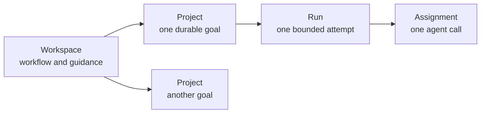
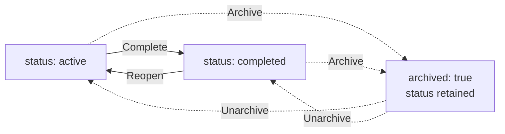
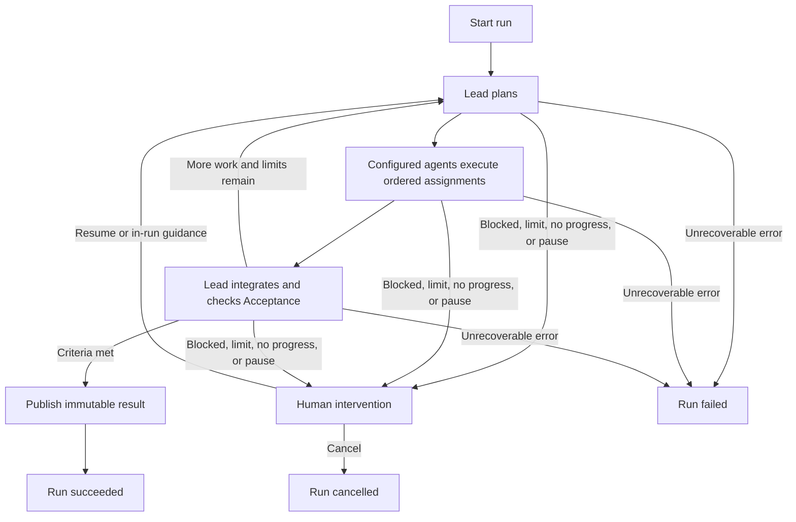
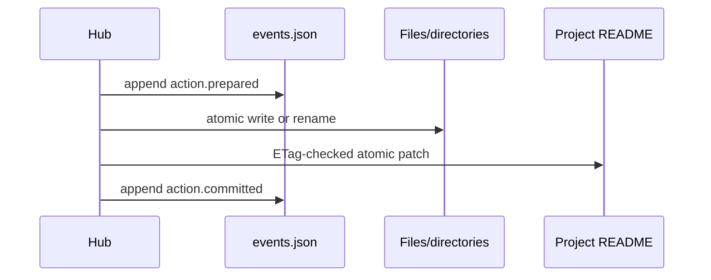
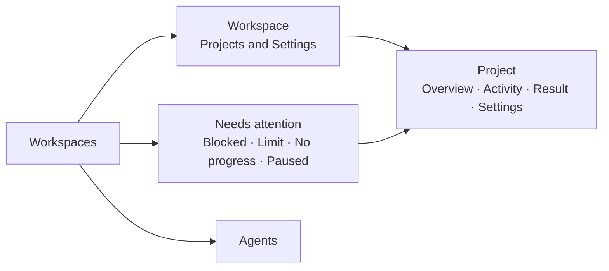

# Workspace Module Design

**Status:** Proposed
**Date:** 2026-07-19

## 1. Proposal

A workspace is one reusable way of doing work. It contains any number of similar
projects:

- **Investigations** is a workspace; each investigation is a project.
- **Presentations** is a workspace; each presentation is a project.



The Hub is a deterministic control plane. Existing stateless agents execute in an MCP
client; the Hub stores coordination state, validates transitions, and exposes human
controls in the web app. It does not run models or a background scheduler.

The minimal v1 decisions are:

| Concern | Decision |
|---|---|
| Workspace configuration | Reuse `.okh/module.yaml` |
| Human-readable guidance | Use `README.md` |
| Project history and run state | One append-only `events.json` per project |
| Reproducible inputs | One immutable snapshot per run |
| Durable output | One immutable result per successful run |
| Agent quality checks | Ordinary assignments, not a review subsystem |
| Human involvement | Interventions during a run; inspect, correct, restore, or complete afterward |

There is no workspace state sidecar, project config sidecar, run journal, artifact
manifest, candidate-version system, approval queue, database, or workflow engine.

## 2. Files and authority

```text
investigations/
  .okh/
    module.yaml
  README.md
  projects/
    strategic-suppliers/
      README.md
      events.json
      runs/
        2026-07-19-001/
          snapshot/
          result/                 # present only after success
```

Client-writable staging lives outside the container:

```text
<okh-state>/workspace-staging/<container>/<module>/<project>/<run>/
```

Each file has one job:

| Path | Authority |
|---|---|
| `.okh/module.yaml` | Lead, allowed agents, and limit overrides |
| Workspace `README.md` | Shared guidance and acceptance rubric |
| Project `README.md` | Current project state, goal, and optional guidance |
| `events.json` | Project history, run coordination, idempotency, and recovery |
| `runs/<id>/snapshot/` | Exact inputs frozen when the run starts |
| `runs/<id>/result/` | Complete immutable output of one successful run |

The project README is the canonical current projection. `events.json` explains how that
state was reached and enables safe retry and crash recovery; it is not a second editable
projection.

One project-level journal is enough for v1. Each run event identifies its run in the
CloudEvents `subject`. A terminal run event prohibits later events for that run, while
the project stream remains open for future runs, lifecycle changes, and result
restoration. Journal segmentation can be added later if measured file size requires it.

## 3. Workspace configuration

The existing module manifest already has the required extension point:

```yaml
type: workspace
description: Evidence-based investigations.
config:
  lead: coordinators/orchestrator
  agents:
    - researcher
    - research-agents/source-analyst
    - shared-hub/review-agents/evidence-checker
  limits:
    iterations: 3
    assignments: 20
    attempts: 2
```

Only `lead` is required. `agents` and `limits` are optional.

- `lead` plans, integrates corrections, and produces the final result.
- `agents` is the allowlist of other profiles the lead may assign.
- `limits` overrides safe defaults and remains bounded by server maxima.

When omitted, limits default to three iterations, twenty total assignments, and two
attempts per assignment. Workspace overrides may be lower or higher but never exceed
server maxima.

### Agent references

| Form | Resolution |
|---|---|
| `agent` | Unique agent with that ID in the current container |
| `module/agent` | Agent in that module of the current container |
| `container/module/agent` | Fully qualified agent |

The final segment is the filename-derived agent ID used by the existing agents module,
not mutable display `name`. An ambiguous bare reference fails with qualification
suggestions.

At run start, every reference resolves to canonical `{ container, module, id }`
identity. The Hub rejects missing, ambiguous, or duplicate canonical references and
snapshots the exact profile. The lead is always allowed and need not be repeated in
`agents`.

### Customization without more schema

Workspace purpose comes from its module folder, description, README guidance, and agent
selection. Project-specific detail uses ordinary Markdown sections. The UI consistently
calls each item a **Project**.

V1 deliberately has no configuration for:

- project kind or UI labels;
- sorting;
- acceptance criteria;
- execution mode or oversight;
- agent roles other than lead; or
- retrospectives and learning.

Sorting is a remembered user preference. The initial sort is `updatedAt` descending;
presentations can use `targetDate` ascending without changing workspace configuration.

## 4. README contract

### Workspace `README.md`

The root README is both the GitHub-friendly overview and the shared instructions:

```markdown
# Investigations

Use primary evidence, distinguish facts from assumptions, and preserve unresolved
questions.

## Working guidance

- Start with primary sources.
- Record contrary evidence.
- State uncertainty instead of inventing precision.

## Acceptance

- Material claims cite primary or authoritative sources.
- Viable alternatives are compared consistently.
- The conclusion states tradeoffs and unresolved risks.
```

### Project `README.md`

```markdown
---
title: Strategic supplier investigation
status: active
archived: false
createdAt: 2026-07-19T18:30:00Z
updatedAt: 2026-07-19T18:30:00Z
targetDate: 2026-08-15
tags: [sourcing, strategy]
activeRun: null
result: null
---

## Goal

Recommend two suppliers with evidence, risks, and open questions.

## Guidance

Prefer filings and direct supplier documentation over market summaries.

## Acceptance

- Cover both North America and Europe.
```

Required frontmatter:

- `title`;
- `status`, either `active` or `completed`;
- `archived`, a boolean;
- `createdAt` and `updatedAt`;
- `activeRun`, either `null` or a run ID; and
- `result`, either `null` or a safe relative path such as
  `runs/2026-07-19-001/result`.

Optional frontmatter is limited to:

- `targetDate` as `YYYY-MM-DD`; and
- normalized lowercase kebab-case `tags`.

The project folder name is its lowercase kebab-case ID and is not repeated in
frontmatter. Only `## Goal` is required in the Markdown body. All other headings are
workflow-specific.

### Acceptance rubric

The workspace must contain at least one top-level bullet under `## Acceptance`. A
project may add more. Every listed criterion is required.

At run start, the Hub snapshots the exact criterion text. Each run-local criterion ID is
derived from the SHA-256 hash of canonical `{ source, ordinal, text }`; the ordered set
also receives one hash. The lead's final integration reports evidence for every
criterion. Unmet criteria cause another bounded iteration or a human intervention when
limits are exhausted.

Acceptance is therefore a work rubric, not a separate YAML schema or human approval
record. The Hub validates criterion IDs, coverage, evidence references, and result
hashes; it does not claim that an agent's semantic judgment is correct.

### Source-preserving edits

The Hub reuses the current Markdown/frontmatter parser and the source-preserving edit
pattern used by todos:

1. Re-read the file and verify its SHA-256 ETag.
2. Patch only selected frontmatter fields or heading content.
3. Validate the complete result.
4. Atomically replace the file.

The Hub owns `status`, `archived`, timestamps, `activeRun`, and `result`. A user may edit
the title, target date, tags, goal, guidance, acceptance additions, and arbitrary
workflow sections. Unrelated Markdown is never regenerated.

## 5. Project lifecycle

Project completion and archiving are separate:



`archived: true` hides and freezes a project without losing whether it was active or
completed. Unarchive only clears the flag.

| Action | Rule |
|---|---|
| Create | Creates an active, unarchived project with no run or result |
| Continue | Starts a new run when the project is active, unarchived, and has no active run |
| Resume | Continues the exact run named by `activeRun` |
| Complete | Marks an active, unarchived project completed when no run is active; a result is optional |
| Reopen | Returns a completed project to active; `archived` must be false |
| Archive | Requires no active run; retains status |
| Unarchive | Clears `archived`; retains status |

Each project has at most one active run and one claimed assignment. Multiple projects
may run independently. Dates never change status automatically.

Create builds the complete project directory, including README and the initial
`project.created` event, in a sibling temporary directory and atomically renames it.
That first event stores the create command ID and argument hash. If the target already
exists, the same pair returns the existing project; a different command or arguments
conflict.

The finite workspace loader scans README frontmatter, then filters, sorts, and paginates
in memory. Supported sort fields are `targetDate`, `createdAt`, `updatedAt`, and `title`.
Missing target dates sort last and project ID breaks ties. V1 targets hundreds, not
millions, of projects.

## 6. Coordination loop

V1 is autopilot with exception-based human control:



Before starting a run, the client proves that it can read and write the external staging
area. A failed preflight creates no run.

The lead produces a bounded ordered plan. Every planned task is an assignment, and each
attempt invokes its agent:

- planning and final integration use `lead`;
- work may use the lead or any configured agent;
- a critique or fact check is an ordinary work assignment; and
- only the final lead integration may publish the run result.

There is no worker/reviewer/critic role, review phase, plan approval, per-assignment
approval, or final approval gate.

The three limits have direct meanings:

| Limit | Counts |
|---|---|
| `iterations` | Lead plan/integration cycles |
| `assignments` | Logical tasks created in the run |
| `attempts` | Attempts for one assignment |

Planning and integration count as assignments. Retrying a task increments its attempts
but does not create another assignment, so total model calls are bounded by
`assignments * attempts`—for example, the defaults allow at most forty calls.
Assignments are sequential in v1. A server restart alone does not consume an attempt.

When a run is blocked, makes no progress, reaches a limit, or is paused, the web app
offers only valid actions: resume, provide in-run guidance, grant a bounded extension, or
cancel.

A successful run automatically makes its result current. The project remains active
until a person chooses **Complete**, so one project may have several successful runs.

## 7. Events and recovery

`events.json` is a CloudEvents 1.0 JSON batch:

```json
[
  {
    "specversion": "1.0",
    "id": "2b7ce542-b724-43ab-9f18-4ec64337a076",
    "source": "okh://main/investigations/projects/strategic-suppliers",
    "type": "dev.okh.workspace.run.start.prepared",
    "subject": "runs/2026-07-19-001",
    "time": "2026-07-19T18:42:00.000Z",
    "datacontenttype": "application/json",
    "sequence": 4,
    "okhcommandid": "9c7f6765-81db-490d-a4f0-bdf45d2cda57",
    "data": {
      "expectedProjectEtag": "sha256:..."
    }
  }
]
```

The standard envelope supplies identity, source, subject, time, type, content type, and
data. OKH adds only a contiguous `sequence`, `okhcommandid` for retry correlation, and
event-specific data schemas.

Run-scoped events use `runs/<run-id>` as `subject`. The successful terminal event also
records result publication. Later lifecycle and result-restoration events are
project-scoped and mention prior runs only in `data`, so they never append to a terminal
run.

The stream records:

- project creation, edits, completion, reopening, archive, and unarchive;
- run start, plan, assignments, attempts, waits, corrections, and terminal outcome;
- snapshot and result hashes; and
- result publication at successful run completion and later restoration.

Prior event bytes never change. Appending copies them byte-for-byte into a sibling
temporary file, writes the new event and closing array delimiter, flushes, and atomically
renames the file. A server file-size limit prevents unbounded replay.

### One transaction pattern

Every multi-file mutation uses the same protocol:



The prepared event contains the expected preimages and exact target hashes for every
step. Recovery replays an unfinished transaction by checking both states:

- before an authoritative file change, it may append `action.aborted`;
- a target hash means that step already succeeded and is skipped;
- an expected preimage means that step is applied;
- after any authoritative file change, remaining steps always roll forward; and
- a conflicting hash, unsafe path, malformed event, or impossible transition blocks
  mutation visibly.

The same pattern covers run start, successful run finish with result publication, other
run finishes, result restoration, and lifecycle changes. Project creation is simpler
because the whole new directory is assembled and renamed atomically.

Every mutation has a command ID. Repeating the same command and arguments returns its
recorded outcome; reusing the ID with different arguments conflicts.

### Hashes

- File ETags cover exact bytes with SHA-256.
- Result tree hashes cover RFC 8785 canonical JSON of the path-sorted
  `{ path, size, sha256 }` array.
- Acceptance-set hashes cover the ordered run-local criterion records.
- Snapshot events record the hash of every frozen source file.

## 8. Runs, snapshots, and results

At run start, `snapshot/` receives exact write-once copies of:

- the workspace module manifest;
- the workspace README;
- the project README; and
- every resolved agent profile.

The start transaction creates the complete run directory, sets project `activeRun`, and
commits the snapshot hashes. Live config, guidance, or profile edits affect future runs
only.

Assignment work stays in external staging while the run is active. Structured results
and output hashes are recorded in `events.json`; later assignments receive declared
prior outputs as read-only inputs. Staging survives a server restart on the same machine
but is not container content and never syncs.

When final integration succeeds, the Hub:

1. Validates the assignment claim, declared paths, acceptance evidence, and output limits.
2. Reads files without following links and revalidates opened handles where supported.
3. Copies the complete output into a sibling temporary result directory.
4. Atomically renames it to `runs/<run>/result`.
5. Sets project `result` to that relative path and clears `activeRun`.
6. Commits the result tree hash and terminal run event.

A failed or cancelled run clears `activeRun` without creating a result. The previous
project result remains current.

Each successful run contributes one immutable result. Comparing or restoring a result
uses prior successful run directories; candidate versions and artifact manifests are
unnecessary.

The successful terminal event stores the result's path-sorted file array and tree hash.
Result comparison diffs those recorded arrays and reads selected changed text files only
when a content diff is requested; it creates no separate manifest.

Restore is allowed only with no active run and when the current result still matches the
expected path and tree hash. The user selects a specific prior successful result, and the
normal transaction protocol changes the README pointer to that path. Result directories
are never mutated or deleted by restore.

### Continue versus resume

- **Resume** replays `events.json` and continues the run in `activeRun`.
- **Continue** starts a new run from current snapshots, the current result, and an
  optional human correction.

Neither operation depends on prior chat history or hidden model reasoning.

## 9. Tool and client boundary

One deterministic MCP tool is sufficient:

```text
workspace {
  operation:
    list | create | status | preflight | start | next | submit
  container
  module
  project?
  ...
}
```

| Operation | Purpose |
|---|---|
| `list` | Filter, sort, and page projects |
| `create` | Create one project |
| `status` | Return current project and run state |
| `preflight` | Prove access to external staging |
| `start` | Start a new run |
| `next` | Claim the next assignment or return an intervention/terminal result |
| `submit` | Submit the current assignment result |

`next` returns a workspace-specific superset of the existing `use_agent` result shape:
the frozen profile and bounded task plus declared inputs, expected result schema, claim
token, and staging path. Large inputs use the existing MCP `resource_link` convention.

Only a hash of the claim token is persisted. The claim also records the server instance
that issued it:

- after restart, the old claim is reclaimable without consuming an attempt and its token
  cannot submit;
- during the same server process, a human may release a lost claim, consuming an
  attempt; and
- stale tokens and undeclared output paths always fail.

The server never calls a model. The `coordinate` skill repeatedly calls `next`, executes
the returned agent task in the client, and calls `submit`.

Built-in skills remain small:

- `initialize` creates the manifest and workspace README;
- `create` gathers a goal and creates one project; and
- `coordinate` starts or resumes coordinated work.

## 10. Human and web experience

There is no formal review entity. Human control is expressed through project actions and
run interventions:



### Workspaces

`/workspaces` shows description, project count, active runs, attention count, nearest
target date, agent-reference validity, and sync state.

### Workspace detail

`/workspaces/:container/:module` provides:

- **New project**;
- status, archive, tag, target-date, and text filters;
- user-remembered sorting;
- Continue, Resume, Complete, Reopen, Archive, and Unarchive actions; and
- settings for lead, allowed agents, limits, guidance, and workspace acceptance.

Target-date sorting places missing dates last. Past dates are highlighted but never
change project state.

### Project detail

| Tab | Content |
|---|---|
| Overview | Goal, guidance, lifecycle, and current state |
| Activity | Plan, assignments, attempts, waits, corrections, and run history |
| Result | Current/prior results, diff, criterion evidence, Complete, Continue, and Restore |
| Settings | Source-preserving README edits |

Inspecting a result creates no durable "reviewed" state. If it is good, the user may
complete the project. If it needs work, the user starts **Continue with correction**. If
it should not be current, the user restores a specific prior result.

### Needs attention and agents

**Needs attention** aggregates only active runs waiting for human action. Its panels show
the recorded cause and valid next actions; there is no global approval/review queue.

`/agents` browses existing profiles, canonical identities, and workspace references.
Workspace settings select one lead and maintain the optional allowlist for future runs;
they never edit profile files or active snapshots.

The frontend route registry must support validated parameterized routes. Invalid IDs
render not-found. Human mutations are same-origin web actions; `web:local` is an audit
label, not verified identity. Controls expose state and disabled reasons accessibly.

## 11. Safety and OKH integration

### Concurrency and recovery

Workspace writes reuse the existing hub-wide container mutation lock rather than adding
a workspace-specific lock. Hub-managed module, workspace, todo, and sync writes
serialize; sync holds the lock through validation, staging, commit, and push.

The lock is not held while an MCP client runs an agent. A later submission revalidates
the project ETag, run state, claim token, output paths, and hashes. Projects therefore
execute independently, while their short durable writes may queue behind another Hub
mutation. Per-container lock partitioning is deferred unless measured contention
justifies it.

Required invariants:

- user-visible files use sibling temporary write, flush, and atomic rename;
- snapshots and results are complete before an event references them;
- old event bytes and result directories never change;
- a terminal run rejects later run-scoped events;
- archived projects and completed projects cannot start work;
- one project cannot have two active runs or two claimed assignments; and
- invalid state stops visibly instead of being repaired heuristically.

### Reuse

- Existing `.okh/module.yaml` and arbitrary `config`.
- Existing module discovery and finite loader.
- Markdown/YAML frontmatter and source-preserving edit patterns.
- Existing agents loader, canonical identity, and `.agent.md` support.
- Existing `use_agent` response and `resource_link` conventions.
- Generic module skills and container sync/PR workflow.
- Loopback web security and MCP App patterns.
- Existing YAML, Zod, and Node crypto dependencies.

### Add

- The `workspace` built-in module type and validators.
- `WorkspaceService`.
- CloudEvents batch validation and byte-preserving atomic append.
- Workspace/project/attention/agent web views.
- Safe parameterized frontend routes.

### Do not add

- Another workspace or project config file.
- Separate project and run journals.
- Database, queue, scheduler, or server-side model runner.
- Persisted collection index.
- Candidate artifact versions or manifests.
- Formal review, approval, or agent-role subsystem.
- Custom agent format.
- Project-type-specific code.

Sync commits the whole container. Useful boundaries are project lifecycle changes and
terminal runs, not individual assignment events. External staging and user UI
preferences never sync.

## 12. Delivery and deferred work

1. **Projects:** module config, README parsing/editing, events, lifecycle, listing, and
   read-only web pages.
2. **Runs:** snapshots, plans, assignments, claims, limits, staging, results, recovery,
   resume, continue, and restore.
3. **Web controls:** workspace settings, project actions, Needs attention, result
   comparison, agents, routing, accessibility, and sync integration.

Deferred until a demonstrated need:

- retrospectives and automated learning;
- parallel assignments;
- automatic local or Copilot SDK runner;
- calendar and recurring projects;
- notifications and timed claim expiry;
- journal segmentation and persistent external indexing;
- binary deduplication or remote result storage;
- remote multi-host active-run execution; and
- web agent authoring.

## 13. Essential validation

The implementation must prove:

- minimal config, agent-reference, limit, and README validation;
- source-preserving edits and ETag conflicts;
- lifecycle and archive transitions;
- filtering, pagination, and remembered sorting;
- preflight before run creation;
- exact replay after restart;
- transaction recovery at every crash boundary;
- CloudEvents schema, sequence, command replay, and terminal-run enforcement;
- planning, assignments, retries, claim recovery, corrections, and all limits;
- snapshot stability when source files later change;
- staging isolation and missing-staging failure;
- result path safety, deterministic tree hashes, publication, comparison, and restore;
- acceptance extraction, criterion IDs, and final lead evidence coverage;
- container write/sync serialization;
- safe parameterized routes and accessible state-aware controls; and
- absence of server-side model or background agent execution.

## 14. Standards and references

| Concern | Convention |
|---|---|
| Module identity/config | Existing OKH `.okh/module.yaml` |
| Human-readable content | `README.md` with YAML frontmatter |
| Agent profiles | GitHub Copilot `.agent.md` |
| Operational history | CloudEvents 1.0 JSON batch |
| Canonical structured hashing | RFC 8785 JSON Canonicalization Scheme |
| Time | ISO 8601 |
| Integrity/concurrency | SHA-256 ETags and atomic replace |

References:

- [CloudEvents specification](https://github.com/cloudevents/spec)
- [CloudEvents JSON format](https://github.com/cloudevents/spec/blob/v1.0/json-format.md)
- [RFC 8785 JSON Canonicalization Scheme](https://www.rfc-editor.org/rfc/rfc8785)
- [Jekyll front matter](https://jekyllrb.com/docs/front-matter/)
- [Hugo front matter](https://gohugo.io/content-management/front-matter/)
- [Anthropic, Building effective agents](https://www.anthropic.com/engineering/building-effective-agents)
- [OpenAI Agents SDK human-in-the-loop](https://openai.github.io/openai-agents-python/human_in_the_loop/)
- [Microsoft AutoGen human-in-the-loop](https://microsoft.github.io/autogen/stable/user-guide/agentchat-user-guide/tutorial/human-in-the-loop.html)
- [Microsoft Guidelines for Human-AI Interaction](https://www.microsoft.com/en-us/research/project/guidelines-for-human-ai-interaction/)
- [NIST AI RMF Generative AI Profile](https://doi.org/10.6028/NIST.AI.600-1)

BPMN, CWL, Temporal, LangGraph, hosted tracing, and worker fleets are intentionally not
adopted. They solve broader execution problems at the cost of another runtime and more
metadata than this module needs.
