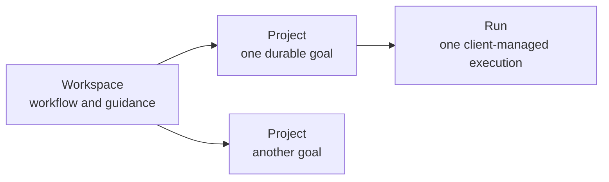
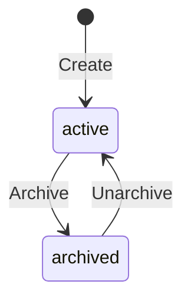
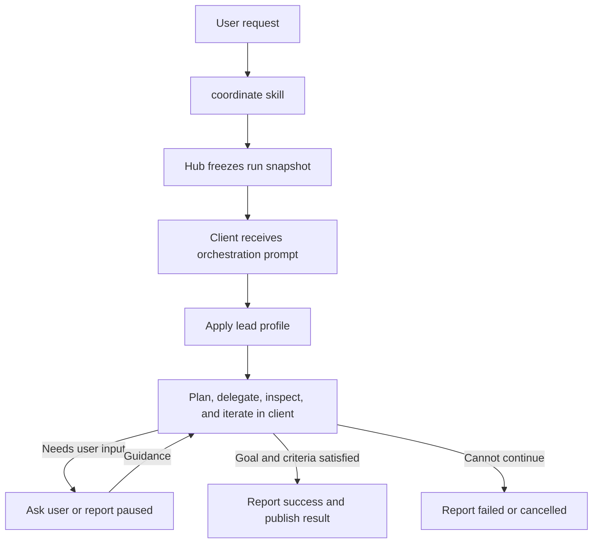
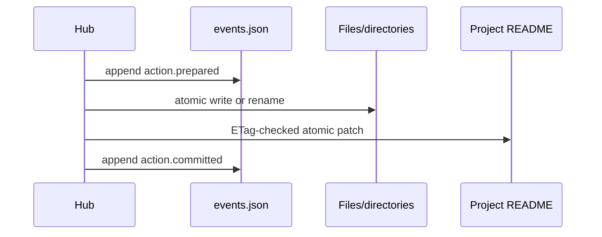
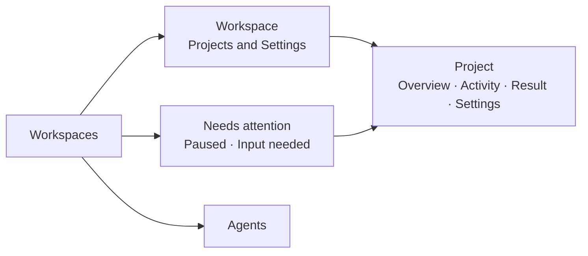
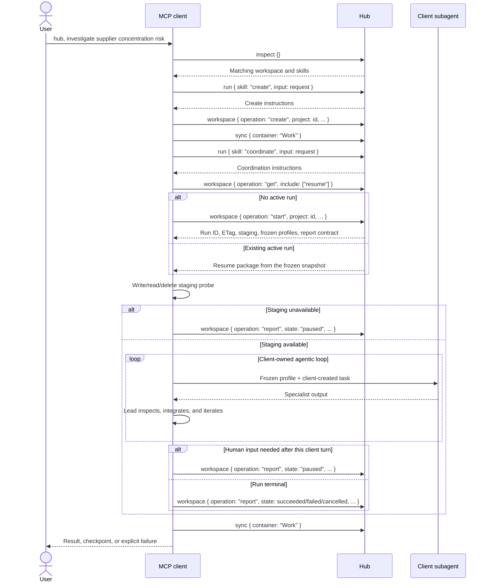

# Workspace Module Design

**Status:** Proposed
**Date:** 2026-07-19

## 1. Proposal

A workspace is one reusable way of doing work. It contains any number of similar
projects:

- **Investigations** is a workspace; each investigation is a project.
- **Presentations** is a workspace; each presentation is a project.



Here, **Run** is the workspace domain noun for one project execution. The existing MCP
`run` tool remains the generic way to invoke a module skill, such as `coordinate`; it is
not another workspace entity.

The Hub is a deterministic record keeper. Existing stateless agents execute in an MCP
client; the Hub freezes run inputs, records run-level checkpoints and outcomes,
publishes results, and exposes human controls in the web app. It does not run models or
a background scheduler.

The minimal v1 decisions are:

| Concern | Decision |
|---|---|
| Workspace configuration | Reuse `.okh/module.yaml` |
| Human-readable guidance | Use `README.md` |
| Project history and run state | One append-only `events.json` per project |
| Reproducible inputs | One immutable snapshot per run |
| Durable output | One immutable result per successful run |
| Agent coordination | Prompt the MCP client's own agentic loop |
| Human involvement | Client conversation or web guidance; restore/archive afterward |

There is no workspace state sidecar, project config sidecar, run journal, artifact
manifest, candidate-version system, approval queue, database, or workflow engine.

## 2. Files and authority

```text
investigations/
  .okh/
    module.yaml
    workspace-events.json           # workspace README command replay
  README.md
  projects/
    strategic-suppliers/
      README.md
      events.json
      runs/
        2026-07-19-001/
          snapshot/
          result/                 # present only after success
```

Client-writable staging lives outside the container:

```text
<okh-state>/workspace-staging/<container>/<module>/<project>/<run>/
```

Each file has one job:

| Path | Authority |
|---|---|
| `.okh/module.yaml` | Lead and agent pool |
| `.okh/workspace-events.json` | Workspace initialization/update idempotency and recovery |
| Workspace `README.md` | Shared guidance and acceptance rubric |
| Project `README.md` | Current project state, goal, and optional guidance |
| `events.json` | Project history, run checkpoints/outcomes, idempotency, and recovery |
| `runs/<id>/snapshot/` | Exact inputs frozen when the run starts |
| `runs/<id>/result/` | Complete immutable output of one successful run |

The project README is the canonical current projection. `events.json` explains how that
state was reached and enables safe retry and crash recovery; it is not a second editable
projection.

Each project has one journal in v1. Each run event identifies its run in the CloudEvents
`subject`. A terminal run event prohibits later events for that run, while the project
stream remains open for future runs, lifecycle changes, and result restoration. The
small workspace-level journal exists only because initialization and shared README
updates have no project journal in which to persist command replay. Journal segmentation
can be added later if measured file size requires it.

## 3. Workspace configuration

The existing module manifest already has the required extension point:

```yaml
type: workspace
description: Evidence-based investigations.
config:
  lead: coordinators/orchestrator
  agents:
    - researcher
    - research-agents/source-analyst
    - shared-hub/review-agents/evidence-checker
```

Only `lead` is required. `agents` is optional.

- `lead` supplies the orchestration behavior for the client agentic loop.
- `agents` is the pool of other profiles supplied for optional delegation.

The `agents` key is a workspace-local list of references resolved through existing
agents modules; it does not define another module type or copy agent profiles.

The pool determines which profiles the Hub supplies; it is not a security boundary, and
the Hub cannot prove what an external MCP client executes.

### Agent references

| Form | Resolution |
|---|---|
| `agent` | Unique agent with that ID in the current container |
| `module/agent` | Agent in that module of the current container |
| `container/module/agent` | Fully qualified agent |

The final segment is the filename-derived agent ID used by the existing agents module,
not mutable display `name`. An ambiguous bare reference fails with qualification
suggestions.

At run start, every reference resolves to canonical `{ container, module, id }`
identity. The Hub rejects missing, ambiguous, or duplicate canonical references and
snapshots the exact profile. The lead is always included in the coordination prompt and
need not be repeated in `agents`.

### Customization without more schema

Workspace purpose comes from its module folder, description, README guidance, and agent
selection. Project-specific detail uses ordinary Markdown sections. The UI consistently
calls each item a **Project**.

The manifest `description` is also a routing hint. It should use the nouns and verbs a
person is likely to say, such as "investigate evidence-based questions" or "create and
refine presentations."

V1 deliberately has no configuration for:

- project kind or UI labels;
- sorting;
- acceptance criteria;
- execution mode or oversight;
- task, retry, turn, or cost limits;
- agent roles other than lead; or
- retrospectives and learning.

Sorting is a remembered user preference. The initial sort is `updatedAt` descending;
presentations can use `targetDate` ascending without changing workspace configuration.
Execution budgets use the MCP client's native limits rather than a second Hub policy.

## 4. README contract

### Workspace `README.md`

The root README is both the GitHub-friendly overview and the shared instructions:

```markdown
# Investigations

Use primary evidence, distinguish facts from assumptions, and preserve unresolved
questions.

## Working guidance

- Start with primary sources.
- Record contrary evidence.
- State uncertainty instead of inventing precision.

## Acceptance

- Material claims cite primary or authoritative sources.
- Viable alternatives are compared consistently.
- The conclusion states tradeoffs and unresolved risks.
```

### Project `README.md`

```markdown
---
title: Strategic supplier investigation
status: active
createdAt: 2026-07-19T18:30:00Z
updatedAt: 2026-07-19T18:30:00Z
targetDate: 2026-08-15
tags: [sourcing, strategy]
activeRun: null
result: null
---

## Goal

Recommend two suppliers with evidence, risks, and open questions.

## Guidance

Prefer filings and direct supplier documentation over market summaries.

## Acceptance

- Cover both North America and Europe.
```

Required frontmatter:

- `title`;
- `status`, either `active` or `archived`;
- `createdAt` and `updatedAt`;
- `activeRun`, either `null` or a run ID; and
- `result`, either `null` or a safe relative path such as
  `runs/2026-07-19-001/result`.

Optional frontmatter is limited to:

- `targetDate` as `YYYY-MM-DD`; and
- normalized lowercase kebab-case `tags`.

The project folder name is its immutable lowercase kebab-case ID and is not repeated in
frontmatter. Only `## Goal` is required in the Markdown body. All other headings are
workflow-specific.

### Acceptance rubric

The workspace must contain at least one top-level bullet under `## Acceptance`. A
project may add more. Every listed criterion is required.

At run start, the Hub snapshots the exact criterion text and assigns simple run-local
IDs in source order, such as `workspace-1` and `project-1`. The lead's final integration
reports evidence for every criterion. Unmet criteria keep the client loop working or
cause a pause when it can no longer make credible progress.

Acceptance is therefore a work rubric, not a separate YAML schema or human approval
record. The Hub validates criterion IDs, coverage, evidence references, and result
hashes; it does not claim that an agent's semantic judgment is correct.

### Source-preserving edits

The Hub reuses the current Markdown/frontmatter parser and the source-preserving edit
pattern used by todos:

1. Re-read the file and verify its SHA-256 ETag.
2. Patch only selected frontmatter fields or heading content.
3. Validate the complete result.
4. Atomically replace the file.

The Hub owns `status`, timestamps, `activeRun`, and `result`. A user may edit the title,
target date, tags, goal, guidance, acceptance additions, and arbitrary workflow sections.
Unrelated Markdown is never regenerated.

## 5. Project lifecycle

Projects have one binary lifecycle:



| Action | Rule |
|---|---|
| Create | Creates an active project with no run or result |
| Continue | Starts a new run when the project is active and has no active run |
| Resume | Continues the exact run named by `activeRun` |
| Archive | Changes an active project to archived when no run is active |
| Unarchive | Returns an archived project to active |

Each project has at most one active run. Multiple projects may run independently.
Archived projects are hidden and frozen. There is no completed state; dates and
successful runs never change project status automatically.

Create builds the complete project directory, including README and the initial
`project.created` event, in a sibling temporary directory and atomically renames it.
That first event stores the create command ID and argument hash. If the target already
exists, the same pair returns the existing project; a different command or arguments
conflict.

The finite workspace loader scans README frontmatter, then filters, sorts, and paginates
in memory. Supported sort fields are `targetDate`, `createdAt`, `updatedAt`, and `title`.
Missing target dates sort last and project ID breaks ties. V1 targets hundreds, not
millions, of projects.

## 6. Client-managed coordination

The Hub starts and records a run; the MCP client's own agentic loop manages it:



`start` creates the external staging directory and returns its path. Before delegating,
the client must write, read, and delete a probe file there. If that check fails, it
reports the run as paused with `staging-unavailable`; no agent work begins. Resume
repeats the same check because a different MCP client may have different filesystem
access.

The Hub validates staging when `report` reads it, but it cannot independently prove that
the client performed the probe or executed any particular subagent. Those remain
client-reported behaviors.

The `coordinate` skill supplies one orchestration prompt containing:

- the frozen workspace and project guidance;
- the goal, acceptance criteria, and current result;
- the lead profile and optional agent-pool profiles;
- the run ID, staging path, and result constraints; and
- the run-level report contract.

That prompt instructs the client LLM to:

1. Apply the lead profile to plan and integrate the work.
2. Delegate to supplied agent profiles when useful, using native subagents when
   available and inline fallback otherwise.
3. Inspect agent outputs and iterate in the client's own context.
4. Ask the user directly when clarification or judgment is needed.
5. Stop when the client's native budget is reached or progress is no longer credible.
6. Write one complete result to staging and report the run state to the Hub.

This reuses the existing
[agents module client contract](2026-07-16-agents-module-design.md): use a native
subagent when the client supports one, or apply the same profile in the parent context
otherwise. Neither mode implies process isolation.

Plans, delegated tasks, retries, model turns, and agent transcripts are client-internal;
they are not Hub entities or events. The Hub therefore does not duplicate the client's
scheduler, retry policy, or token/cost budget and does not claim to audit hidden
reasoning.

The client reports only run-level states:

```text
paused | succeeded | failed | cancelled
```

A paused report includes a concise summary, relevant staged paths, and the question or
blocker for the human; it never contains hidden reasoning. Guidance may come from the
same client conversation or the web app. A successful report includes criterion
evidence and the staged result. The Hub validates structure, paths, hashes, and state
transitions, not semantic quality.

A successful run automatically makes its result current. The project remains active, so
one project may have any number of successful runs before it is archived.

## 7. Events and recovery

`events.json` is a CloudEvents 1.0 JSON batch:

```json
[
  {
    "specversion": "1.0",
    "id": "2b7ce542-b724-43ab-9f18-4ec64337a076",
    "source": "okh://main/investigations/projects/strategic-suppliers",
    "type": "dev.okh.workspace.run.start.prepared",
    "subject": "runs/2026-07-19-001",
    "time": "2026-07-19T18:42:00.000Z",
    "datacontenttype": "application/json",
    "sequence": 4,
    "okhcommandid": "9c7f6765-81db-490d-a4f0-bdf45d2cda57",
    "data": {
      "expectedProjectEtag": "sha256:..."
    }
  }
]
```

The standard envelope supplies identity, source, subject, time, type, content type, and
data. OKH adds only a contiguous `sequence`, `okhcommandid` for retry correlation, and
event-specific data schemas.

Run-scoped events use `runs/<run-id>` as `subject`. The successful terminal event also
records result publication. Later lifecycle and result-restoration events are
project-scoped and mention prior runs only in `data`, so they never append to a terminal
run.

The stream records:

- project creation, edits, archive, and unarchive;
- run start, pause checkpoints, human guidance, and terminal outcome;
- snapshot and result hashes; and
- result publication at successful run completion and later restoration.

Prior event bytes never change. Appending copies them byte-for-byte into a sibling
temporary file, writes the new event and closing array delimiter, flushes, and atomically
renames the file. A server file-size limit prevents unbounded replay.

### One transaction pattern

Every multi-file mutation uses the same protocol:



The prepared event contains the expected preimages and exact target hashes for every
step. Recovery replays an unfinished transaction by checking both states:

- before an authoritative file change, it may append `action.aborted`;
- a target hash means that step already succeeded and is skipped;
- an expected preimage means that step is applied;
- after any authoritative file change, remaining steps always roll forward; and
- a conflicting hash, unsafe path, malformed event, or impossible transition blocks
  mutation visibly.

The same pattern covers run start, successful run finish with result publication, other
run finishes, result restoration, and lifecycle changes. Project creation is simpler
because the whole new directory is assembled and renamed atomically.

Every mutation has a command ID. Repeating the same command and arguments returns its
recorded outcome; reusing the ID with different arguments conflicts.

### Hashes

- File ETags cover exact bytes with SHA-256.
- Result tree hashes cover RFC 8785 canonical JSON of the path-sorted
  `{ path, size, sha256 }` array.
- Snapshot events record the hash of every frozen source file.

## 8. Runs, snapshots, and results

At run start, `snapshot/` receives exact write-once copies of:

- the workspace module manifest;
- the workspace README;
- the project README; and
- every resolved agent profile.

The start transaction creates the complete run directory, sets project `activeRun`, and
commits the snapshot hashes. Live config, guidance, or profile edits affect future runs
only.

The client agentic loop uses external staging as scratch space while the run is active.
Staging survives a server restart on the same machine but is not container content and
never syncs. The Hub records no client-internal work graph or transcript.

When the client reports success, the Hub:

1. Validates the active run, report schema, acceptance evidence, and output limits.
2. Reads files without following links and revalidates opened handles where supported.
3. Copies the complete output into a sibling temporary result directory.
4. Atomically renames it to `runs/<run>/result`.
5. Sets project `result` to that relative path and clears `activeRun`.
6. Commits the result tree hash and terminal run event.

A failed or cancelled run clears `activeRun` without creating a result. The previous
project result remains current.

Each successful run contributes one immutable result. Comparing or restoring a result
uses prior successful run directories; candidate versions and artifact manifests are
unnecessary.

The successful terminal event stores the result's path-sorted file array and tree hash.
Result comparison diffs those recorded arrays and reads selected changed text files only
when a content diff is requested; it creates no separate manifest.

Restore is allowed only when the project is active, no run is active, and the current
result still matches the expected path and tree hash. The user selects a specific prior
successful result, and the normal transaction protocol changes the README pointer to
that path. Result directories are never mutated or deleted by restore.

### Continue versus resume

- **Resume** reconstructs the orchestration prompt from the frozen snapshot, staging,
  latest durable checkpoint, and later guidance for the run in `activeRun`.
- **Continue** starts a new run from current snapshots, the current result, and an
  optional human correction.

Neither operation depends on prior chat history or hidden model reasoning. After an
unexpected client exit, resume may repeat client-internal work; immutable result
publication and command idempotency keep that retry safe.

## 9. Tool and client boundary

A critical pass leaves seven operations:

```text
list | get | create | start | report | update | intervene
```

| Candidate | Decision |
|---|---|
| `list` | Keep: `inspect` discovers modules and items but does not provide workspace filtering, attention queries, or pagination |
| `status` | Rename to `get`: it returns content, history, and resume inputs, not merely status |
| `preflight` | Remove: a separate handshake duplicates run recovery; the client probes staging immediately after `start` |
| `create` | Keep: initialization and project creation are deterministic writes |
| `start` / `report` | Keep: these are the two durable boundaries around client-owned execution |
| `update` | Keep: edits, lifecycle changes, and result restoration are project/workspace mutations |
| `intervene` | Keep separate: guidance and cancellation target a live run and have different concurrency semantics |

There are deliberately no `resume`, `continue`, `configure`, `compare`, or `sync`
operations. Those are client workflows composed from the seven operations plus existing
OKH tools.

### Common contract

```text
workspace {
  operation: list | get | create | start | report | update | intervene
  container: string
  module: string
  project?: string
  commandId?: string
  etag?: string
  ...operation fields
}
```

- `container`, `module`, and `project` are exact immutable IDs. Natural-language title
  matching happens before the call.
- `list` and `get` are read-only. Every mutation requires a UUID `commandId`; replaying
  the same command and arguments returns the recorded response.
- Mutations of existing content also require the latest `etag` returned by `get`.
  Mismatch changes nothing and tells the client to read and reconsider; success returns
  the new ETag for the next call.
- Results follow current OKH conventions: concise text, structured content, and
  `resource_link` values. Validation errors are explicit and never return
  success-shaped fallbacks.
- The tool never calls a model and never synchronizes implicitly. The client calls the
  existing `sync` tool after the requested durable unit of work.

### `list`

`list` queries project summaries without loading result content:

```text
workspace {
  operation: "list"
  container
  module
  status?: active | archived | all       # default: active
  attention?: boolean
  tags?: string[]
  tagMode?: any | all
  targetAfter?: YYYY-MM-DD
  targetBefore?: YYYY-MM-DD
  query?: string
  sort?: updatedAt | createdAt | targetDate | title
  order?: asc | desc
  limit?: 1..100
  cursor?: string
}
```

`attention: true` means the latest active-run boundary is a pause with no later
guidance. The response contains project ID, title, lifecycle status, dates, tags,
`activeRun`, current-result summary, attention summary, and an opaque next cursor.

```text
workspace {
  operation: "list",
  container: "Work",
  module: "investigations",
  status: "active",
  attention: true,
  limit: 25
}
```

A representative structured response is:

```json
{
  "projects": [
    {
      "id": "supplier-concentration",
      "title": "Supplier concentration investigation",
      "status": "active",
      "targetDate": "2026-08-22",
      "tags": ["sourcing"],
      "updatedAt": "2026-07-19T18:30:00Z",
      "activeRun": "2026-07-19-002",
      "currentResult": {
        "runId": "2026-07-19-001",
        "path": "runs/2026-07-19-001/result",
        "treeHash": "sha256:..."
      },
      "attention": {
        "kind": "paused",
        "summary": "Regulator data needs interpretation.",
        "question": "Should the six-month lag be acceptable?"
      }
    }
  ],
  "nextCursor": null
}
```

### `get`

With no `project`, `get` returns workspace README settings, resolved agent-reference
health, project counts, and the workspace README ETag. With a project ID, it returns the
project README projection, ETag, current run summary, current-result link, and valid next
actions.

```text
workspace {
  operation: "get"
  container
  module
  project?
  include?: [resume, results]
}
```

- `resume` adds the active run ID, frozen inputs, staging path, latest checkpoint,
  later guidance, criterion list, and report contract; it is `null` without
  `activeRun`.
- `results` adds successful run IDs, timestamps, result paths, tree hashes, criterion
  evidence, and module-file resource links.

```text
workspace {
  operation: "get",
  container: "Work",
  module: "investigations",
  project: "supplier-concentration",
  include: ["resume", "results"]
}
```

Without a project, the structured response is:

```json
{
  "workspace": {
    "container": "Work",
    "module": "investigations",
    "description": "Investigate evidence-based questions and compare alternatives.",
    "guidance": "Prefer primary evidence and state uncertainty explicitly.",
    "acceptance": [
      "Material claims cite primary or authoritative sources."
    ],
    "lead": "coordinators/orchestrator",
    "agents": [
      "research-agents/researcher",
      "review-agents/evidence-checker"
    ],
    "agentHealth": "valid"
  },
  "counts": {
    "active": 4,
    "archived": 2,
    "activeRuns": 1,
    "attention": 1
  },
  "etag": "sha256:...",
  "validActions": ["update", "create-project"]
}
```

For a project with an active run, `start` and `get include: ["resume"]` return the same
resume package:

```json
{
  "project": {
    "id": "supplier-concentration",
    "title": "Supplier concentration investigation",
    "status": "active",
    "activeRun": "2026-07-19-002",
    "result": "runs/2026-07-19-001/result"
  },
  "etag": "sha256:...",
  "resume": {
    "runId": "2026-07-19-002",
    "stagingPath": "<okh-state>/workspace-staging/Work/investigations/supplier-concentration/2026-07-19-002",
    "snapshot": [
      {
        "kind": "project",
        "uri": "okh://containers/Work/investigations/files/projects%2Fsupplier-concentration%2Fruns%2F2026-07-19-002%2Fsnapshot%2Fproject.md",
        "sha256": "sha256:..."
      }
    ],
    "currentResult": {
      "runId": "2026-07-19-001",
      "treeHash": "sha256:...",
      "uri": "okh://containers/Work/investigations/files/projects%2Fsupplier-concentration%2Fruns%2F2026-07-19-001%2Fresult%2Freport.md"
    },
    "criteria": [
      {
        "id": "workspace-1",
        "source": "workspace",
        "text": "Material claims cite primary or authoritative sources."
      },
      {
        "id": "project-1",
        "source": "project",
        "text": "Cover both North America and Europe."
      }
    ],
    "checkpoint": {
      "summary": "Regulator data needs interpretation.",
      "stagedPaths": ["notes/regulator-data.md"],
      "question": "Should the six-month lag be acceptable?"
    },
    "guidance": [],
    "profiles": {
      "lead": {
        "agent": {
          "container": "Work",
          "module": "coordinators",
          "id": "orchestrator",
          "description": "Plans, delegates, and integrates project work"
        },
        "requestedTools": ["read", "search"],
        "profile": {
          "format": "github-copilot-agent-md",
          "content": "---\ndescription: Plans and integrates work\n---\n..."
        },
        "delegation": {
          "preferredMode": "native-subagent",
          "fallbackMode": "inline-parent"
        }
      },
      "pool": [
        {
          "agent": {
            "container": "Work",
            "module": "research-agents",
            "id": "researcher",
            "description": "Finds primary evidence"
          },
          "requestedTools": ["read", "search", "web"],
          "profile": {
            "format": "github-copilot-agent-md",
            "content": "---\ndescription: Finds primary evidence\n---\n..."
          },
          "delegation": {
            "preferredMode": "native-subagent",
            "fallbackMode": "inline-parent"
          }
        }
      ]
    },
    "reportContract": {
      "states": ["paused", "succeeded", "failed", "cancelled"],
      "requiredByState": {
        "paused": ["checkpoint"],
        "succeeded": ["resultPath", "evidence"],
        "failed": ["reason"],
        "cancelled": ["reason"]
      },
      "outputLimits": {
        "maxFiles": 1000,
        "maxFileBytes": 16777216,
        "maxTotalBytes": 268435456
      }
    }
  },
  "results": [
    {
      "runId": "2026-07-19-001",
      "finishedAt": "2026-07-19T19:10:00Z",
      "path": "runs/2026-07-19-001/result",
      "treeHash": "sha256:..."
    }
  ],
  "validActions": ["guide", "cancel", "update-project"]
}
```

Frozen profile entries intentionally omit `task`. The coordinate loop creates a focused
task for each delegation and combines it with the frozen profile, matching the existing
`use_agent` separation between profile and task without reading a live profile.
The returned output limits are fixed server safety caps, not workspace execution
budgets or agent-loop limits.

The existing `read_resource` tool reads linked files on tool-only hosts. No separate
history, compare, or artifact-browsing operation is needed.

### `create`

Without `project`, `create` initializes the workspace README and `projects/` directory
after `add_module` has created the manifest. It is valid only while those workspace
files are absent:

```text
workspace {
  operation: "create",
  container: "Work",
  module: "investigations",
  guidance: "Prefer primary evidence and state uncertainty.",
  acceptance: [
    "Material claims cite primary or authoritative sources.",
    "The conclusion states tradeoffs and unresolved risks."
  ],
  commandId: "<uuid>"
}
```

With `project`, it creates one active project:

```text
workspace {
  operation: "create",
  container: "Work",
  module: "investigations",
  project: "supplier-concentration",
  title: "Supplier concentration investigation",
  goal: "Recommend two resilient alternatives with evidence and risks.",
  guidance?: string,
  acceptance?: string[],
  targetDate?: "2026-08-15",
  tags?: ["sourcing", "strategy"],
  commandId: "<uuid>"
}
```

The caller cannot set `status`, timestamps, `activeRun`, or `result`. The response
returns the created projection, ETag, valid next actions, and README resource link.

### `start`

`start` creates one run; it never resumes one:

```text
workspace {
  operation: "start",
  container: "Work",
  module: "investigations",
  project: "supplier-concentration",
  correction?: "Add direct evidence from the latest filings.",
  etag: "sha256:...",
  commandId: "<uuid>"
}
```

The project must be active with no `activeRun`, and every configured agent reference
must resolve. The transaction freezes the manifest, workspace/project READMEs, lead,
agent-pool profiles, and acceptance criteria, and records the current result path/hash.
It creates staging and returns the updated project ETag plus the same resume package
described by `get`.

The client next performs the staging probe defined in Section 6. Replaying `start` with
the same command ID returns the existing package; another start conflicts while a run
is active.

### `report`

`report` is the executing client's only run-state write:

```text
workspace {
  operation: "report",
  container
  module
  project
  run
  state: paused | succeeded | failed | cancelled
  checkpoint?: {
    summary: string
    stagedPaths?: string[]
    question?: string
    reason?: string
  }
  resultPath?: string
  evidence?: [{ criterion: string, references: string[] }]
  reason?: string
  etag
  commandId
}
```

| State | Required content | Effect |
|---|---|---|
| `paused` | Concise checkpoint; question or reason when applicable | Leaves `activeRun` set and exposes the run in Needs attention |
| `succeeded` | Safe staging-relative `resultPath` and evidence for every criterion | Publishes one immutable result, makes it current, and clears `activeRun` |
| `failed` | Human-readable reason | Clears `activeRun`; current result is unchanged |
| `cancelled` | Human-readable reason | Acknowledges cancellation and clears `activeRun` |

```text
workspace {
  operation: "report",
  container: "Work",
  module: "investigations",
  project: "supplier-concentration",
  run: "2026-07-19-002",
  state: "succeeded",
  resultPath: ".",
  evidence: [
    { criterion: "workspace-1", references: ["report.md#sources"] },
    { criterion: "project-1", references: ["report.md#regional-coverage"] }
  ],
  etag: "sha256:...",
  commandId: "<uuid>"
}
```

### `update`

`update` accepts exactly one `patch` or one `action`:

```text
workspace {
  operation: "update"
  container
  module
  project?
  patch?: {
    guidance?
    acceptance?
    title?
    goal?
    targetDate?
    tags?
  }
  action?: archive | unarchive | restore
  fromRun?: string
  etag
  commandId
}
```

Without `project`, a patch may replace workspace guidance or acceptance. Lead, agent
pool, and routing description remain manifest settings and use the existing `config`
tool. With `project`, patchable fields are title, goal, guidance, project acceptance,
target date, and tags; `null` clears an optional field. Other Markdown sections remain
ordinary source content rather than growing the tool schema.

`archive` and `restore` require no active run. A paused run still counts as active and
must first be cancelled with `intervene` or reach a terminal report. `unarchive` changes
only lifecycle status. `restore` additionally requires `fromRun` and changes only the
current result pointer.

```text
workspace {
  operation: "update",
  container: "Work",
  module: "investigations",
  project: "supplier-concentration",
  patch: {
    targetDate: "2026-08-22",
    guidance: "Treat distributor data as provisional and label uncertainty."
  },
  etag: "sha256:...",
  commandId: "<uuid>"
}
```

### `intervene`

`intervene` records an external human action against an active run:

```text
workspace {
  operation: "intervene"
  container
  module
  project
  run
  action: guide | cancel
  guidance?: string
  reason?: string
  etag
  commandId
}
```

`guide` requires a paused run and non-empty guidance. It makes the run ready to resume
but does not execute it; only an MCP client can invoke `coordinate`. `cancel` accepts
any active run, appends its terminal event, clears `activeRun`, and rejects later client
reports. It cannot terminate a client process that is already executing.

```text
workspace {
  operation: "intervene",
  container: "Work",
  module: "investigations",
  project: "supplier-concentration",
  run: "2026-07-19-002",
  action: "guide",
  guidance: "Use the regulator dataset and call out its six-month lag.",
  etag: "sha256:...",
  commandId: "<uuid>"
}
```

### Skills compose tools

Built-in skills remain guidance, consistent with the rest of OKH:

- `initialize` calls `workspace:create` without a project after `add_module`;
- `configure` uses existing `config` for description/lead/agents and
  `workspace:update` for README guidance/acceptance;
- `create` gathers a goal and calls `workspace:create` with a project; and
- `coordinate` calls `workspace:get`, then resumes the active run or calls
  `workspace:start`, runs the client loop, and finishes with `workspace:report`.

`start` and `get include: resume` supply frozen profile content using the existing
`use_agent` response conventions. The client delegates with those frozen profiles
rather than calling live `use_agent` during a run, so later profile edits cannot alter
the execution snapshot.

Expected errors include not found, ETag conflict, command-ID conflict, invalid
transition, field invalid for workspace/project scope, unresolved agent, unsafe path,
unavailable staging, invalid evidence, and output-limit violations. Each error identifies
the failed precondition and valid next calls; it does not mutate partial state.

## 10. Human and web experience

There is no formal review entity. Human control is expressed through project actions and
run interventions:



### Workspaces

`/workspaces` shows description, project count, active runs, attention count, nearest
target date, agent-reference validity, and sync state.

### Workspace detail

`/workspaces/:container/:module` provides:

- **New project**;
- status, archive, tag, target-date, and text filters;
- user-remembered sorting;
- Archive and Unarchive actions; and
- settings for lead, agent pool, guidance, and workspace acceptance.

Target-date sorting places missing dates last. Past dates are highlighted but never
change project state.

### Project detail

| Tab | Content |
|---|---|
| Overview | Goal, guidance, lifecycle, and current state |
| Activity | Run checkpoints, human guidance, outcomes, and history |
| Result | Current/prior results, diff, criterion evidence, and Restore |
| Settings | Source-preserving README edits |

Activity offers Cancel for any active run and explains that this closes the Hub record
but cannot terminate an MCP client process.

Inspecting a result creates no durable "reviewed" state. If it needs work, the user edits
project guidance or tells an MCP client to continue with a correction. If it should not
be current, the user restores a specific prior result. Archiving is the only project
lifecycle action for work that should no longer remain active.

### Needs attention and agents

**Needs attention** aggregates only active runs waiting for human action. Its panels show
the recorded checkpoint and offer guidance or cancellation; there is no global
approval/review queue.

`/agents` browses existing profiles, canonical identities, and workspace references.
Workspace settings select one lead and maintain the optional agent pool for future runs;
they never edit profile files or active snapshots.

Runs start and resume only from an MCP client, because that client executes the agents.
The web app has no Start, Continue, or Resume-run button.

The frontend route registry must support validated parameterized routes. Invalid IDs
render not-found. Web mutations are same-origin; equivalent MCP lifecycle or
intervention calls require an explicit user request and use the same service,
preconditions, and command IDs. `web:local` and `mcp:user-request` are audit labels, not
verified identities. Controls expose state and disabled reasons accessibly.

## 11. Usage from an MCP client

The default Hub wake phrase is `hub`; users may configure another. Workspace requests
follow the same routing rule as existing Hub requests: when addressed, the client calls
`inspect` first and routes through the selected module's skills and tools.

### Natural-language routing contract

The client resolves an explicit `container/module/project` reference directly.
Otherwise it:

1. Inspects live containers and modules.
2. Matches a workspace by module name and description.
3. Resolves an existing project by ID or unique title match.
4. Asks one clarification when a workspace or project is ambiguous.
5. Uses the user's verb to distinguish create, resume, continue, and lifecycle changes.

The client never guesses between multiple matching workspaces and never creates a second
project when the request refers to an existing one.

A user may disambiguate directly:

> hub, continue `Work/investigations/supplier-concentration-question` with the latest
> filings.

The routing table uses `tool:selector` only as shorthand: `run:create` means
`run { skill: "create" }`, while `workspace:create` means
`workspace { operation: "create" }`. The names intentionally match because the skill
gathers and validates intent while the operation performs the deterministic write.
Full argument objects follow in the examples.

| User intent | Hub routing |
|---|---|
| "Set up an Investigations workspace" | `add_module` -> `run:initialize` -> `workspace:create` -> `sync` |
| "Configure Investigations to use..." | `run:configure` -> `config` and/or `workspace:update` -> `sync` |
| "Create an investigation for later" | `run:create` -> `workspace:create` -> `sync` |
| "Investigate..." or "start a new presentation..." | Create if needed -> `run:coordinate` -> `workspace:get/start/report` -> `sync` |
| "Resume..." | `run:coordinate` -> `workspace:get include:resume` -> client loop -> `report` |
| "Continue..." or "revise..." | `run:coordinate` -> `get` -> `start` with correction -> client loop -> `report` |
| "Change the goal/date/tags/guidance..." | `workspace:get` -> `workspace:update` -> `sync` |
| "Archive", "unarchive", "reopen", or "restore" | `workspace:get` -> `workspace:update` -> `sync` |
| "Use this guidance" or "cancel" | `workspace:get` -> `workspace:intervene` -> `sync` |
| "What needs attention?" | `workspace:list` with `attention: true` |
| "Show or compare result history" | `workspace:get include:results` -> `read_resource` as needed |
| "List", "find", or "show details" | `workspace:list` or `workspace:get` |



The subagent lane is a native client subagent when supported and inline parent execution
otherwise. It receives the frozen profile and a client-created task; the client does not
call live `use_agent` during the run.

### Example A: Set up and configure a workspace

> hub, add an Investigations workspace to my Work container. Use the orchestrator as
> lead, include the researcher and evidence-checker in its agent pool, and require
> primary sources, explicit alternatives, and unresolved risks.

The exact call sequence is:

```text
inspect {}

add_module {}

# After the user agrees to the normal add-module plan:
add_module {
  container: "Work",
  path: "investigations",
  type: "workspace",
  description: "Investigate evidence-based questions and compare alternatives.",
  config: {
    lead: "coordinators/orchestrator",
    agents: [
      "research-agents/researcher",
      "review-agents/evidence-checker"
    ]
  },
  create: true
}

run {
  container: "Work",
  module: "investigations",
  skill: "initialize",
  input: "Use primary evidence; require alternatives, tradeoffs, and unresolved risks."
}

# The initialize instructions direct:
workspace {
  operation: "create",
  container: "Work",
  module: "investigations",
  guidance: "Prefer primary evidence and state uncertainty explicitly.",
  acceptance: [
    "Material claims cite primary or authoritative sources.",
    "Viable alternatives are compared consistently.",
    "The conclusion states tradeoffs and unresolved risks."
  ],
  commandId: "<uuid>"
}

inspect { container: "Work", module: "investigations" }
sync { container: "Work", message: "Initialize Investigations workspace" }
```

The result is still only:

```text
investigations/
  .okh/module.yaml
  README.md
  projects/
```

Later configuration uses the workspace skill rather than another metadata file:

> hub, configure Investigations to add the market-analyst agent and require an explicit
> confidence statement.

Configuration composes the existing manifest tool with the workspace README mutation:

```text
inspect {}
run {
  container: "Work",
  module: "investigations",
  skill: "configure",
  input: "Add market-analyst and require an explicit confidence statement."
}
config {
  container: "Work",
  module: "investigations",
  set: {
    agents: [
      "research-agents/researcher",
      "review-agents/evidence-checker",
      "analysis-agents/market-analyst"
    ]
  }
}
workspace {
  operation: "get",
  container: "Work",
  module: "investigations"
}
workspace {
  operation: "update",
  container: "Work",
  module: "investigations",
  patch: {
    acceptance: [
      "Material claims cite primary or authoritative sources.",
      "Viable alternatives are compared consistently.",
      "The conclusion states tradeoffs and unresolved risks.",
      "Every conclusion includes an explicit confidence statement."
    ]
  },
  etag: "<etag from get>",
  commandId: "<uuid>"
}
inspect { container: "Work", module: "investigations" }
sync { container: "Work", message: "Configure Investigations workspace" }
```

Active run snapshots do not change. The revised configuration applies to future runs
and remains editable in the web Settings page.

### Example B: Create a project or start new work

To create a project without starting agents:

> hub, create an investigation for the supplier concentration question so I can work on
> it later. Target August 15, 2026 and tag it sourcing.

The client resolves the workspace, proposes `supplier-concentration` as the immutable
project ID, and executes:

```text
inspect {}
run {
  container: "Work",
  module: "investigations",
  skill: "create",
  input: "Create the supplier concentration investigation for later; target 2026-08-15 and tag sourcing."
}
workspace {
  operation: "create",
  container: "Work",
  module: "investigations",
  project: "supplier-concentration",
  title: "Supplier concentration investigation",
  goal: "Assess supplier concentration risk and recommend resilient alternatives.",
  acceptance: ["Cover both North America and Europe."],
  targetDate: "2026-08-15",
  tags: ["sourcing"],
  commandId: "<uuid>"
}
sync { container: "Work", message: "Create supplier concentration investigation" }
```

No run exists yet. The client asks only if routing or required goal details are unclear.

An imperative workflow request means create **and** start:

> hub, investigate supplier concentration risk in North America and Europe and recommend
> two resilient alternatives.

For a new imperative request, the client first creates and syncs the project as above,
then starts client-owned execution:

```text
run {
  container: "Work",
  module: "investigations",
  skill: "coordinate",
  input: "Investigate supplier concentration risk in North America and Europe and recommend two resilient alternatives."
}
workspace {
  operation: "get",
  container: "Work",
  module: "investigations",
  project: "supplier-concentration",
  include: ["resume"]
}
workspace {
  operation: "start",
  container: "Work",
  module: "investigations",
  project: "supplier-concentration",
  etag: "<etag from get>",
  commandId: "<uuid>"
}

# The client probes the returned staging path, runs the lead loop, and writes its result.
workspace {
  operation: "report",
  container: "Work",
  module: "investigations",
  project: "supplier-concentration",
  run: "<run from start>",
  state: "succeeded",
  resultPath: ".",
  evidence: [
    { criterion: "workspace-1", references: ["report.md#sources"] },
    { criterion: "project-1", references: ["report.md#regional-coverage"] }
  ],
  etag: "<etag from start>",
  commandId: "<uuid>"
}
sync { container: "Work", message: "Publish supplier concentration result" }
```

If a likely matching project already exists, it reports that project and asks whether to
resume/continue it or create a distinct project.

The same routing works for another workspace:

> hub, start a new presentation on the Q3 roadmap for the July 30, 2026 leadership
> meeting.

The client resolves the Presentations workspace, creates a project with
`targetDate: 2026-07-30`, then coordinates its first run. If more than one workspace
matches "presentations," it asks which one instead of choosing silently. The operation
sequence is identical; only `module`, project fields, and the user task differ.

### Example C: Resume an interrupted run or iterate a result

Resume means an active run already exists:

> hub, resume the supplier concentration investigation.

The exact resume path does not call `start`:

```text
inspect {}
run {
  container: "Work",
  module: "investigations",
  skill: "coordinate",
  input: "Resume the supplier concentration investigation."
}
workspace {
  operation: "get",
  container: "Work",
  module: "investigations",
  project: "supplier-concentration",
  include: ["resume"]
}

# Only when this user request answers or redirects a recorded pause:
workspace {
  operation: "intervene",
  container: "Work",
  module: "investigations",
  project: "supplier-concentration",
  run: "<activeRun from get>",
  action: "guide",
  guidance: "<the user's answer or correction>",
  etag: "<etag from get>",
  commandId: "<uuid>"
}
sync { container: "Work", message: "Record supplier investigation guidance" }

# The client probes staging, resumes the lead loop, then reports with the ETag returned
# by intervene and syncs the paused or terminal report.
```

If the paused checkpoint contains an unanswered question, a bare "resume" does not
invent an answer; the client asks for the missing guidance. No new snapshot is created.

Continue means the prior run is terminal and a new run is wanted:

> hub, continue the supplier concentration investigation. Add direct evidence from the
> latest filings and make the regional tradeoffs explicit.

This is the normal revision loop:

```text
inspect {}
run {
  container: "Work",
  module: "investigations",
  skill: "coordinate",
  input: "Revise the current result with direct filing evidence and explicit regional tradeoffs."
}
workspace {
  operation: "get",
  container: "Work",
  module: "investigations",
  project: "supplier-concentration"
}
workspace {
  operation: "start",
  container: "Work",
  module: "investigations",
  project: "supplier-concentration",
  correction: "Add direct filing evidence and make regional tradeoffs explicit.",
  etag: "<etag from get>",
  commandId: "<uuid>"
}

# Probe staging -> run the client loop -> report -> sync, as in Example B.
```

The prior immutable result remains current until this new run succeeds. Failure or
cancellation leaves it unchanged, making iteration safe without candidate-version
state.

If the user says "continue" while a run is active, the client reports that state and asks
whether to resume it or cancel it; it never starts a second run.

If the project is archived, the client reports that state and requires unarchive before
starting.

### Example D: Revise project instructions without a run

Project metadata and instructions can change without executing agents:

> hub, move the supplier investigation target to August 22, treat distributor data as
> provisional, and require uncertainty to be explicit.

```text
inspect {}
workspace {
  operation: "get",
  container: "Work",
  module: "investigations",
  project: "supplier-concentration"
}
workspace {
  operation: "update",
  container: "Work",
  module: "investigations",
  project: "supplier-concentration",
  patch: {
    targetDate: "2026-08-22",
    guidance: "Treat distributor data as provisional and label its uncertainty.",
    acceptance: [
      "Cover both North America and Europe.",
      "State uncertainty for provisional evidence."
    ]
  },
  etag: "<etag from get>",
  commandId: "<uuid>"
}
sync { container: "Work", message: "Revise supplier investigation guidance" }
```

`acceptance` replaces the project's complete acceptance list, so the client first reads
and preserves criteria the user did not remove. If a run is active, its frozen snapshot
does not change; these edits apply to the next run.

### Example E: Find waits, provide guidance, or cancel

> hub, what workspace work needs attention?

```text
inspect {}
workspace {
  operation: "list",
  container: "Work",
  module: "investigations",
  status: "active",
  attention: true
}
```

To answer one paused run and resume it:

> hub, retry the supplier investigation with this guidance: treat distributor data as
> provisional and document the uncertainty.

```text
run {
  container: "Work",
  module: "investigations",
  skill: "coordinate",
  input: "Treat distributor data as provisional and document the uncertainty."
}
workspace {
  operation: "get",
  container: "Work",
  module: "investigations",
  project: "supplier-concentration",
  include: ["resume"]
}
workspace {
  operation: "intervene",
  container: "Work",
  module: "investigations",
  project: "supplier-concentration",
  run: "<activeRun from get>",
  action: "guide",
  guidance: "Treat distributor data as provisional and document the uncertainty.",
  etag: "<etag from get>",
  commandId: "<uuid>"
}
sync { container: "Work", message: "Record supplier investigation guidance" }

# Probe staging -> resume -> report with the ETag from intervene -> sync the report.
```

The web **Needs attention** action ends after `intervene`; it cannot resume execution.
An MCP client may resume immediately. To cancel instead:

```text
workspace {
  operation: "get",
  container: "Work",
  module: "investigations",
  project: "supplier-concentration"
}
workspace {
  operation: "intervene",
  container: "Work",
  module: "investigations",
  project: "supplier-concentration",
  run: "<activeRun from get>",
  action: "cancel",
  reason: "The decision is no longer needed.",
  etag: "<etag from get>",
  commandId: "<uuid>"
}
sync { container: "Work", message: "Cancel supplier investigation run" }
```

Cancellation closes the Hub run immediately but cannot stop an already executing client;
any late report is rejected.

### Example F: Operational queries

Read-only operational requests call `list`, `get`, or existing `inspect` and never sync:

| Prompt | Exact call after `inspect {}` |
|---|---|
| "List active sourcing investigations due by August 31" | `workspace { operation: "list", container: "Work", module: "investigations", status: "active", tags: ["sourcing"], targetBefore: "2026-08-31" }` |
| "Show the supplier investigation, its current result, and valid actions" | `workspace { operation: "get", container: "Work", module: "investigations", project: "supplier-concentration" }` |
| "Show archived investigations containing supplier" | `workspace { operation: "list", container: "Work", module: "investigations", status: "archived", query: "supplier" }` |
| "Are any workspace agent references invalid?" | `inspect {}` followed by `workspace { operation: "get", container: "Work", module: "investigations" }` for the selected workspace |

The client follows `cursor` for another page. It does not read every project or result to
answer a summary query.

### Example G: Inspect, compare, or restore results

> hub, compare the last two results for the supplier concentration investigation.

```text
inspect {}
workspace {
  operation: "get",
  container: "Work",
  module: "investigations",
  project: "supplier-concentration",
  include: ["results"]
}

# Read only changed text files selected from the returned path/hash arrays:
read_resource { uri: "<result file resource URI returned by get>" }
```

Comparison is client-side reasoning over immutable result metadata and selected files;
it does not create Hub state. To make an older result current:

> hub, restore the result from run `2026-07-19-001`.

```text
workspace {
  operation: "update",
  container: "Work",
  module: "investigations",
  project: "supplier-concentration",
  action: "restore",
  fromRun: "2026-07-19-001",
  etag: "<etag from get>",
  commandId: "<uuid>"
}
sync { container: "Work", message: "Restore supplier investigation result" }
```

Restore changes only the current result pointer. It neither mutates the old result nor
starts a run.

### Example H: Archive, unarchive, or reopen

> hub, archive the supplier concentration investigation.

```text
inspect {}
workspace {
  operation: "get",
  container: "Work",
  module: "investigations",
  project: "supplier-concentration"
}
workspace {
  operation: "update",
  container: "Work",
  module: "investigations",
  project: "supplier-concentration",
  action: "archive",
  etag: "<etag from get>",
  commandId: "<uuid>"
}
sync { container: "Work", message: "Archive supplier concentration investigation" }
```

Archive requires no active run. "Reopen" is a natural-language alias for the same call
with `action: "unarchive"`. If the user says:

> hub, reopen the supplier concentration investigation and continue it with the latest
> regulatory changes.

the client unarchives and syncs first, then follows Example C with the correction text.
If the project is already active, it confirms whether "reopen" means start a revision
run rather than silently doing so.

### Example I: Recover after a client exit or staging mismatch

An unexpected client exit leaves `activeRun` intact. A later "resume" follows Example C:
`run:coordinate`, `workspace:get include:resume`, a staging probe, and no new `start`.
The client uses the frozen snapshot, surviving staging, and latest checkpoint; it may
repeat client-internal work because transcripts are not durable.

If the current client cannot access staging, it records the recoverable wait:

```text
workspace {
  operation: "report",
  container: "Work",
  module: "investigations",
  project: "supplier-concentration",
  run: "<activeRun>",
  state: "paused",
  checkpoint: {
    summary: "No agent work started in this client.",
    question: "Resume from a client that can access the staging path.",
    reason: "staging-unavailable"
  },
  etag: "<current etag>",
  commandId: "<uuid>"
}
sync { container: "Work", message: "Pause inaccessible workspace run" }
```

The user may resume from a compatible client or cancel. If staging is permanently lost,
cancel is the terminal escape hatch; a later Continue starts a fresh run from the
current published result while the cancelled run and checkpoint remain in history. No
dedicated recovery or preflight operation is needed.

For Git containers, client-driven configuration, creation, lifecycle, restore, and
intervention actions sync after the completed user request. `coordinate` syncs at human
waits and terminal outcomes.

## 12. Safety and OKH integration

### Concurrency and recovery

Workspace writes reuse the existing hub-wide container mutation lock rather than adding
a workspace-specific lock. Hub-managed module, workspace, todo, and sync writes
serialize; sync holds the lock through validation, staging, commit, and push.

The lock is not held while an MCP client runs its agentic loop. A later report
revalidates the project ETag, run state, output paths, and hashes. Projects therefore
execute independently, while their short durable writes may queue behind another Hub
mutation. Per-container lock partitioning is deferred unless measured contention
justifies it.

Required invariants:

- user-visible files use sibling temporary write, flush, and atomic rename;
- snapshots and results are complete before an event references them;
- old event bytes and result directories never change;
- a terminal run rejects later run-scoped events;
- archived projects cannot start work;
- one project cannot have two active runs; and
- invalid state stops visibly instead of being repaired heuristically.

### Reuse

- Existing `.okh/module.yaml` and arbitrary `config`.
- Existing module discovery and finite loader.
- Markdown/YAML frontmatter and source-preserving edit patterns.
- Existing agents loader, canonical identity, and `.agent.md` support.
- Existing `use_agent` response and `resource_link` conventions.
- Generic module skills and container sync/PR workflow.
- Loopback web security and MCP App patterns.
- Existing YAML, Zod, and Node crypto dependencies.

### Add

- The `workspace` built-in module type and validators.
- `WorkspaceService`.
- Workspace `initialize`, `configure`, `create`, and `coordinate` skills with
  wake-phrase routing guidance.
- CloudEvents batch validation and byte-preserving atomic append.
- Workspace/project/attention/agent web views.
- Safe parameterized frontend routes.

### Do not add

- Another workspace or project config file.
- Separate project and run journals.
- Database, queue, scheduler, or server-side model runner.
- Persisted plans, tasks, attempts, claims, or client transcripts.
- Persisted collection index.
- Candidate artifact versions or manifests.
- Formal review, approval, or agent-role subsystem.
- Custom agent format.
- Project-type-specific code.

Sync commits the whole container. Useful boundaries are project lifecycle or
intervention changes and run-level pauses or terminal outcomes. External staging and
user UI preferences never sync.

## 13. Delivery and deferred work

1. **Projects:** module config, README parsing/editing, events, lifecycle, listing, and
   MCP routing/skills, and read-only web pages.
2. **Runs:** snapshots, coordination prompts, staging, pause/terminal reports, results,
   recovery, resume, continue, and restore.
3. **Web controls:** workspace settings, project actions, Needs attention, result
   comparison, agents, routing, accessibility, and sync integration.

Deferred until a demonstrated need:

- retrospectives and automated learning;
- automatic local or Copilot SDK runner;
- calendar and recurring projects;
- notifications;
- journal segmentation and persistent external indexing;
- binary deduplication or remote result storage;
- remote multi-host active-run execution; and
- web agent authoring.

## 14. Essential validation

The implementation must prove:

- minimal config, agent-reference, and README validation;
- source-preserving edits and ETag conflicts;
- lifecycle and archive transitions;
- wake-phrase routing for create, start, resume, continue, update, and intervention;
- lifecycle/attention filtering, pagination, and remembered sorting;
- staging read/write/delete probe before delegation and a durable paused result on failure;
- exact replay after restart;
- transaction recovery at every crash boundary;
- CloudEvents schema, sequence, command replay, and terminal-run enforcement;
- deterministic coordination-prompt composition from frozen inputs;
- pause, guidance, success, failure, and cancellation report transitions;
- client-only run initiation and the `get`/`start` start-versus-resume branch;
- resume-package and result-history retrieval without a new run;
- cancellation of active runs and rejection of late client reports;
- snapshot stability when source files later change;
- staging isolation, client-specific access failure, permanent-loss cancellation, and
  fresh continuation;
- result path safety, deterministic tree hashes, publication, comparison, and restore;
- acceptance extraction, criterion IDs, and final lead evidence coverage;
- container write/sync serialization;
- safe parameterized routes and accessible state-aware controls; and
- absence of server-side model or background agent execution.

## 15. Standards and references

| Concern | Convention |
|---|---|
| Module identity/config | Existing OKH `.okh/module.yaml` |
| Human-readable content | `README.md` with YAML frontmatter |
| Agent profiles | GitHub Copilot `.agent.md` |
| Operational history | CloudEvents 1.0 JSON batch |
| Canonical structured hashing | RFC 8785 JSON Canonicalization Scheme |
| Time | ISO 8601 |
| Integrity/concurrency | SHA-256 ETags and atomic replace |

References:

- [CloudEvents specification](https://github.com/cloudevents/spec)
- [CloudEvents JSON format](https://github.com/cloudevents/spec/blob/v1.0/json-format.md)
- [RFC 8785 JSON Canonicalization Scheme](https://www.rfc-editor.org/rfc/rfc8785)
- [Jekyll front matter](https://jekyllrb.com/docs/front-matter/)
- [Hugo front matter](https://gohugo.io/content-management/front-matter/)
- [Anthropic, Building effective agents](https://www.anthropic.com/engineering/building-effective-agents)
- [OpenAI Agents SDK human-in-the-loop](https://openai.github.io/openai-agents-python/human_in_the_loop/)
- [Microsoft AutoGen human-in-the-loop](https://microsoft.github.io/autogen/stable/user-guide/agentchat-user-guide/tutorial/human-in-the-loop.html)
- [Agent2Agent Protocol, Life of a Task](https://a2a-protocol.org/latest/topics/life-of-a-task/)
- [Microsoft Guidelines for Human-AI Interaction](https://www.microsoft.com/en-us/research/project/guidelines-for-human-ai-interaction/)
- [NIST AI RMF Generative AI Profile](https://doi.org/10.6028/NIST.AI.600-1)

BPMN, CWL, Temporal, LangGraph, hosted tracing, and worker fleets are intentionally not
adopted. They solve broader execution problems at the cost of another runtime and more
metadata than this module needs.
