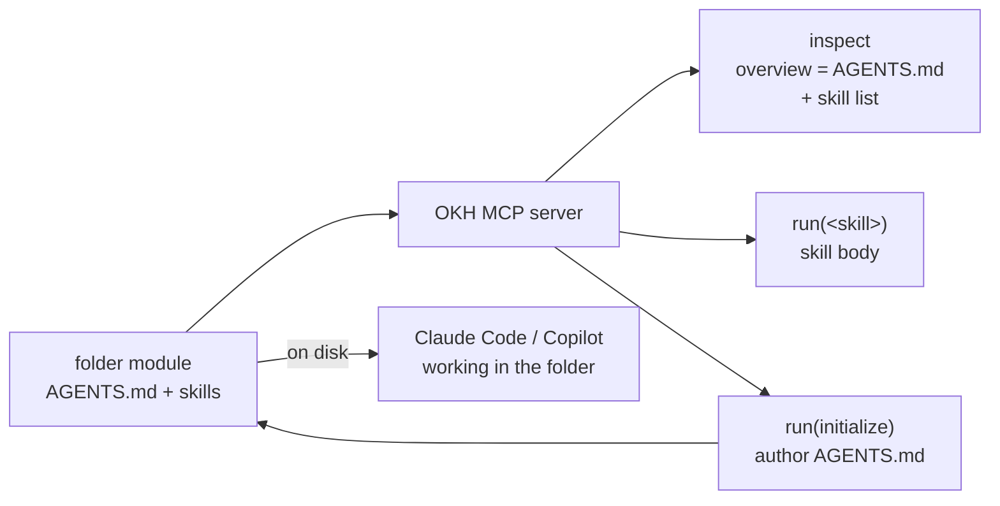

# Folder Module: An Agent-Ready Space for Unstructured Work

**Status:** Approved
**Date:** 2026-07-22

## 1. Decision

Add a built-in module type named `folder`.

- One module is a space for **unstructured work** — freeform files and subfolders
  at the top level, with no OKF/wiki/memory schema imposed.
- It is **agent-ready**: a required `AGENTS.md` at the module root is its
  entry-point instructions (the [agents.md](https://agents.md) open standard —
  a "README for agents"), and the module supports cross-agent **skills**.
- This serves two consumption modes:
  1. An external coding agent (Claude Code, GitHub Copilot) works **directly in
     the folder on disk**, reading its `AGENTS.md` and skills from the standard
     locations those tools already scan.
  2. An MCP client **loads the folder's information into context** — `inspect`
     surfaces the `AGENTS.md` overview plus the skill list, and `run` returns any
     skill's full body. No new tool is required.



`folder` is distinct from the existing `agents` module type and the two coexist:

| | `folder` type | `agents` type |
| --- | --- | --- |
| Purpose | Unstructured work space + instructions | Catalog of reusable agent personas |
| Root file | `AGENTS.md` (instructions) | — |
| Agent files | — | `.github/agents/*.agent.md` (personas) |
| Skills | `.agents/skills`, `.claude/skills`, `.github/skills` | `.okh/skills`, `.claude/skills` |

## 2. Module format

```text
my-folder/
  .okh/
    module.yaml            # type: folder
  AGENTS.md                # REQUIRED — overview / entry-point instructions
  .agents/
    skills/
      <name>/SKILL.md      # canonical skill location (scaffolded, wins collisions)
  .claude/
    skills/ …              # also discovered (Claude Code convention)
  .github/
    skills/ …              # also discovered (GitHub Copilot convention)
  <any unstructured work files and subfolders>
```

- The module's identity is its folder name, per the module system. `.okh/module.yaml`
  carries `type: folder` and the one-line routing `description`.
- Work product lives at the top level. Skills live in the conventional hidden
  roots so the top level stays clean and portable across agents.

## 3. Loader

A new `folderLoader` in `src/modules/loaders/folder.ts` implementing the `Loader`
interface:

- **`overview(moduleRoot)`** — reads and returns `AGENTS.md` verbatim. This is what
  `inspect { container, module }`, `ask`, and `context` surface, so the
  "load folder info into MCP context" mode needs no new tool. If `AGENTS.md` is
  missing, return a short placeholder that points to the `initialize` skill
  (mirroring `workspaceLoader.overview`); `validate` still reports it as an error.
- **`enumerate(moduleRoot)`** — lists **top-level entries only** (immediate files
  and immediate subdirectories), keeping `inspect` readable for large folders.
  Excludes `AGENTS.md` and the reserved/hidden roots (`.okh`, `.agents`, `.claude`,
  `.github`) plus common noise (`node_modules`, `__pycache__`, `vendor`, `venv`).
  Each entry is an `Item` with `type: "file"` or `type: "folder"`. Skills are
  surfaced by the skill system, not as items.
- **`requiredFiles`** — `["AGENTS.md"]`. Structural validation fails without it.
- **`validate(moduleRoot)`** — surfaces skill-tree issues discovered across the
  folder's configured skill roots (via the existing skill-scan machinery), so a
  malformed `SKILL.md` is reported through the normal validation path.
- **`scaffold(moduleRoot)`** — writes a starter `AGENTS.md` from
  `resources/module-types/folder/AGENTS-skeleton.md` (using the `wx` create flag,
  like `knowledgeLoader`) and creates an empty `.agents/skills/` directory.

Registered in `src/modules/registry.ts` under the `folder` key.

## 4. Skill discovery

Folder modules discover skills from the cross-agent standard roots — not OKH's
native `.okh/skills`. Add a `folder` case to `skillRootsForType()` in
`src/modules/skills.ts`:

```ts
export function skillRootsForType(moduleType: string): readonly string[] {
  if (moduleType === "skills") return [...MODULE_SKILL_ROOTS, MODULE_ROOT_SKILL_ROOT];
  if (moduleType === "folder") return FOLDER_SKILL_ROOTS; // [".agents/skills", ".claude/skills", ".github/skills"]
  return MODULE_SKILL_ROOTS;
}
```

- Precedence follows root order: `.agents/skills` (canonical default) wins over
  `.claude/skills`, which wins over `.github/skills`, on a name collision — the
  same "earlier root shadows later root" semantics used today.
- The vendored `initialize` skill merges in through the existing `vendoredSkills`
  path (built-in types resolve `resources/module-types/<type>/skills/`). A
  same-named local skill overrides the vendored one, per `mergeSkills`.
- Anything in the code that assumes module skill roots are exactly
  `MODULE_SKILL_ROOTS` must route through `skillRootsForType(type)` so folder's
  roots are honored end-to-end (discovery, `run` resolution, and validation).

## 5. Vendored `initialize` skill

`resources/module-types/folder/skills/initialize/SKILL.md` guides the client agent
to author or improve **this folder's** `AGENTS.md`. It references a new best-practices
resource doc via frontmatter, exactly as `agents/create` references
`okh://docs/agent-templates.md`:

```yaml
---
name: initialize
description: Author or improve this folder module's AGENTS.md so agents can work in it effectively.
resources:
  - okh://docs/agents-md.md
---
```

The skill instructs the agent to:

1. Inspect the module (`inspect { container, module }`) and read any existing
   `AGENTS.md` and files to learn the folder's actual purpose and conventions.
2. Write a concise, high-signal `AGENTS.md` grounded in the researched best
   practices, covering the six core areas where they apply to this folder:
   **commands, testing, project structure, code style, git workflow, and
   boundaries** — plus a clear statement of the folder's purpose/scope and a
   pointer to its own skills.
3. Prefer executable commands early, real examples over prose, and explicit
   "never touch" boundaries; never invent commands, paths, versions, or tools —
   discover them from the folder.
4. Persist only `AGENTS.md` (and skill files if authoring skills), re-inspect to
   confirm the module validates, and sync the container.

### Best-practices resource: `resources/docs/agents-md.md`

A new canonical doc (exposed at `okh://docs/agents-md.md`) capturing the AGENTS.md
best practices distilled from the [agents.md](https://agents.md) standard and
GitHub's analysis of 2,500+ real files:

- AGENTS.md is a "README for agents" — freeform Markdown, machine-focused, distinct
  from a human `README.md`.
- Six core areas: commands, testing, project structure, code style, git workflow,
  boundaries.
- Put executable commands (with flags) early; show one real code example over
  paragraphs; be specific about stack/versions; set explicit boundaries
  ("never commit secrets" is the most common helpful constraint).
- Keep it scoped and concise; iterate as agents make mistakes.
- Note the nesting rule: the nearest `AGENTS.md` to an edited file takes precedence
  (relevant when a folder module nests deeper structure).

## 6. Wiring and documentation

Adding a built-in type touches these surfaces (following the `llmwiki`/`workspace`
precedent):

- `src/modules/types.ts` — add `"folder"` to `BUILTIN_MODULE_TYPES`.
- `src/modules/registry.ts` — register `folderLoader`.
- `src/modules/skills.ts` — add the `folder` skill-roots case and `FOLDER_SKILL_ROOTS`.
- Resources:
  - `resources/module-types/folder/AGENTS-skeleton.md` (starter AGENTS.md)
  - `resources/module-types/folder/skills/initialize/SKILL.md`
  - `resources/docs/agents-md.md` (best-practices catalog, `okh://docs/agents-md.md`)
- Docs/tool surfaces that enumerate built-in types:
  - `resources/docs/concepts.md` (Module types list)
  - `resources/docs/reference.md`
  - `resources/tool-meta/add_module.md` (the `type` arg examples)
  - `resources/prompts/onboard.md`
  - `src/server/tools.ts` (any built-in-type enumerations in tool descriptions)
- The `okh://docs/agents-md.md` resource must be registered wherever
  `okh://docs/*` resources are declared/served (alongside `agent-templates.md`).

## 7. Tests

Mirror existing loader/type tests:

- `test/loaders.test.ts` (or a new `test/folder.test.ts`) — `enumerate` lists only
  top-level entries and excludes reserved dirs and `AGENTS.md`; `overview` returns
  `AGENTS.md`; `overview` falls back to the placeholder when absent; `scaffold`
  writes the skeleton and `.agents/skills/`; `validate` fails without `AGENTS.md`
  and reports malformed skill trees.
- Skill-roots coverage — a skill in `.agents/skills` is discovered and runnable;
  `.claude/skills` and `.github/skills` are discovered; `.agents/skills` shadows a
  same-named skill in a later root; the vendored `initialize` is present and
  overridable.
- `inspect`/`run` coverage — a folder module shows its `AGENTS.md` overview and its
  skills, and `run(initialize)` returns the skill body with the
  `okh://docs/agents-md.md` dependency.

## 8. Non-goals (YAGNI)

- **No dedicated "load to context" / `brief` skill.** `inspect` (overview + skills)
  plus `run` already deliver AGENTS.md and skill bodies into the client's context.
- **No bare visible `skills/` directory.** Skills live only in the hidden
  cross-agent roots so the top level stays reserved for actual work.
- **No `.okh/skills` root for folder.** Folder is deliberately aligned with the
  cross-agent standard so the same files work when Claude Code or Copilot run in
  the folder directly.
- **No agent persona management.** That remains the `agents` module type's job.
