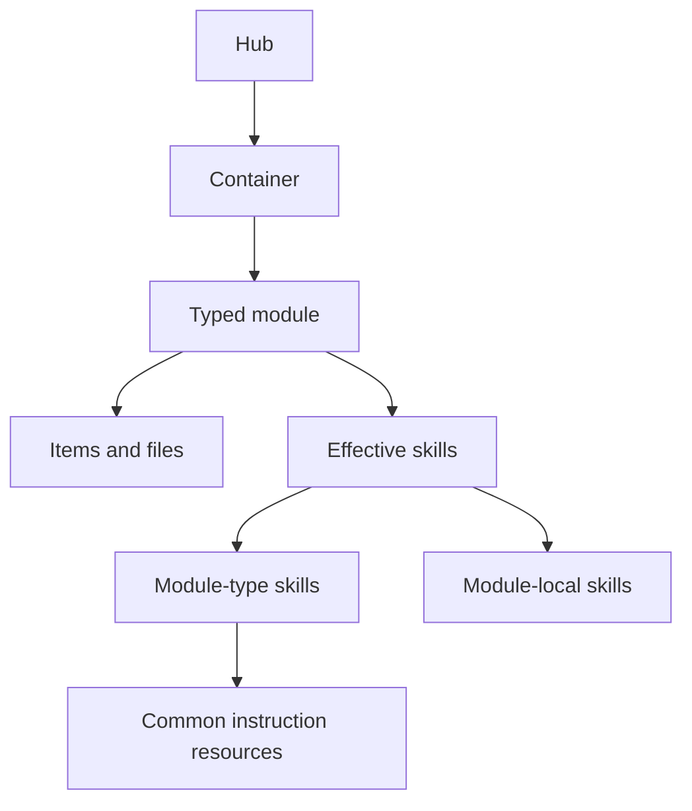

# Concepts and routing

## Domain model

- **Hub** - this MCP server, addressed by a configurable wake phrase. One hub
  manages any number of containers.
- **Container** - a registered local folder, OS-synced folder, or git repository.
  Its registry entry records backend, local path, and sync mode.
- **Module** - a typed top-level folder inside a container. Its
  `.okh/module.yaml` selects a loader and carries a routing description.
- **Item** - a discoverable unit inside a module, such as a knowledge concept,
  memory entry, wiki page, skill, or agent profile.
- **Skill** - module-scoped discipline in a `SKILL.md`. `run` returns its
  instructions; the client agent performs the work.
- **Common instruction** - reusable built-in guidance exposed under
  `okh://instructions/`. It is read by skills and is not independently runnable.
- **Resource** - read-only MCP context. OKH resources expose hub content,
  canonical documentation, and common instructions.
- **Workspace** - a typed module that defines one reusable workflow, lead, optional
  agent pool, shared guidance, and acceptance rubric.
- **Project** - a durable active or archived goal inside a workspace.
- **Run** - one frozen execution boundary coordinated by the MCP client's own agentic
  loop; OKH stores its snapshot, checkpoint/outcome events, and immutable result.

## Module types

Built-in types are `knowledge`, `memory`, `llmwiki`, `skills`, `agents`, and
`workspace`. Any other
non-empty type is custom and uses the generic file-listing loader.

Modules must be direct children of a container. The folder name is the module
identity; modules do not have a separate `name` field.

## Skill precedence

A module's effective skills are:

1. Skills bundled with its built-in module type.
2. Skills discovered inside the module from `.okh/skills/` and
   `.claude/skills/`.
3. For a `skills` module, skills rooted directly in its area tree.

A local skill with the same name as a module-type skill overrides it. Skill names
must be unique within one module but may repeat in another module because every
`run` identifies `{ container, module, skill }`.

Built-in skills declare reusable dependencies with a `resources` array in
frontmatter. `run` returns those dependencies as `resource_link` content and embeds
the required content when it fits the bounded context budget. Oversized requirements
are explicitly deferred to `read_resource`. Sibling files of a local skill are linked
through the module-file resource template for on-demand reads.

## Routing

When a user addresses the hub, call `inspect` with no arguments first. It returns
the live container/module/skill map. Every runnable skill appears beneath the
specific module required to run it; there is no independent skill catalog.

- Learn, teach, or add durable knowledge: run `learn` on a `knowledge` module.
- Explicitly remember an observation, reminder, commitment, or task: run
  `remember` on a `memory` module.
- Other natural-language todo changes: run `todo` on a `memory` module.
- Read, list, or filter todos: call `todos` directly.
- Answer from stored content: call `ask`.
- Assemble a task-specific working set: call `context`.
- Create a stateless Hub agent: run `create` on the target `agents` module.
- Run a stateless Hub agent: select an ID from `inspect`, then call `use_agent`.
  Prefer the returned profile and task in a native subagent; otherwise follow them
  in the parent context and report the fallback mode.
- Create a durable workspace project: run `create` on the selected `workspace` module.
- Start, resume, or continue project execution: run `coordinate` on that workspace.
  The skill uses frozen profiles returned by `workspace`; it does not call live
  `use_agent` during an active run.
- List/read workspace state or record an explicitly requested intervention: call
  `workspace` directly with the corresponding operation.
- Ingest source documents: call `help { question: "ingest" }`, apply its embedded
  instructions, confirm the routing plan, then run the target module's writing skill.
- Explain OKH: call `help`.

After writes, call `sync` for each changed container. In `shared` mode, `sync`
pushes the configured personal branch; `sync` with action `publish-pr` opens or
finds its pull request.
